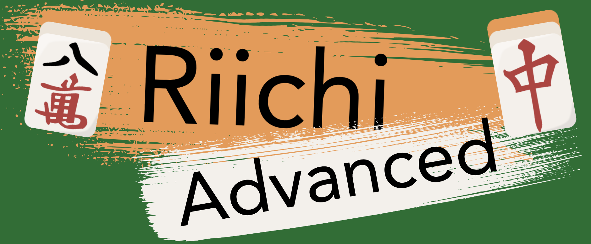

# Riichi Advanced

- Play now: <https://riichiadvanced.com/>
- Discord (join us!): <https://discord.gg/5QQHmZQavP>

Riichi Advanced is an infinitely extensible mahjong web client featuring the following:

- 28+ base rulesets, including:
  + Riichi,
  + Hong Kong Old Style,
  + Sichuan Bloody Rules,
  + Zan Sanma,
  + MCR,
  + Taiwanese,
  + [Super Bingo Sanma](https://fansubbing.com/2024/03/10/super-bingo-sanma-rules/),
  + you can even play Riichi Mahjong with Saki powers!
- A variety of mods for each ruleset! Play with:
  + head bump,
  + sequences wrapping from 9 to 1
  + a "ten" tile for each suit
  + every local yaku in existence
  + every joker tile in existence
  + transparent Washizu tiles
  + every tile is aka dora
  + and more!
- Multiplayer lobby system with public/private rooms! Invite your friends, or play against AI!
- Infinitely customizable ruleset! Beyond mods, you can change the rules by writing [MahjongScript](documentation/mahjongscript.md) to make minute changes to a game!
- Localization support! 中文支持！ 日本語対応！

Join the [Discord](https://discord.gg/5QQHmZQavP) for development updates and bug reporting! (There are a lot of funny bugs, don't miss out!)

If interested in contributing, check out the [contributing doc](CONTRIBUTING.md)!

## Table of contents

- [Changelog](#changelog)
- [Supported rulesets](#supported-rulesets)
- [Custom rulesets](#custom-rulesets)
- [How can I contribute?](#how-can-i-contribute)
- [Repository breakdown](#repository-breakdown)
- [Running the server locally](#running-the-server-locally)
- [Technical notes](#technical-notes)
- [Links to all documentation](#links-to-all-documentation)
- [Acknowledgments](#acknowledgments)

## Changelog

See [CHANGELOG.md](CHANGELOG.md).

## Supported rulesets

- [__Riichi__](documentation/riichi.md): The classic riichi ruleset, now with an assortment of mods to pick and choose at your liking.
- [__Sanma__](documentation/sanma.md): Three-player Riichi.
- __Space Mahjong__: Riichi, but sequences can wrap (891, 912), and you can make sequences from winds and dragons. In addition, you can chii from any direction, and form open kokushi (3 han).
- [__Cosmic Riichi__](https://docs.google.com/document/d/1F-NhQ5fdi5CnAyEqwNE_qWR0Og99NtCo2NGkvBc5EwU): A Space Mahjong variant with mixed triplets, more yaku, and more calls.
- [__Galaxy Mahjong__](documentation/galaxy.md): Riichi, but one of each tile is replaced with a blue galaxy tile that acts as a wildcard of its number. Galaxy winds are wind wildcards, and galaxy dragons are dragon wildcards.
- [__Kansai Sanma__](documentation/kansai.md): Sanma, but you draw until the last visible dora indicator. In addition, all fives are akadora, fu is fixed at 30, there is no tsumo loss, and scores are rounded to the nearest 1000. Flowers act as nukidora in place of north winds, which are now yakuhai. Exhaustive draws in south round always result in a repeat regardless of who's tenpai.
- [__Zan Sanma__](documentation/Zansanma.md): Kansai Sanma, with rules focused entirely on winning shuugi (chips).
- [__Speed Tonpuu__](https://peterish.com/riichi-docs/speed-tonpuu-rules): A house variant of riichi with red fives, blue sevens, a gold five, and three shiro pocchi tiles. Everything earns chips.
- [__Super Bingo__](https://fansubbing.com/2024/03/10/super-bingo-sanma-rules): A wild sanma variant where the sevens in the deck are doubled, and there are also rainbow sevens which are worth lots of chips. In addition, winning with riichi or yakuman lets you continuously flip tiles from the wall, gaining chips for flipped tile matching your discards.
- [__Chinitsu__](documentation/chinitsu_challenge.md): Two-player variant where the only tiles are bamboo tiles. Try not to chombo!
- __Minefield__: Two-player variant where you start with 34 tiles to make a mangan+ hand, and your remaining tiles are your discards.
- __Sakicards v1.3__: Riichi, but everyone gets a different Saki power, which changes the game quite a bit. Some give you bonus han every time you use your power. Some let you recover dead discards. Some let you swap tiles around the entire board, including the dora indicator.
- [__Hong Kong__](documentation/hk.md): Hong Kong Old Style mahjong. Three point minimum, everyone pays for a win, and win instantly if you have seven flowers.
- [__Sichuan Bloody__](documentation/sichuan.md): Sichuan Bloody mahjong. Trade tiles, void a suit, and play until three players win (bloody end rules).
- [__MCR__](documentation/mcr.md): Mahjong Competition Rules. Has a scoring system of a different kind of complexity than Riichi.
- __Taiwanese__: 16-tile mahjong with riichi mechanics.
- [__Bloody 30-Faan Jokers__](documentation/bloody30faan.md): Bloody end rules mahjong, with Vietnamese jokers, and somehow more yaku than MCR.
- [__American (NMJL)__](documentation/american.md): American Mah-Jongg. Assemble hands with jokers, and declare other players' hands dead.
- [__Vietnamese__](documentation/vietnamese.md): Mahjong with eight differently powerful joker tiles.
- __Malaysian__: Three-player mahjong with 16 flowers, a unique joker tile, and instant payouts.
- __Singaporean__: Mahjong with various instant payouts and various unique ways to get penalized by pao.
- __Tianjin__: Mahjong except the dora indicator actually indicates joker tiles.
- __Ningbo__: Includes Tianjin mahjong joker tiles, but adds more winning patterns and played with a 4-tai minimum.
- __Hefei__: Mahjong with no honor tiles, but you must have at least eight tiles of a single suit to win.
- __Custom__: Create and play your own custom ruleset. (See [documentation.md](documentation/documentation.md) for a tutorial.)

Each ruleset has optional mods like chombo and aotenjo, you'll have to check out each one to discover its variants!

## Custom rulesets

Once you enter the lobby or room for a ruleset you can scroll down to view the JSON object defining the ruleset.

If you're looking to make a custom ruleset using the game's MahjongScript ruleset language, that documentation is available [here](documentation/documentation.md). To play a custom ruleset, simply select Custom on the main page, click Room Settings, and paste and edit your ruleset in the box provided.

Otherwise, click Room Settings and the Config tab to reveal a [MahjongScript](documentation/mahjongscript.md) editor, where any MahjongScript you write will be applied to the game.

## How can I contribute?

Mostly we need people to play and [report bugs](https://github.com/EpicOrange/riichi_advanced/issues), of which there are likely many. We also accept pull requests so if you see an [issue](https://github.com/EpicOrange/riichi_advanced/issues) you'd like to tackle, feel free to do so!

Also if you know of any English-based mahjong rulesets available online, do tell us in Discord and we'll add it to the list!

Check out [CONTRIBUTING.md](/CONTRIBUTING.md) for more details.

Monetary contributions are not accepted at this time.

## Running the server locally (MacOS, Linux)

First, install Elixir (≥ 1.14), `npm`, `z3`, `jq`, and the Rust toolchain via `rustup`.

Then run:

    git clone "https://github.com/EpicOrange/riichi_advanced.git"
    cd riichi_advanced

    # Get Elixir dependencies
    mix deps.get

    # Generate self-signed certs for local https
    mix phx.gen.cert

    # Get Node dependencies (there aren't many)
    (cd assets; npm i)

    # Start the server
    HTTPS_PORT=4000 iex -S mix phx.server

This should start the server up at `https://localhost:4000`. (Make sure to use `https`! `http` doesn't work locally for some reason.) Phoenix should live-reload all your changes to Elixir/JS/CSS files while the server is running.

If it complains about a daemon not running, open a separate terminal and run `epmd` (Erlang Port Mapper Daemon), and try again.

## Running the server locally (not MacOS/Linux)

If you want to run your own instance of Riichi Advanced, see [INSTALL.md](/INSTALL.md) for instructions and troubleshooting.

## Technical notes

If you're interested in the technicals, there are basically five moving parts to Riichi Advanced, each solving one of the five main challenges that came up during its development:

- __Custom DSL to define rulesets!__ Originally, mahjong rulesets were represented by rigid JSON objects with various `jq` query files acting as 'mods'. To avoid technical overhead and allow players to write their own mods without possible vulnerabilities from writing raw `jq`, a DSL called MahjongScript was created to compile down to a safe subset of `jq`. Its compiler can be found [here](/lib/riichi_advanced/majs/compiler.ex).
- __Solving for joker tiles via constraint solving!__ The challenge was to encode these custom rulesets into SMT, generating SMTLIB2 constraints and sending it to Z3 to enumerate all joker tile assignments. If you're a SMT nerd you should definitely give the encoding a once-over, it can be found [here](/lib/riichi_advanced/game/smt.ex).
- __Profiling and optimization!__ Riichi Advanced used to be a lot laggier than it is now! Profiling using Elixir's `:fprof` revealed that a single function (`match`) was the hot loop. Rewriting It In Rust (actually, several algorithmic improvements, but also Rust) resolved many performance problems to the point of playability. The Rust package can be found [here](/native/riichiadvanced_match/src).
- __Automated deploy!__ All games are in-memory (no database) so updates pushed to GitHub will automatically spin up a fresh server and push all game state to it, so that those running in-memory games do not terminate. It's basically scuffed blue-green cutover. Most of the deploy code is server-side (private) but the discovery and cutover part can be found [here](/lib/riichiadvanced/admin.ex).
- __Fault tolerance!__ It's an Elixir project, so any crashing subprocess (like game states) just get restarted. Writing a usable supervision tree took several design iterations, but has settled on `Application` -> `GameSessionSupervisor` -> (many) `GameSupervisor` -> `GameState`. The application root is [here](/lib/riichiadvanced/application.ex).

A longer version of this can be found in [technical_notes.md](documentation/technical_notes.md). If you like solving these kinds of problems, consider joining the [Discord](https://discord.gg/5QQHmZQavP)! We have a lot of problems.

## Links to all documentation

__Riichi Advanced__: all about programming the game engine.

- [Ruleset tutorial + documentation (MahjongScript)](/documentation/documentation.md)
- [Ruleset tutorial + documentation (old JSON version)](/documentation/documentation_json.md)
- [MahjongScript language reference](/documentation/mahjongscript.md)
- [Mod creation reference](/documentation/mahjongscript.md)
- [Tutorial creation reference](/documentation/tutorials.md)
- [Tiles reference](/documentation/tiles.md)
- [Technical notes (engine internals)](/documentation/technical_notes.md)

__Rulesets__ (for nerds): Most of the rules can be accessed in-game by clicking on Rules after entering a room. Note that there are also in-game rules tabs! Otherwise, here are links to all the writeups stored in the `/documentation` directory of this repository.

- Riichi variants
  + [Riichi](/documentation/riichi.md)
  + [Sanma](/documentation/sanma.md)
  + [Space Mahjong](/documentation/space.md)
  + [Galaxy Mahjong](/documentation/galaxy.md)
  + [Chinitsu Challenge](/documentation/chinitsu_challenge.md)
  + [Zan Sanma](/documentation/Zansanma.md)
- Non-Riichi variants
  + [American Mahjong](/documentation/Zansanma.md)
  + [Bloody 30 Faan Jokers](/documentation/bloody30faan.md)
  + [Fuzhou Mahjong](/documentation/fuzhou.md)
  + [Hong Kong Old Style](/documentation/hk.md)
  + [MCR strategy guide](/documentation/mcr.md)
  + [Sichuan Bloody Rules](/documentation/sichuan.md)
  + [Vietnamese](/documentation/vietnamese.md)
  + [Zung Jung](/documentation/zung_jung.md)

## Acknowledgments

The basic [tileset](documentation/tiles.md) used in this game is taken [from this repository](https://github.com/FluffyStuff/riichi-mahjong-tiles). Thank you to @FluffyStuff!

Many of the more unique tiles in the game (read: joker tiles) were created using the [Hanyi Senty Tang](https://sentyfont.com/sentytang.htm) font.

In addition, special thanks to the following sites for offering English-based rulesets:

- [Mahjong Pros](https://mahjongpros.com/)
- [Sloperama](https://www.sloperama.com/mahjongg/index.html)
- [Mahjong Picture Guide](https://www.mahjongpictureguide.com)

A big thank you to our beta testers on Discord:

- #yuriaddict
- 5𝔷ł𝔬𝔱𝔶𝔠𝔥-𝔨𝔲𝔫
- Anton00
- averyoriginalname
- BluePotion
- Buckwheat
- Caballo
- DragonRider JC
- GameRaccoon
- Glassy
- GOAT^
- Hyperistic
- JustKidding
- KlorofinMaster
- L_
- lorena.davletiar
- Miisuya
- Nehalem
- nilay
- schi
- Sophie
- stuf
- tomato
- UltimateNeutrino
- モカ妹紅（MochaMoko）
