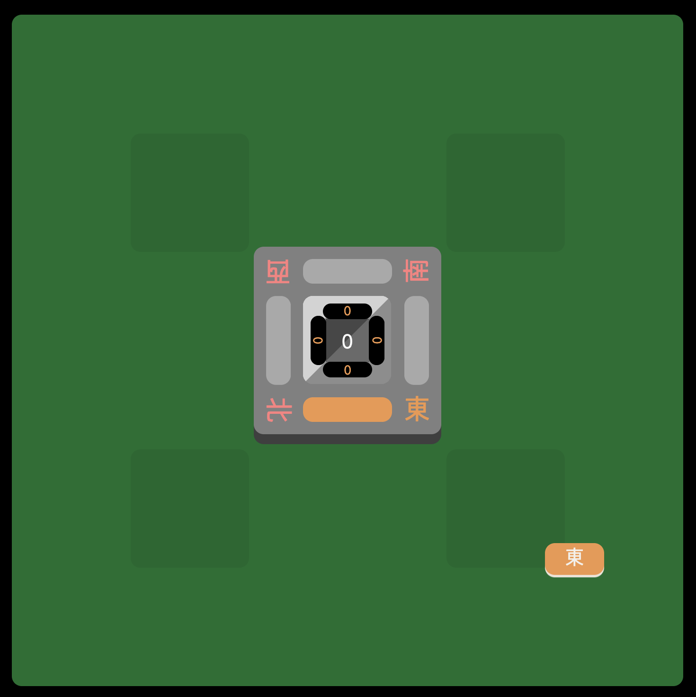
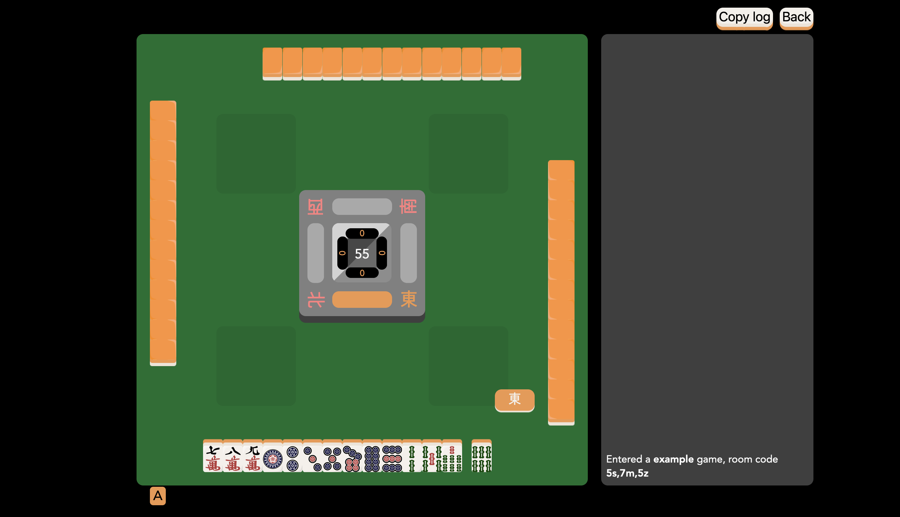

# `ruleset.json` basic concepts

A ruleset is a JSON file consisting of a single object. We'll introduce the possible keys of this object one by one.

Let's start with a bare object:

    {}

This creates the following game:

## Defining keys in the ruleset

To add a wall to the game, simply specify a `"wall"` key containing an array of tiles as strings. For example:

    {
      "wall": ["1m", "1m", "1m", "1m",
               "2m", "2m", "2m", "2m",
               "3m", "3m", "3m", "3m",
               "4m", "4m", "4m", "4m",
               "5m", "5m", "5m", "5m",
               "6m", "6m", "6m", "6m",
               "7m", "7m", "7m", "7m",
               "8m", "8m", "8m", "8m",
               "9m", "9m", "9m", "9m",
               "1p", "1p", "1p", "1p",
               "2p", "2p", "2p", "2p",
               "3p", "3p", "3p", "3p",
               "4p", "4p", "4p", "4p",
               "5p", "5p", "5p", "5p",
               "6p", "6p", "6p", "6p",
               "7p", "7p", "7p", "7p",
               "8p", "8p", "8p", "8p",
               "9p", "9p", "9p", "9p",
               "1s", "1s", "1s", "1s",
               "2s", "2s", "2s", "2s",
               "3s", "3s", "3s", "3s",
               "4s", "4s", "4s", "4s",
               "5s", "5s", "5s", "5s",
               "6s", "6s", "6s", "6s",
               "7s", "7s", "7s", "7s",
               "8s", "8s", "8s", "8s",
               "9s", "9s", "9s", "9s"]
    }

This results in this game:

You can see that the 108 in the center corresponds to the 108 tiles we have just specified.

Add `"starting_tiles"` to have each player start with that many tiles from the wall:

    {
      "wall": ["1m", "1m", "1m", "1m",
               "2m", "2m", "2m", "2m",
               "3m", "3m", "3m", "3m",
               "4m", "4m", "4m", "4m",
               "5m", "5m", "5m", "5m",
               "6m", "6m", "6m", "6m",
               "7m", "7m", "7m", "7m",
               "8m", "8m", "8m", "8m",
               "9m", "9m", "9m", "9m",
               "1p", "1p", "1p", "1p",
               "2p", "2p", "2p", "2p",
               "3p", "3p", "3p", "3p",
               "4p", "4p", "4p", "4p",
               "5p", "5p", "5p", "5p",
               "6p", "6p", "6p", "6p",
               "7p", "7p", "7p", "7p",
               "8p", "8p", "8p", "8p",
               "9p", "9p", "9p", "9p",
               "1s", "1s", "1s", "1s",
               "2s", "2s", "2s", "2s",
               "3s", "3s", "3s", "3s",
               "4s", "4s", "4s", "4s",
               "5s", "5s", "5s", "5s",
               "6s", "6s", "6s", "6s",
               "7s", "7s", "7s", "7s",
               "8s", "8s", "8s", "8s",
               "9s", "9s", "9s", "9s"],
      "starting_tiles": 13
    }

https://github.com/user-attachments/assets/523253a2-ca78-40f0-b677-f4ad54530aa8

Because every player has drawn 13 tiles, that leaves 56 tiles in the wall. Note that there is no drawing from the wall quite yet.

Unless otherwise stated, every key like `wall` and `starting_tiles` are top-level keys. These define the main moving parts of Riichi Advanced rulesets. A full documentation of the keys is below this concepts guide.

## Events, contexts, and actions

To make players draw from the wall, we will introduce our first **action**: `draw`, which draws a tile.

Add the following to the ruleset:

    "after_turn_change": {
      "actions": [["draw"]]
    }

This results in the following game:

https://github.com/user-attachments/assets/d765d382-9d6a-4579-84e0-938ebe3efb03

The `after_turn_change` **event** is triggered after every turn change, as well as at the start of the game. Every event handler (like this one) is defined by a top-level key.

In addition, every event has an invisible **context**. Contexts determine how actions are evaluated, and at minimum must define a `seat` (the seat of the player that the actions act on). In other words, the player who `draw`s is the `seat` player, which is defined by `after_turn_change`. It happens that `after_turn_change` sets `seat` to the player whose turn it is after the turn change, so that player is the one who gets to draw.

Note that `actions` is specified as a doubly nested array. This is because `actions` is a list of actions, and each action itself is an array, to accommodate parameters: `["draw"]` draws one tile, while `["draw", 2]` draws two.

## Conditions

Our ruleset above has one issue: once the draw gets to the end of the wall, the game will try to draw nonexistent tiles and crash. Instead we should check if there are draws left using the `no_tiles_remaining` **condition**, and end the game with an exhaustive draw via the `ryuukyoku` action.

The simplest conditional is the `when` action. `when` takes two parameters: a list of conditions, and a list of actions to fire when all those conditions are met.

We can prepend it to the `actions` list of `after_turn_change`:

    "after_turn_change": {
      "actions": [
        ["when", ["no_tiles_remaining"], [["ryuukyoku"]]],
        ["draw"]
      ]
    }

Now the game will end in an exhaustive draw when there are no more tiles. However, the second action will still fire, and crash the game. So we need to negatively condition `draw` on `no_tiles_remaining`. Any condition can be negated by prepending the string `"not_"` to it:

    "after_turn_change": {
      "actions": [
        ["when", ["no_tiles_remaining"], [["ryuukyoku"]]],
        ["when", ["not_no_tiles_remaining"], [["draw"]]]
      ]
    }

Instead of two checks for a condition and its negation, we can use the 3-argument `ite` action (**i**f-**t**hen-**e**lse) to combine these two `when` actions:

    "after_turn_change": {
      "actions": [
        ["ite", ["no_tiles_remaining"], [["ryuukyoku"]], [["draw"]]]
      ]
    }

## Auto buttons

You might have noticed that players' hands are in dire need of sorting. To remedy this, we could call the `sort_hand` action after every turn change just like how we `draw` after every turn change. But what if the player wants to turn it off?

This is the main purpose of **auto buttons**, which are essentially action lists that fire every turn change if enabled. With auto buttons, players can control whether certain actions trigger on every turn. Here's the solution for hand sorting:

    "auto_buttons": {
      "auto_sort": {
        "display_name": "A",
        "actions": [["sort_hand"]],
        "enabled_at_start": true
      }
    }

All auto buttons are defined in the toplevel `auto_buttons` key and have an identifier, here `auto_sort`. Each auto button has a display name `display_name`, an action list `actions`, and whether they are enabled by default `enabled_at_start`. Here's what that looks like:

That's really all there is to auto buttons.

## Call buttons and interruptible actions

Let's say you want the ability to call pairs -- if someone drops a tile and you have the same tile in hand, you get to interrupt the turn change and call it. To do so, you must define a **call button**. Just like how auto buttons are defined in the toplevel `auto_buttons` object, call buttons are defined in the toplevel `buttons` object.

We will spend this section breaking down the following implementation.

    {
      ...
      "buttons": {
        "pair": {
          "display_name": "Pair",
          "call": [[0]],
          "show_when": ["not_our_turn", "not_no_tiles_remaining", "someone_else_just_discarded", "call_available"],
          "actions": [["call"], ["change_turn", "self"]]
        }
      },
      "interruptible_actions": ["play_tile"]
    }

https://github.com/user-attachments/assets/392652bc-1baf-413b-a616-16617211ff94

This defines a button with button text "Pair" that shows when every condition in the `show_when` condition list is satisfied. Then it runs the action list: `call` calls tiles based on the `call` key in the button, and `change_turn` changes turn to ourselves.

`"call": [[0]]` is a **call specification**. This one is pretty simplistic so it is hard to explain, but let's start with more interesting call specifications as examples and work backwards:

- chii: `[[-2, -1], [-1, 1], [1, 2]]`. Either two tiles left of the discard, two tiles with one on either side of the discard, or two tiles right of the discard.
- pon: `[[0, 0]]`. Only one possibility, which is two tiles matching the discard.
- pair: `[[0]]`. Only one possibility, which is one tile matching the discard.

Call buttons _must_ have `call_available` as one of the conditions in `show_when`. This condition checks whether the last discard matches the call specification. If you don't check that, and click the call button, the game will crash.

The final moving part is the top-level `interruptible_actions` key, which is an array of action names that can be interrupted. Here the internal `play_tile` action is made interruptible, and so after every `play_tile` action, the game will check the `show_when` button condition for each button to see if it should appear. Without this key, it will only check for buttons at the start of each game.

Even if an action, like `"draw"`, is made interruptible by inclusion in the top-level `interruptible_actions` array, one can specify the action name `"uninterruptible_draw"` instead of `"draw"` to have the engine ignore the interrupt. This is useful because every interrupt requires recalculating all buttons for all players, and sometimes you don't need or want that.

## Conditions with arguments and complex conditions

The buttons in the top-level `buttons` object do not need to be call buttons. Call buttons are simply buttons that have a call specification in the `call` key: buttons in general only need `display_name`, `show_when`, and `actions`.

Here's an example: the default riichi button in the riichi ruleset:

    "riichi": {
      "display_name": "Riichi",
      "show_when": [
        "our_turn",
        "has_draw",
        {"name": "status_missing", "opts": ["riichi"]},
        {"name": "has_score", "opts": [1000]},
        "next_draw_possible",
        {"name": "has_no_call_named", "opts": ["chii", "pon", "daiminkan", "kakan"]},
        {"name": "match", "opts": [["hand", "calls", "draw"], ["tenpai_14", "kokushi_tenpai"]]}
      ],
      "actions": [
        ["big_text", "Riichi"],
        ["set_status", "riichi", "just_reached"],
        ["push_message", "declared riichi"],
        ["when", [{"name": "status", "opts": ["discards_empty"]}, "no_calls_yet"], [["set_status", "double_riichi"]]]
      ]
    }

Notice that some of the conditions in `show_when` are objects. Unlike actions, whose arguments are given as additional entries in the action array, conditions with arguments must be in the form `{"name": <name>, "opts": [<args>]}`. Indeed, every string condition like `"our_turn"` is shorthand for `{"name": "our_turn", "opts": []}`.

The reason for this is complex conditions. If you have conditions "a" "b" and "c", then to express ("a" AND "b" AND "c") you would write:

    ["a", "b", "c"]

AND conditions are what we're used to seeing. I defined them as a condition list. But if you want (("a" OR "b") AND "c") you would write

    [["a", "b"], "c"]

and if you wanted ("a" OR ("b" AND "c")) you would write

    [["a", ["b", "c"]]]

So the first level of array joins all its elements with AND, the second level of array joins with OR, and the third level of array joins with AND, and so on. Because complex conditions are defined by the nesting level of arrays, conditions with arguments cannot be defined using arrays, which is why conditions with arguments look like `{"name": <name>, "opts": [<args>]}` instead.

This concludes the overview of basic concepts in Riichi Advanced rulesets. Note that for the riichi button, the last condition in `show_when` is a `match` condition, and it is used extensively in Riichi Advanced to check for tenpai, to check for yaku, and to check for anything involving the hand. It is also the most complex condition by far, so it gets its own explainer section below. It is not a basic concept so feel free to skip it and proceed to the full documentation.

## The `match` condition and match specifications

    {"name": "match", "opts": [["hand", "calls", "draw"], ["tenpai_14", "kokushi_tenpai"]]}

`match` is a condition with two arguments. The first is an array of objects to match against, here `["hand", "calls", "draw"]`. The second is an array of **match specifications**, here `["tenpai_14", "kokushi_tenpai"]`. The idea is, if your hand, calls, and drawn tile matches `tenpai_14` or `kokushi_tenpai`, then you get to riichi.

`tenpai_14` or `kokushi_tenpai` are **named match specifications**. This is how they are specified in the default riichi ruleset:

    "tenpai_14_definition": [
      [ "exhaustive", [["pair"], 1], [["ryanmen/penchan", "kanchan", "pair"], 1], [["shuntsu", "koutsu"], 3] ],
      [ "exhaustive", [["shuntsu", "koutsu"], 4] ],
      [ [["quad"], -1], [["koutsu"], -2], [["pair"], 6] ]
    ],
    "kokushi_tenpai_definition": [
      [ "unique",
        [["1m","9m","1p","9p","1s","9s","1z","2z","3z","4z","5z","6z","7z"], 12],
        [["1m","9m","1p","9p","1s","9s","1z","2z","3z","4z","5z","6z","7z"], 1]
      ]
    ]

Named match specifications are top-level keys ending in `"_definition"`. Each named match specification is an array of **match specifications** that it represents. So the array `["tenpai_14", "kokushi_tenpai"]` is equivalent to writing the following array of four match specifications:

    [
      [ "exhaustive", [["pair"], 1], [["ryanmen/penchan", "kanchan", "pair"], 1], [["shuntsu", "koutsu"], 3] ],
      [ "exhaustive", [["shuntsu", "koutsu"], 4] ],
      [ [["quad"], -1], [["koutsu"], -2], [["pair"], 6] ],
      [ "unique",
        [["1m","9m","1p","9p","1s","9s","1z","2z","3z","4z","5z","6z","7z"], 12],
        [["1m","9m","1p","9p","1s","9s","1z","2z","3z","4z","5z","6z","7z"], 1]
      ]
    ]

Let's go over these one by one and see how `match` matches against your 14-tile hand as defined by `["hand", "calls", "draw"]`.

    [ "exhaustive", [["pair"], 1], [["ryanmen/penchan", "kanchan", "pair"], 1], [["shuntsu", "koutsu"], 3] ]

Skipping the `exhaustive` flag for now, the intuition of this one is that it takes a pair out of your 14-tile hand, leaving a 12-tile hand. Then it takes one of either `["ryanmen/penchan", "kanchan", "pair"]` out of the 12-tile hand, leaving a 10-tile hand. Finally, it takes out _three_ of either `["shuntsu", "koutsu"]` out of the remainder, leaving one tile, which is ignored. The `exhaustive` flag at the beginning means this entire process exhaustively tries every single possibility of taking out these three **groups**, instead of just taking the first one it sees for each group. The match succeeds if it was able to find each group. Intuitively it means 13 of the 14 tiles in your hand match a standard hand with a ryanmen/penchan/kanchan/pair wait, making you tenpai.

Things like `pair`, `ryanmen/penchan`, etc are **sets** defined in the top-level `set_definitions` which for riichi looks like this:

    "set_definitions": {
      "pair": [0, 0],
      "shuntsu": [0, 1, 2],
      "koutsu": [0, 0, 0],
      "quad": [0, 0, 0, 0],
      "ryanmen/penchan": [0, 1],
      "kanchan": [0, 2],
      "iipeikou": [0, 0, 1, 1, 2, 2],
      ...
    }

I think that is self-explanatory. Let's move onto the next match definition.

      [ "exhaustive", [["shuntsu", "koutsu"], 4] ],

This does the same thing as above, except it just takes four `shuntsu` or `koutsu` out of your hand immediately. If it's able to do that then you are clearly tenpai with a single tile wait.

      [ [["quad"], -1], [["koutsu"], -2], [["pair"], 6] ],

This is the seven pairs check. Although you can check for six pairs via the simpler match definition `[ [["pair"], 6] ]`, we need to filter out the two cases where you have six pairs but are not tenpai for seven pairs. We do this with **negative counts**, which specifies a negative match for a group. Basically, if we're able to take out a `quad` from the hand (indicating two identical pairs), then the match fails. Also if the hand includes two `koutsu`, there's no way to discard one of the two unpaired tiles and wait on a unique pair, so that also fails to match. Otherwise, it proceeds to take six pairs out of the hand, and if it can, then the match succeeds and you are tenpai for seven pairs.

      [ "unique",
        [["1m","9m","1p","9p","1s","9s","1z","2z","3z","4z","5z","6z","7z"], 12],
        [["1m","9m","1p","9p","1s","9s","1z","2z","3z","4z","5z","6z","7z"], 1]
      ],

This is the kokushi check and introduces the `unique` flag. `unique` is useful when you want to ensure that each group specified in the group list `["1m","9m","1p","9p","1s","9s","1z","2z","3z","4z","5z","6z","7z"]` is taken _at most once_ over the course of taking out twelve of them. (I say "group", but each group consists of one tile, which is a valid definition of a group.) This check removes 12 unique terminal/honors plus one more, and if it can do that, the match succeeds and you are tenpai for kokushi.

Here is the full list of allowed items in a group:

- keywords
  + `"nojoker"` specifies that every item after it cannot use jokers
  + `"unique"` specifies that every item in this group is taken at most once (if the group is to be taken >1 times)
- Tiles like `"1m"` and `"9p"`
- `"any"`, to represent any tile
- Sets of tiles/offsets like `["1m", "2m", "3m"]` or `[0, 1, 2]`

Offsets are one of the following:

- Integers like `[0, 1, 2]`, representing "some tile" together with the two in sequence after that tile. Although negative integers technically work, it's not really useful (since you can always shift each integer so that the least offset is `0`).
- Exact tiles like `"1m"` and `"9p"` and `"any"`
- Fixed offsets like `1A` and `2B`. The set `["1A", "2B", "3C"]` represents any 1 tile of some suit, a 2 tile of another suit, and a 3 tile of a third suit. You may also specify `DA`, `DB`, `DC` as well (where red dragon is manzu suit, green dragon is souzu suit, and white dragon is pinzu suit) -- this is mostly used internally to represent American mahjong hands (see below section).

## American hand match specifications

American hands are a special case since they're so specific. They can be implemented using the above syntax, but there is a shorthand specifically for these kinds of hands (which are then translated to the above syntax behind-the-scenes).

An American match specification is a string instead of an array. An example is `"FF 2024a 2222b 2222c"`. The idea is that we have space-separated groups where the individual characters represent the following:

- `F`: any flower
- `D`: any dragon
- `W`: any wind
- `N`,`E`,`W`,`S`: north/east/west/south wind
- `R`,`G`,`0`: red/green/white dragon
- `1` to `9`: a number tile
- `X`: a variable number tile

`X` groups must be suffixed with a number. For instance, `"XXXXX0a XX1a XXXXX2a"` matches a quint of some number, a pair of that number + 1, and a quint of that number + 2.

The `a` at the end is a suit specifier, required for groups consisting of `1` to `9`, `D`, and/or `X`. The three suit specifiers are `a`, `b`, `c`. For example, `"2024a 2222b 2222c"` matches 2024 of one suit (0 is white dragon), 2222 or another suit, and 2222 of a third suit.

See `rulesets/american.json` for more examples.

## Marking

Riichi Advanced has a mechanism that allows for marking arbitrary tiles for use in another action. The most notable use of this is to implement charleston passes, where a player marks three tiles to pass. The Sakicards variant makes heavy use of marking in order to implement tile swaps and discard pile interactions and other shennanigans.

To trigger a mark action, simply run the action `["mark", mark_spec]` where `mark_spec` is an array of items in the following format:

    [target, number, restrictions]

Examples:

- `["mark", [["hand", 3, ["self", "not_joker"]]]]`: Mark 3 tiles in your own hand (that are not jokers).
- `["mark", [["hand", 1, ["terminal_honor"]], ["discard", 1, ["last_discard"]]]]`: Mark a terminal/honor in hand and the last discard.
- `["mark", [["hand", 1, ["match_suit", "not_riichi"]], ["discard", 1, ["match_suit"]]]]`: Mark one tile in your own hand, then mark one tile in your discards. Once you mark one tile, the other tile must match the suit of the marked tile. In addition, the tile in hand can only be your drawn tile, if you are in riichi.

The mark action only prompts the user to mark tiles -- it doesn't do anything with them. Once all tiles are marked, the remaining actions are triggered, and there are certain actions that interact with the marked tiles. These three are the most important:

- `["move_tiles", src, dst]`: Move tiles from `src` to `dst`.
- `["swap_tiles", src, dst]`: Swap tiles between `src` and `dst`.
- `["clear_marking"]`: Exit marking mode. This is required after you're done with `move_tiles` or `swap_tiles`, since marking mode essentially pauses the game.

There are a number of ad-hoc actions that also interact with the marked tiles, but they are not meant to be used beyond Sakicards (since they are very specific actions, and the plan is to replace them in the future). For example:

- `["flip_marked_discard_facedown"]`. Flips marked discard tiles facedown. This exits marking mode.

You can reference these actions in the full actions list below.

One final note: the `mark` action also takes two optional action lists to be run before and after marking:

    ["mark", mark_spec, pre_actions, post_actions]

These are just extra hooks to run actions (for example, maybe you want to draw tiles immediately before marking) but are basically not necessary unless you are marking after a delay or something.

---

# `ruleset.json` full documentation

Here are all the toplevel keys. Every key is optional.

- `after_bloody_end`: Triggers after processing the end of a bloody end game (after `after_win`)
- `after_call`: Triggers at the end of any call. Context: `seat` is the caller's seat, `caller` is the caller's seat, `callee` is the seat called from, and `call` contains call information.
- `after_charleston`: Triggers after a round of `charleston_*` actions is triggered.
- `after_discard_passed`: Triggered by the `check_discard_passed` action but only if the last discard had passed.
- `after_draw`: Triggers at the end of any draw. Context: `seat` is the drawing player's seat.
- `after_saki_start`: Triggers after all players have drafted their saki cards in the sakicards gamemode. This is only here because I hardcoded this interaction and may remove it in the future. Context: `seat` is the current seat (so, east).
- `after_start`: Triggers at the start of each round. Context: `seat` is the current seat (so, east).
- `after_turn_change`: Triggers at the end of each turn change. Context: `seat` is the seat whose turn it is after the turn change.
- `after_win`: Triggers at the end of a win, after yaku is calculated.
- `before_abortive_draw`: Triggers before an abortive draw is called. Context: `seat` is the seat whose turn it is at the time of the abortive draw.
- `before_call`: Triggers at the start of any call. Context: `seat` is the caller's seat, `caller` is the caller's seat, `callee` is the seat called from, and `call` contains call information.
- `before_conclusion`: Triggers at the end of a game (right before the end scores are shown).
- `before_continue`: Triggers before the game continues, after someone wins in a bloody end game.
- `before_exhaustive_draw`: Triggers before an exhaustive draw is called. Context: `seat` is the seat whose turn it is at the time of the exhaustive draw.
- `before_start`: Triggers before a new round begins. This is useful to influence whether the game should continue or not (e.g. for tobi calculations).
- `before_turn_change`: Triggers at the start of each turn change. Context: `seat` is the seat whose turn it is before the turn change.
- `before_win`: Triggers right before a win is called, before yaku is calculated. Context: `seat` is the seat who called the win.
- `on_no_valid_tiles`: Triggers on someone's turn if they cannot discard any tiles.
- `play_effects`: This is not actually an event like the others. Instead it is a list of action lists triggered on discards, where each action list is conditioned on the identity of the tile being discarded. Context: `seat` is the seat who played a tile, and `tile` is the played tile.

Buttons:

- `auto_buttons`: List of auto buttons, described above
- `buttons`: List of buttons, described above

Mods:

- `available_mods`: List of available mods
- `default_mods`: List of mods enabled by default

Rules:

- `bloody_end`: If true, the game ends after three players win, not after one player wins.
- `display_honba`: Whether to show number of honba in the middle
- `display_riichi_sticks`: Whether to show number of riichi sticks in the middle
- `display_wall`: Whether to show the "Show wall" button on the bottom right. (Check the riichi ruleset for an example.)
- `dora_indicators`: Defines what tile dora indicators indicate
- `enable_saki_cards`: Set to `true` to enable saki power stuff (may remove this key in the future)
- `initial_score`: Starting score
- `interruptible_actions`: List of actions that can be interrupted by buttons
- `max_revealed_tiles`: Number of tiles to show at the top at all times
- `max_rounds`: Number of rounds before the game ends
- `persistent_statuses`: Names of statuses that should persist between rounds.
- `persistent_counters`: Names of counters that should persist between rounds.
- `play_restrictions`: List of two-element arrays detailing a **play restriction**. The first element is an array of tiles that the restriction applies to. The second element is a condition -- if the condition is true, the player cannot play that tile.
- `reserved_tiles`: List of tiles reserved from the end of the wall
- `revealed_tiles`: List of reserved tiles revealed at the start of the game
- `set_definitions`: List of definitions for sets used in match definitions, described above
- `shown_statuses`: List of statuses to show (private to the player)
- `starting_tiles`: Number of tiles every player starts with every round
- `wall`: The list of tiles used in the game. [Here are all the tiles available in the tileset currently.](tiles.md)

Yaku and scoring:

- `score_calculation`: Scoring method. See the scoring method section.
- `yaku_precedence`: An object specifying which yaku gets overridden by other yaku.

Saki:

- `saki_deck`: Deck of saki cards.
- `saki_ver`: The saki card spritesheet to use, either "v12" or "v13".

Other:

- `tile_images`: Mapping of tiles to replacement image urls.

# Actions

- `["noop"]`: does nothing, but you can put it in `interruptible_actions` to make it an interrupt.
- `["push_message", message]`: Sends a message to all players using the current player as a label. Example: `["push_message", "declared riichi"]`
- `["push_system_message", message]`: Sends a message to all players, with no label. Example: `["push_system_message", "Converted each shuugi to 2000 points."]`
- `["run", fn_name, {"arg1": "value1", ...}]`: Call the given function with the given arguments. A function is essentially a named list of actions. Functions are defined in the toplevel `"functions"` key -- see `riichi.json` for examples. Within a function you may write variables preceded with a dollar sign -- like `$arg1` -- and the value will be replaced with the corresponding `value1` in the (optional) given object. Functions can be called recursively, but this is rarely done, and therefore there is an arbitrary call stack limit of 10 calls.
- `["draw", num, tile]`: Draw `num` tiles. If `tile` is specified, it draws that tile instead of from the wall. Instead of a tile for `tile` you may instead write `"opposite_end"` to draw from the opposite end of the wall (i.e. the dead wall, if one exists)
- `["call"]`: For call buttons only, like pon. Triggers the call.
- `["self_call"]`: For self call buttons only, like ankan. Triggers the self call.
- `["upgrade_call"]`: For upgrade call buttons only, like kakan. Triggers the upgrade call.
- `["flower", flower1, flower2, ...]`: Declare a flower, with `flower1`, etc as the choices.
- `["draft_saki_card", num]`: Draw a saki card out of `num` choices.
- `["reverse_turn_order"]`: Reverses the turn order.
- `["advance_turn"]`: Goes forward in turn order.
- `["change_turn", seat]`: Change turn to the specified seat. Allowed values of `seat` are: `"east"`, `"south"`, `"west"`, `"north"`, `"shimocha"`, `"toimen"`, `"kamicha"`, `"self"`
- `["win_by_discard"]`: Declares a win using the last discard as the winning tile.
- `["win_by_call"]`: Declares a win using the last called tile as the winning tile.
- `["win_by_draw"]`: Declares a win using the first drawn tile as the winning tile.
- `["ryuukyoku", name]`: Declares an exhaustive draw. `name` is optional, but if provided it will override the default name.
- `["abortive_draw", name]`: Declares an abortive draw by the given `name`.
- `["set_status", status1, status2, ...]`: Add to the set of statuses for the current player.
- `["unset_status", status1, status2, ...]`: Remove from the set of statuses for the current player.
- `["set_status_all", status1, status2, ...]`: Add to the set of statuses for all players.
- `["unset_status_all", status1, status2, ...]`: Remove from the set of statuses for all players.
- `["set_counter", counter_name, amount or spec, ...opts]`: Set the current player's counter `counter_name` to the given `amount`, which is either a number or one of the following strings followed by some options:
  + the name of an existing counter
  + `"count_matches", to_match, [match_spec1, match_spec2, ...]`: Counts the number of times the given `match_spec`s matches `to_match`, and adds that to the counter. The syntax for these options is the same as the options for the `match` condition, which is described in the match condition section.
  + `"count_matching_ways", to_match, [match_spec1, match_spec2, ...]`: When `to_match` describes multiple sets of tiles (e.g. `hand_any` describes multiple single-tile hands, one for each tile in hand) then `"count_matching_ways"` counts how many of these hands match at least one of the given match specs. Used in Sakicards for Ueshige Suzu's ability, in order to count how many hand tiles match aside tiles.
  + `"tiles_in_wall"`: Gives the number of tiles remaining in the wall.
  + `"num_discards"`: Gives the number of discards made by the current player (includes called tiles).
  + `"num_aside"`: Gives the number of aside tiles for the current player.
  + `"num_facedown_tiles"`: Gives the number of facedown tiles in the current player's pond.
  + `"num_facedown_tiles_others"`: Gives the number of facedown tiles in other players' ponds.
  + `"num_matching_revealed_tiles_all", tile_spec1, tile_spec2, ...`: Looks at the every player's hand and counts the number of tiles they have revealed matching the given `tile_spec`s.
  + `"num_matching_melded_tiles_all", tile_spec1, tile_spec2, ...`: Looks at the every player's visible calls and counts the number of those tiles matching the given `tile_spec`s.
  + `"half_score"`: Half of the current player's score, rounded up.
  + `"count_draws", seat`: The number of draws the given `seat` has.
  + `"count_dora", dora_indicator`: Counts the number of dora in the current player's hand and calls, given the `dora_indicator`. This uses the toplevel `"dora_indicators"` key to determine the mapping of dora indicator to dora.
  + `"count_reverse_dora", dora_indicator`: Counts the number of reverse dora in the current player's hand and calls, given the `dora_indicator`. This uses the toplevel `"reverse_dora_indicators"` key to determine the mapping of dora indicator to reverse dora.
  + `"pot"`: The number of points in the pot.
  + `"honba"`: The number of honba (repeats) for the current round.
  + `"fu"`: Only usable in `before_win`. Calculates fu for the winning hand.
- `["set_counter_all", counter_name, amount or spec, ...opts]`: Same as `set_counter`, but calculates the amount once and sets every player's `counter_name`. Right now this is the only way to pass counters between players.
- `["add_counter", counter_name, amount or spec, ...opts]`: Same as `set_counter`, but adds to the existing counter instead. For nonexistent counters this is the same as `set_counter` since nonexistent counters are considered to be at zero.
- `["subtract_counter", counter_name, amount or spec, ...opts]`: Same as `add_counter`, but subtracts.
- `["multiply_counter", counter_name, amount or spec, ...opts]`: Same as `add_counter`, but multiplies.
- `["divide_counter", counter_name, amount or spec, ...opts]`: Same as `add_counter`, but divides. The resulting counter is floored to get an integer.
- `["big_text", text, seat]`: Popup big text for the current player, or the given seat if `seat` is specified. Allowed values of `seat` are: `"shimocha"`, `"toimen"`, `"kamicha"`, `"self"`, `"last_discarder"`
- `["pause", ms]`: Pause for `ms` milliseconds. Useful after a `big_text` to make actions happen only after players see the big text.
- `["sort_hand"]`: Sort the current player's hand.
- `["reveal_tile", tile]`: Show a given tile above the game for the remainder of the round.
- `["add_score", amount, recipients]`: Add to the score for the current player, or for the `recipients` if specified. Allowed values for `recipients` are: `"shimocha"`, `"toimen"`, `"kamicha"`, `"self"`, `"last_discarder"`, `"all"`, `"others"`
- `["subtract_score", amount, recipients]`: Same as `add_score`, but subtracts it.
- `["put_down_riichi_stick", num]`: Makes the current player put down a riichi stick, or `num` riichi sticks if specified. Adds the value of a riichi stick to the pot, but does not change the player's score (use `"subtract_score"` for that).
- `["add_honba", num]`: Adds the given number of honba. (default 1)
- `["reveal_hand"]`: Shows the current player's hand to everyone for the remainder of the round.
- `["reveal_other_hands"]`: Same as `"reveal_hand"` but for everyone except the current player.
- `["discard_draw"]`: Discards the current player's draw. Useful as an auto button.
- `["press_button", button_id]`: Press a given button by id, does nothing if the button doesn't exist. Useful for auto buttons.
- `["press_first_call_button", button_id]`: Press the first call button visible after pressing `button_id`. Does nothing if the options displayed are for another `button_id`. Useful for auto buttons.
- `["when", cond, actions]`: If `cond` evaluates to true, run the given actions.
- `["unless", cond, actions]`: If `cond` evaluates to false, run the given actions.
- `["ite", cond, actions1, actions2]`: If `cond` evaluates to true, run `actions1`, otherwise run `actions2`.
- `["as", seats_spec, actions]`: Sets the `seat` to the given `seats_spec` and runs the actions. If you specify multiple seats, it will run the given actions multiple times (once for each seat). Allowed `seats_spec` values:
  + `"east"`, `"south"`, `"west"`, `"north"`: Selects that seat.
  + `"self"`, `"shimocha"`, `"toimen"`, `"kamicha"`: Selects the seat relative to the current seat.
  + `"last_discarder"`: Selects the last seat that discarded.
  + `"caller"`: Selects the caller, the player receiving the called tile (usable in call buttons only).
  + `"callee"`: Selects the callee, the player giving the called tile (usable in call buttons only).
  + `"all"`, `"everyone"`: Selects every seat.
  + `"others"`: Selects every seat except the current seat.
  + `"chii_victims"`: Selects all players for which the current seat has chiis from. (This is implemented and used solely in Sakicards, specifically for Maya Yukiko's second ability)
- `["when_anyone", cond, actions]`: For each player, if `cond` evaluates to true for that player, run the given actions for that player. (This changes `seat` in the context.)
- `["when_everyone", cond, actions]`: If `cond` evaluates to true for every player, run the given actions for the current player. (This does not change `seat` in the context.)
- `["when_others", cond, actions]`: If `cond` evaluates to true for every player except the current player, run the given actions for the current player. (This does not change `seat` in the context.)
- `["mark", mark_spec, pre_mark_actions, post_mark_actions]`: First runs the optional `pre_mark_actions` before asking the player to mark a tile. Like `"call"`, this happens before any of the actions in the current action list, so it doesn't matter where you put the mark action. For examples of `mark_spec` look at example usages in the `saki.json` ruleset. The optional `post_mark_actions` are run immediately after mark, though admittedly there is little use for this since you can just write actions that occur after marking.
- `["move_tiles", src, dst]`: Moves tiles from `src` to `dst`. Both `src` and `dst` can be either a string, like `"hand"`, or an object specifying additional restrictions, like `{"hand": ["marked"]}`. In general it's `{target1: [restrictions], target2: [restrictions], ...}` for both `src` and `dst`. You may supply multiple `src` targets, but only one `dst` target.
  + Here are all the possible values for `target`:
    * `"hand"`: Selects your entire hand, including the draw.
    * `"draw"`: Selects your draw only.
    * `"aside"`: Selects your aside tiles.
    * `"calls"`: Selects every call you've called (not flowers).
    * `"discard"`: Selects all of your discards.
    * `"revealed_tile"`: Selects all revealed tiles (e.g. dora indicators). (Cannot be used for `dst`.)
    * `"scry"`: Selects all scryed tiles. (Cannot be used for `dst`.)
  + Here are the possible values for `restrictions`:
    * `"marked"`: Filters for only marked tiles.
    * `"1m"`, `"2p"`, etc: Filters for that specific tile.
    * In general, any restriction usable in `play_restrictions` is available for use.
- `["swap_tiles", src, dst]`: Same as `"move_tiles"` except `src` and `dst` get swapped. You may use `"revealed_tile"` and `"scry"` for `dst`, as well as multiple `dst` targets. They will be matched one-to-one in order when swapping: for example, if you select (for `src`) A,B,C from hand, and (for `dst`) D from draw and E,F from aside, then A swaps with D, B swaps with E, and C swaps with F. If the two sides are imbalanced, the excess will go to the first target on the opposite side; for example, if you select (for `src`) A,B,C from hand, and (for `dst`) D from draw, then after A swaps with D, it will move B,C to the draw as well.
- `["swap_out_fly_joker", joker]`: Before running this action, you need to mark a tile in hand as well as any call containing the given `joker` tile (e.g. `"1j"`). This swaps the tile in hand with the joker inside the call, as is done in the American and Malaysian variants.
- `["extend_live_wall_with_marked"]`: Add all marked hand tiles to the end of the live wall. Must be preceded by a `"mark"` action that marks a hand tile.
- `["extend_dead_wall_with_marked"]`: Add all marked hand tiles to the end of the dead wall. Must be preceded by a `"mark"` action that marks a hand tile.
- `["pon_marked_discard"]`: Calls pon on the marked discard. Must be preceded by a `"mark"` action that marks a discard.
- `["flip_marked_discard_facedown"]`: Flips the first marked discard upside down. Must be preceded by a `"mark"` action that marks a discard.
- `["clear_marking"]`: Clears a marking action. All of the above marking actions do this automatically, except for `move_tiles` and `swap_tiles`. If you run `move_tiles` and `swap_tiles` for marked tiles, make sure to run this action to clear the marking.
- `["set_tile_alias", from, to]`: Assigns all tiles in `from` to tiles in `to` for the current player. Basically if `from` is a single tile, then that tile becomes a joker whose possible values are the tiles in `to`, and this only applies to the current player.
- `["set_tile_alias_all", from, to]`: Same, but applies this assignment to all players.
- `["clear_tile_aliases"]`: Clears all joker assignments for the current player.
- `["set_tile_ordering", [tile1, tile2, ...]]`: Asserts that `tile1` comes after `tile2` and so on. Applies only to the current player.
- `["set_tile_ordering_all", [tile1, tile2, ...]]`: Same, but applies this assertion to all players.
- `["save_tile_behavior", label]`: Saves all joker assignments and tile orderings under the name `label` for the current player, which defaults to `"default"` when not supplied.
- `["load_tile_behavior", label]`: Loads all joker assignments and tile orderings under the name `label` for the current player, which defaults to `"default"` when not supplied.
- `["add_attr", [target1, ...], [attr1, ...], [tile_spec1...]]`: Add the given attributes to the given targets that match all given tile specs.
- `["add_attr_first_tile", tile, [attr1, ...]]`: Add the given attributes to the first instance of the given tile in hand.
- `["add_attr_tagged", tag, [attr1, ...]]`: Add the given attributes to all instances of the tagged tiles. (includes wall)
- `["remove_attr_hand", attr1, attr2, ...]`: Remove the given attributes from all tiles in the current player's hand.
- `["remove_attr_all", attr1, attr2, ...]`: Remove the given attributes from all tiles owned by the current player (hand, draw, aside, but not calls)
- `["tag_tiles", tag_name, tiles]`: Globally tag the given tile(s) with the given tag name.
- `["tag_drawn_tile", tag_name]`: Globally tag the current player's drawn tile with the given tag name.
- `["tag_last_discard", tag_name]`: Globally tag the current player's last discard with the given tag name.
- `["tag_dora", tag_name, dora_indicator]`: Globally tag the dora indicated by the given dora_indicator tile, using the toplevel `"dora_indicators"` key as reference.
- `["untag", tag_name]`: Untag all tiles tagged with the given tag name.
- `["convert_last_discard", tile]`: Turn the last discard into the given tile.
- `["flip_all_calls_faceup"]`: Flip all draws faceup. Mostly used to flip all concealed kongs faceup for variants that hide them.
- `["draw_from_aside"]`: Draw a tile from the tiles set aside. This action will be removed in the future in favor of `"move_tiles"`.
- `["charleston_left"]`: Select and pass three tiles left. Must be preceded by a `"mark"` action that marks 3 hand tiles.
- `["charleston_across"]`: Select and pass three tiles across. Must be preceded by a `"mark"` action that marks 3 hand tiles.
- `["charleston_right"]`: Select and pass three tiles right. Must be preceded by a `"mark"` action that marks 3 hand tiles.
- `["shift_tile_to_dead_wall", num]`: Add `num` tiles to the dead wall from the live wall. (The haitei tile becomes a dead wall tile.)
- `["recalculate_buttons"]`: Buttons are recalculated at the start of a round as well as before every interruptible action defined in the `"interruptible_actions"` toplevel key. This action is an alternative way to recalculate buttons. Note that buttons are simultaneously calculated for everyone.
- `["draw_last_discard"]`: Draw your last discard. This action will be removed in the future in favor of `"move_tiles"`.
- `["scry", num]`: Reveal the next `num` tiles in wall to the current player. This will show up as a line of tiles above your hand.
- `["scry_all", num]`: Reveal the next `num` tiles in wall to all players. This will also print a message to the room describing what is happening.
- `["clear_scry"]`: Hide the tiles revealed by `"scry"`.
- `["choose_yaku"]`: Bring up a UI that allows you to select a subset of every yaku in the current ruleset. This is used in conjunction with the conditions `"has_declared_yaku_with_hand"` etc. to ensure that the current player has their selected yaku. This action is used in Sakicards for Shimizudani Ryuuka's third ability.
- `["disable_saki_card", seat_spec]`: Disable all sakicards for the given seat.
- `["enable_saki_card", seat_spec]`: Enable all sakicards for the given seat.
- `["save_revealed_tiles"]`: Save the current state of the revealed tiles (e.g. dora indicators).
- `["load_revealed_tiles"]`: Load the previously saved state of the revealed tiles (e.g. dora indicators).
- `["merge_draw"]`: Move the draw into the hand. This action will be removed in the future in favor of `"move_tiles"`.
- `["delete_tiles", tile1, tile2, ...]`: Delete every instance of the given tiles from the current player's hand/draw.
- `["pass_draws", seat_spec, num]`: Move up to `num` tiles from the current player's draw to the given seat's draw. This action will be removed in the future in favor of `"move_tiles"`.
- `["saki_start"]`: Prints some messages about what cards each player chose, and triggers the `after_saki_start` event.

Every unrecognized action is a no-op.

# Conditions

Prepend `"not_"` to any of the condition names to negate it.

- `"true"`: Always true.
- `"false"`: Always false.
- `"our_turn"`: The current turn is ours.
- `"our_turn_is_next"`: The next turn is ours.
- `"our_turn_is_prev"`: The previous turn is ours.
- `"game_start"`: No actions have been performed.
- `"no_discards_yet"`: No discard actions have been performed.
- `"no_calls_yet"`: No call actions have been performed.
- `{"name": "last_call_is", "opts": [call_button_id]}`: The last call, if any, was performed by the given call button id.
- `"kamicha_discarded"`: The last action, if any, was kamicha discarding.
- `"someone_else_just_discarded"`: The last action, if any, was someone else discarding.
- `"just_discarded"`: The last action, if any, was us discarding.
- `"just_called"`: The last action, if any, was us calling.
- `"call_available"`: For call buttons only. The specified call is available.
- `"self_call_available"`: For self call buttons only. The specified self call is available.
- `"can_upgrade_call"`: For upgrade call buttons only. The specified upgrade call is available.
- `"has_draw"`: The current player has drawn a tile.
- `"has_aside"`: The current player has set aside a tile.
- `"has_calls"`: The current player has called tiles.
- `{"name": "has_call_named", "opts": [call1, call2, ...]}`: The current player has one of the specified calls. Example: `{"name": "has_call_named", "opts": ["chii", "pon", "daiminkan", "kakan"]}`
- `{"name": "has_no_call_named", "opts": [call1, call2, ...]}`: The current player has none of the specified calls. Example: `{"name": "has_no_call_named", "opts": ["chii", "pon", "daiminkan", "kakan"]}`
- `"won_by_call"`: The winner won by stealing a called tile.
- `"won_by_draw"`: The winner won by drawing the winning tile.
- `"won_by_discard"`: The winner won by stealing the discard tile.
- `{"name": "fu_equals", "opts": [fu]}`: The winning player has the given amount of fu. Valid values of fu are multiples of 10.
- `{"name": "has_yaku_with_hand", "opts": [han]}`: Using the current player's draw as the winning tile, the current player's hand scores at least `han` points using the yaku in `.score_calculation.yaku_lists`. Example: `{"name": "has_yaku_with_hand", "opts": [1]}`
- `{"name": "has_yaku_with_discard", "opts": [han]}`: Using the last discard as the winning tile, the current player's hand scores at least `han` points using the yaku in `.score_calculation.yaku_lists`. Example: `{"name": "has_yaku_with_discard", "opts": [1]}`
- `{"name": "has_yaku_with_call", "opts": [han]}`: Using the last called tile as the winning tile, the current player's hand scores at least `han` points using the yaku in `.score_calculation.yaku_lists`. Example: `{"name": "has_yaku_with_call", "opts": [1]}`
- `{"name": "has_yaku2_with_hand", "opts": [han]}`: Using the current player's draw as the winning tile, the current player's hand scores at least `han` points using the yaku in `.score_calculation.yaku2_lists`. Example: `{"name": "has_yaku_with_hand", "opts": [1]}`
- `{"name": "has_yaku2_with_discard", "opts": [han]}`: Using the last discard as the winning tile, the current player's hand scores at least `han` points using the yaku in `.score_calculation.yaku2_lists`. Example: `{"name": "has_yaku_with_discard", "opts": [1]}`
- `{"name": "has_yaku2_with_call", "opts": [han]}`: Using the last called tile as the winning tile, the current player's hand scores at least `han` points using the yaku in `.score_calculation.yaku2_lists`. Example: `{"name": "has_yaku_with_call", "opts": [1]}`
- `{"name": "last_discard_matches", "opts": [tile_spec1, tile_spec2, ...]}`: The last discard matches one of the given tile specs. See the tile specs section for details.
- `{"name": "last_called_tile_matches", "opts": [tile_spec1, tile_spec2, ...]}`: The last called tile matches one of the given tile specs. See the tile specs section for details.
- `{"name": "needed_for_hand", "opts": [match_spec1, match_spec2, ...]}`: Only used when a tile is in context, e.g. in `play_restrictions`. The context's tile is needed for the current player's hand to match one of the given match specifications.
- `"is_drawn_tile`: Only used when a tile is in context, e.g. in `play_restrictions`. The context's tile is a drawn tile.
- `{"name": "status", "opts": [status1, status2, ...]}`: The current player has all of the specified statuses.
- `{"name": "status_missing", "opts": [status1, status2, ...]}`: The current player is missing all of the specified statuses.
- `{"name": "discarder_status", "opts": [status1, status2, ...]}`: The last discarder has all of the specified statuses.
- `{"name": "shimocha_status", "opts": [status1, status2, ...]}`: Shimocha has all of the specified statuses.
- `{"name": "toimen_status", "opts": [status1, status2, ...]}`: Toimen has all of the specified statuses.
- `{"name": "kamicha_status", "opts": [status1, status2, ...]}`: Kamicha has all of the specified statuses.
- `{"name": "others_status", "opts": [status1, status2, ...]}`: Someone else has all of the specified statuses.
- `{"name": "anyone_status", "opts": [status1, status2, ...]}`: Anyone has all of the specified statuses.
- `{"name": "everyone_status", "opts": [status1, status2, ...]}`: Everyone has all of the specified statuses.
- `{"name": "buttons_include", "opts": [button1, button2, ...]}`: All of the specified buttons are showing for the current player.
- `{"name": "buttons_exclude", "opts": [button1, button2, ...]}`: None of the specified buttons are showing for the current player.
- `{"name": "tile_drawn", "opts": [tile1, tile2, ...]}`: All of the given reserved tiles have been drawn.
- `{"name": "tile_not_drawn", "opts": [tile1, tile2, ...]}`: None of the given reserved tiles have been drawn.
- `{"name": "tile_revealed", "opts": [tile1, tile2, ...]}`: All of the given reserved tiles have been revealed above.
- `{"name": "tile_not_revealed", "opts": [tile1, tile2, ...]}`: None of the given reserved tiles have been revealed above.
- `"no_tiles_remaining"`: No tiles remain in the wall.
- `{"name": "tiles_remaining", "opts": [num]}`: At least `num` tiles remain in the wall.
- `"next_draw_possible"`: The player whose turn it is has at least one draw remaining (after their current draw).
- `{"name": "has_score", "opts": [score]}`: The current player has at least `score` score.
- `{"name": "has_score_below", "opts": [score]}`: The current player has less than `score` score.
- `{"name": "round_wind_is", "opts": [direction]}`: The current round wind is the specified direction, one of `"east"`, `"south"`, `"west"`, `"north"`.
- `{"name": "seat_is", "opts": [direction]}`: The current player's seat wind is the specified direction, one of `"east"`, `"south"`, `"west"`, `"north"`.
- `{"name": "winning_dora_count", "opts": [dora_indicator, num]}`: The current player has `num` dora tiles of the given dora indicator.
- `{"name": "match", "opts": [to_match, [match_spec1, match_spec2, ...]]}`: See the section on match specifications to see how this condition works.
- `{"name": "winning_hand_consists_of", "opts": [tile1, tile2, ...]}`: The winning hand (excluding winning tile) contains only the given tiles (jokers allowed).
- `{"name": "winning_hand_and_tile_consists_of", "opts": [tile1, tile2, ...]}`: The winning hand (including winning tile) contains only the given tiles (jokers allowed).
- `"all_saki_cards_drafted"`: Everyone has at least one saki card.
- `{"name": "has_existing_yaku", "opts": [yaku1, yaku2, ...]}`: Used in `meta_yaku` only. The winner has scored all of the given yaku.
- `"has_no_yaku"`: Used in `meta_yaku` only. The winner has scored no yaku.
- `"placement"`: The current player has the given placement (1-4).
- `"last_discard_matches_existing"`: The last discarded tile matches one of the current player's existing discards (includes called discards) (uses jokers).
- `"called_tile_matches_any_discard"`: The last called tile matches one of anybody's existing discards (excludes called discards) (uses jokers).
- `"last_discard_exists"`: The last discarded tile was not taken by another player.
- `{"name": "call_would_change_waits", "opts": [match_spec1, match_spec2, ...]}`: For call buttons' `show_when` key only. The given call would change the waits of the current player, where a winning hand is defined by the given match definitions.
- `{"name": "call_changes_waits", "opts": [match_spec1, match_spec2, ...]}`: For call buttons' `call_conditions` key only. The given call changes the waits of the current player, where a winning hand is defined by the given match definitions.
- `{"name": "wait_count_at_least", "opts": [num, [match_spec1, match_spec2, ...]]}`: The number of tiles the current player is waiting on is at least `num`, where a winning hand is defined by the given match definitions.
- `{"name": "wait_count_at_most", "opts": [num, [match_spec1, match_spec2, ...]]}`: The number of tiles the current player is waiting on is at most `num`, where a winning hand is defined by the given match definitions.
- `{"name": "call_contains", "opts": [[tile1, tile2, ...], num]}`: For call buttons only. The call contains at least `num` of any of the given tiles.
- `{"name": "called_tile_contains", "opts": [[tile1, tile2, ...], num]}`: For call buttons only. The called tile contains at least `num` of any of the given tiles. (only num=1 is valid)
- `{"name": "call_choice_contains", "opts": [[tile1, tile2, ...], num]}`: For call buttons only. The tiles used to call contains at least `num` of any of the given tiles.
- `{"name": "tagged", "opts": [tile, tag_name]}`: The given tile is tagged with the given `tag_name`. Valid values for `tile` are: `"last_discard"`, `"tile"`, where the last one uses the tile in context (and therefore is only valid in places like `play_restrictions`)
- `{"name": "has_hell_wait", "opts": [match_spec1, match_spec2, ...]}`: The current player is waiting on a single out, where a winning hand is defined by the given match definitions.
- `"third_row_discard"`: The current player has at least 12 tiles in their pond.
- `{"name": "tiles_in_hand", "opts": [num]}`: The current player has `num` tiles in hand.
- `{"name": "anyone", "opts": [cond1, cond2, ...]}`: Anyone satisfies the given conditions.
- `{"name": "counter_equals", "opts": [counter_name, amount]}`: The counter `counter_name` equals `amount`.
- `{"name": "counter_at_least", "opts": [counter_name, amount]}`: The counter `counter_name` is at least `amount`.
- `{"name": "counter_at_most", "opts": [counter_name, amount]}`: The counter `counter_name` is at most `amount`.
- `{"name": "has_attr", "opts": [tile, attr1, attr2]}`: The given tile is has the given attributes `attr1`, `attr2`, etc. Valid values for `tile` are: `"last_discard"`, `"tile"`, where the last one uses the tile in context (and therefore is only valid in places like `play_restrictions`)
- `{"name": "hand_tile_count", "opts": [count1, count2, ...]}`: The current player has one of `count1`, `count2`, etc. tiles in hand (counts hand+draw, ignores calls and aside tiles)
- `"genbutsu_kamicha"`: The last discard was genbutsu against kamicha.
- `"genbutsu_toimen"`: The last discard was genbutsu against toimen.
- `"genbutsu_shimocha"`: The last discard was genbutsu against shimocha.

# Tile specs

- `"any"`: Matches any tile.
- `"1z"`, `"3m"`, etc: Matches that exact tile.
- `"same"`: Matches the same tile. Only used in `play_restrictions` for the `last_discard_matches` or `last_called_tile_matches` conditions.
- `"not_same"`: Matches a different tile. Only used in `play_restrictions` for the `last_discard_matches` or `last_called_tile_matches` conditions.
- `"manzu"`: Matches a manzu tile (hardcoded).
- `"pinzu"`: Matches a pinzu tile (hardcoded).
- `"souzu"`: Matches a souzu tile (hardcoded).
- `"jihai"`: Matches a honor tile (hardcoded).
- `"terminal"`: Matches a terminal tile (hardcoded).
- `"yaochuuhai"`: Matches a terminal/honor tile (hardcoded).
- `"flower"`: Matches a flower tile (hardcoded).
- `"joker"`: Matches a joker tile (hardcoded).
- `"1"` to `"9"`: Matches that number tile (hardcoded).
- `"kuikae"`: Matches a tile that is kuikae to the last call. Only used in `play_restrictions`.

# Scoring methods

Scoring refers to the exchange of points after a win or a draw. To enable scoring, the `"score_calculation"` key must exist and must contain an array under a `"yaku_lists"` key:
  
    "score_calculation": {
      "scoring_method": "multiplier",
      "yaku_lists": ["yaku"]
    },

The idea is that each of the yaku in the toplevel `"yaku"` array will be processed and their point total added up to get the value `points`. You can also specify a second array key `"yaku2_lists"` which is the same thing but gives the value `points2`. For example, in the Riichi ruleset, `points` are Han and `points2` represents the number of stacked yakuman.

The following are optional string keys that are in place for each of the strings in the scoring screen in the Riichi ruleset.
  
    "score_calculation": {
      "point_name": "Han",
      "point2_name": "★",
      "minipoint_name": "Fu",
      "win_by_discard_label": "Ron",
      "win_by_draw_label": "Tsumo",
      "win_by_discard_name": "Ron",
      "win_by_discard_name_2": "Double Ron",
      "win_by_discard_name_3": "Triple Ron",
      "win_by_draw_name": "Tsumo",
      "win_with_pao_name": "Sekinin Barai",
      "triple_win_draw_name": "Sanchahou",
      "exhaustive_draw_name": "Ryuukyoku",
      "nagashi_name": "Nagashi Mangan",
      // secondary points to display to the right of points
      // can be "points", "points2", or "minipoints"
      "right_display": "minipoints",
      "score_denomination": ""
    },

In addition, to calculate the actual score from `points`/`points2`, the `"score_calculation"` key must exist and be associated with an object with a `"scoring_method"` key. Scoring will be performed based on this `"scoring_method"` key.

Here are the currently supported options for `"scoring_method"`:

### `"scoring_method": "multiplier"`

The idea is that you multiply `points` by some number (can be less than 1) to get the final score. For example, in Malaysian mahjong, score is fan times 20, so you would put:
  
    "score_calculation": {
      "scoring_method": "multiplier",
      "score_multiplier": 20,
    },

If there is a `"dealer_multiplier"` key and the winner is the dealer, then this score is multiplied by that.

You can also set `"score_multiplier": "points2"` to let `yaku2` act as multipliers. In other words, `yaku` will be summed and then multiplied with the product of `yaku2`. See `ningbo.json`.

### `"scoring_method": "score_table"`

Here, `points` is used as a (string) index into a points table, whose keys must be strings per the JSON schema. For example, in Hong Kong Old Style, the score doubles every Fan, and doubles every two Fan after 4 Fan, so you would put:

    "score_calculation": {
      "scoring_method": "score_table",
      "score_table": {"0": 1, "1": 2, "2": 4, "3": 8, "4": 16, "5": 24, "6": 32, "7": 48, "8": 64, "9": 96, "10": 128, "11": 192, "12": 256, "max": 384},
    },

If there is a `"dealer_multiplier"` key and the winner is the dealer, then this score is multiplied by that.

### `"scoring_method": "vietnamese"`

In Vietnamese mahjong, certain yaku award Phán and certain yaku award Mủn. We represent Phán with `points1` and Mủn with `points2`, so this scoring method requires a `"yaku2_lists"` key.

Every 6 Phán is worth one Mủn, and each Mủn represents a multiplier on the 6 Phán score.

All you need to specify is the score value of 0-6 Phán in the same manner as the `"score_table"` method:

    "score_table": {"0": 0.5, "1": 1, "2": 2, "3": 4, "4": 8, "5": 16, "max": 32},

`"max"` must be present here, as it is the value used for the `Mủn` multiplier.

If there is a `"dealer_multiplier"` key and the winner is the dealer, then this score is multiplied by that.

### `"scoring_method": "han_fu_formula"`

This is the riichi scoring method.

First of all, this mode calculates fu for the hand and stores it in a variable `minipoints`. If there is interest in having options like `"closed_triplet_fu: 100"` I'd be down to support it, but unfortunately this calculation is completely hardcoded for now.

Then the score is calculated as follows:

    han_fu_multiplier * minipoints * 2^(2 + points)

where the `"han_fu_multiplier"` key defaults to `4`. If there is a `"dealer_multiplier"` key and the winner is the dealer, then this score is multiplied by that.

To get the final score, this score is rounded up to the nearest `"han_fu_rounding_factor"`, which defaults to `100`.

Then it checks for limit hands, defined by the following three keys, which for Riichi are set to:

    "limit_thresholds": [
      [3, 70], [4, 40], [5, 0],
      [6, 0],
      [8, 0],
      [11, 0],
      [13, 0]
    ],
    "limit_scores": [
      8000, 8000, 8000,
      12000,
      16000,
      24000,
      32000
    ],
    "limit_names": [
      "Mangan", "Mangan", "Mangan",
      "Haneman",
      "Baiman",
      "Sanbaiman",
      "Kazoe Yakuman"
    ],

The idea is that it checks `[points, minipoints]` against the latest value in `"limit_thresholds"`, and if any of them match, the score is replaced by the corresponding `"limit_score"` and given the corresponding `"limit_name"`.

### `"scoring_method": ["han_fu_formula", "multiplier"]`

This is the actual value of `"scoring_method"` used for riichi. The idea for a two-value array value for `"scoring_method"` is that we use `"han_fu_formula"` for `points` and `"multiplier"` for `points2`, and add the resulting scores. For riichi, this means using `"han_fu_formula"` to calculate the standard Han score, and `"multiplier"` for yakuman hands.

Riichi also specifies the key `"yaku2_overrides_yaku1": true`, which means if any yaku contribute to `points2`, then we ignore all yaku that contribute to `points`.

## Payments

All of the above is to calculate the basic score of a hand, displayed when the hand wins. How are payouts calculated?

In event of a win-by-discard, the discarder pays the score multiplied by `"discarder_multiplier"`, which defaults to `1`. Non-discarders pay the score multiplied by `"non_discarder_multiplier"`, which defaults to `0`. 

Otherwise the win is by self-draw. Then every player pays the winner the score multiplied by `"draw_multiplier"`, which defaults to `1`.

You may also have optional keys `"discarder_penalty"`, `"non_discarder_penalty"`, `"draw_penalty"` which add a fixed amount to their respective payments (after the multiplication). For example, in MCR all players pay the winner 8 points regardless of the score, so all of these would be set to `8`.

If there is a `"split_oya_ko_payment"` key set to `true`, then self-draw wins are processed differently. Specifically, it splits the score X into Y=X/4 (if winner is non-dealer) or Y=X/3 (if the winner is dealer). The dealer is paid 2Y points rounded up to the nearest `"han_fu_rounding_factor"`, and all non-dealers are paid Y points rounded up to the nearest `"han_fu_rounding_factor"`.

There are typically no payments at exhaustive draw, but you can enable riichi-style tenpai and nagashi exhaustive draw payments via the following:

    "score_calculation": {
      "draw_tenpai_payments": [1000, 1500, 3000],
      "draw_nagashi_payments": [2000, 4000],
    },

These keys check for `"tenpai"` and `"nagashi"` statuses respectively on the players at the time of exhaustive draw. For tenpai payments, tenpai players pay `1000/1500/3000` to non-tenpai players for 1/2/3 players tenpai. For nagashi payments, it's a mangan payment, so 2000 from nondealers and 4000 from dealer (or 4000 all if dealer got nagashi).
