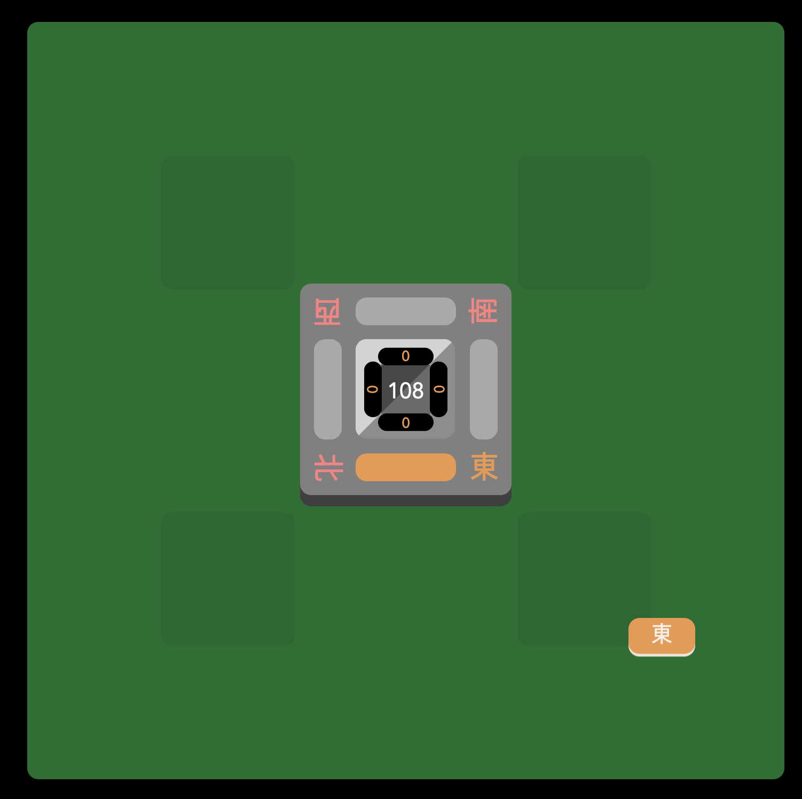

Note: this file is for the `majs` documentation. The `json` documentation is [here](./documentation_json.md).

# Table of contents

- [`ruleset.json` basic concepts](#rulesetjson-basic-concepts)
  + [The `set` command](#the-set-command)
  + [The `apply` command](#the-apply-command)
  + [The `on` command](#the-on-command)
  + [Conditions](#conditions)
  + [The `define_auto_button` command](#the-define-auto-button-command)
  + [The `define_button` command](#the-define-button-command)
  + [Interrupts](#interrupts)
  + [Conditions with arguments and complex conditions](#conditions-with-arguments-and-complex-conditions)
  + [The `define_yaku` command](#the-define-yaku-command)
  + [The `match` condition and match specifications](#the-match-condition-and-match-specifications)
  + [American hand match specifications](#american-hand-match-specifications)
  + [Marking](#marking)
  + [Tile attributes](#tile-attributes)
    * [Visual effects via attributes](#visual-effects-via-attributes)
  + [Tile aliasing, i.e. defining jokers](#tile-aliasing-ie-defining-jokers)
    * [Attributes and tile aliasing](#attributes-and-tile-aliasing)
- [`ruleset.json` full documentation](#rulesetjson-full-documentation)
  + [Actions](#actions)
  + [Conditions](#conditions-1)
  + [Tile specs](#tile-specs)
  + [Match targets](#match-targets)
  + [Scoring methods](#scoring-methods)
    * [`"scoring_method": "multiplier"`](#scoring_method-multiplier)
    * [`"scoring_method": "score_table"`](#scoring_method-score_table)
    * [`"scoring_method": "vietnamese"`](#scoring_method-vietnamese)
    * [`"scoring_method": "han_fu_formula"`](#scoring_method-han_fu_formula)
    * [`"scoring_method": ["han_fu_formula", "multiplier"]`](#scoring_method-han_fu_formula-multiplier)
    * [Other scoring-related keys](#other-scoring-related-keys)
  + [Payments](#payments)
    * [Payment-related keys](#payment-related-keys)
    * [Payment-related statuses](#payment-related-statuses)
  + [Calculating fu](#calculating-fu)
  + [Setting up next-round logic](#setting-up-next-round-logic)

# `ruleset.json` basic concepts

A ruleset is a `.majs` file consisting of a list of commands. Let's start with an empty file.
This creates the following game:

## The `set` command

To add a wall to the game, we'll introduce the `set` command, where we set the `"wall"` key to a list of tiles. For example:

    set wall, ["1m", "1m", "1m", "1m",
               "2m", "2m", "2m", "2m",
               "3m", "3m", "3m", "3m",
               "4m", "4m", "4m", "4m",
               "5m", "5m", "5m", "5m",
               "6m", "6m", "6m", "6m",
               "7m", "7m", "7m", "7m",
               "8m", "8m", "8m", "8m",
               "9m", "9m", "9m", "9m",
               "1p", "1p", "1p", "1p",
               "2p", "2p", "2p", "2p",
               "3p", "3p", "3p", "3p",
               "4p", "4p", "4p", "4p",
               "5p", "5p", "5p", "5p",
               "6p", "6p", "6p", "6p",
               "7p", "7p", "7p", "7p",
               "8p", "8p", "8p", "8p",
               "9p", "9p", "9p", "9p",
               "1s", "1s", "1s", "1s",
               "2s", "2s", "2s", "2s",
               "3s", "3s", "3s", "3s",
               "4s", "4s", "4s", "4s",
               "5s", "5s", "5s", "5s",
               "6s", "6s", "6s", "6s",
               "7s", "7s", "7s", "7s",
               "8s", "8s", "8s", "8s",
               "9s", "9s", "9s", "9s"]

This results in this game:

You can see that the 108 in the center corresponds to the 108 tiles we have just specified.

We'll also use `set` to set the key `"starting_tiles"`, which makes each player start with that many tiles from the wall:

    set starting_tiles, 13

https://github.com/user-attachments/assets/523253a2-ca78-40f0-b677-f4ad54530aa8

Because every player has drawn 13 tiles, that leaves 56 tiles in the wall. Note that there is no drawing from the wall quite yet.

Every key like `wall` and `starting_tiles` are called `top-level keys`, and these are the only keys you can set with `set`. These keys define the main moving parts of Riichi Advanced rulesets. A [full documentation](#rulesetjson-full-documentation) of the keys is below this concepts guide.

## The `apply` command

There is also the `apply` command which lets you modify a key instead of replacing it like with `set`. For example, if you wanted to add flowers to the wall, you might do:

    apply append, wall, ["1f", "2f", "3f", "4f", "1g", "2g", "3g", "4g"]

This will append the given tiles to the `wall` key. Besides `append`, there are many methods allowed as the method used for `apply`, they are:

  - `"set"`
  - `"add"`
  - `"prepend"`
  - `"append"`
  - `"subtract"`
  - `"multiply"`
  - `"merge"`
  - `"divide"`
  - `"modulo"`
  - plus any binary operator supported in the C math library, which are `atan2`, `copysign`, `drem`, `fdim`, `fmax`, `fmin`, `fmod`, `frexp`, `hypot`, `jn`, `ldexp`, `modf`, `nextafter`, `nexttoward`, `pow`, `remainder`, `scalb`, `scalbln`, `yn`.

## The `on` command

To make players draw from the wall, use the `on` command to add the following **event handler** to the ruleset:

    on after_turn_change do
      draw
    end

This results in the following game:

https://github.com/user-attachments/assets/d765d382-9d6a-4579-84e0-938ebe3efb03

The `after_turn_change` **event** is triggered after every turn change, as well as at the start of the game. Every event handler (like this one) is defined using `on`. You can have multiple `on` blocks for the same event; the actions within will be executed in the order of when they were added.

In addition, every event has an invisible **context**. Contexts determine how actions are evaluated, and at minimum must define a `seat` (the seat of the player that the actions act on). In other words, the player who `draw`s is the `seat` player, which is defined by `after_turn_change`. It happens that `after_turn_change` sets `seat` to the player whose turn it is after the turn change, so that player is the one who gets to draw.

A detailed list of all actions can be [found below](#actions), and there you might find that `draw` does have optional arguments -- for example, `draw(2)` draws two tiles. Without arguments, `draw` defaults to drawing one tile. Note the missing parentheses, which is purely stylistic: specifying `draw()` is the same as specifying `draw`.

## Conditions

Our ruleset above has one issue: once the draw gets to the end of the wall, the game will try to draw nonexistent tiles and crash. Instead we should check if there are draws left using the `no_tiles_remaining` **condition**, and end the game with an exhaustive draw via the `ryuukyoku` action.

Like in most languages, the `if` keyword is used to specify conditional branching. Here's our fixed event handler using `if`:

    on after_turn_change do
      if no_tiles_remaining do
        ryuukyoku
      end
      draw
    end

Now the game will end in an exhaustive draw when there are no more tiles. However, the second action `draw` will still fire, and crash the game. So we need to negatively condition `draw` on `no_tiles_remaining`. Any condition can be negated by prepending the string `"not_"` to it:

    on after_turn_change do
      if no_tiles_remaining do
        ryuukyoku
      end
      if not_no_tiles_remaining do
        draw
      end
    end

Instead of two checks for a condition and its negation, we can use an `else` branch:

    on after_turn_change do
      if no_tiles_remaining do
        ryuukyoku
      else
        draw
      end
    end

Note that whitespace is generally very flexible in `.majs`, so if you wanted you can stack everything on one line:

    on after_turn_change do if no_tiles_remaining do ryuukyoku else draw end end

## The `define_yaku` command

Defining yaku is as easy as:

    define_yaku yaku, "Haitei", 1, no_tiles_remaining and won_by_draw

In other words, `define_yaku` is a command that takes the following:

- the name of the **yaku list** to add the yaku to
- the name of the yaku (if you are awarded two yaku of the same name, their values are added together)
- the value of the yaku
- a condition: the game awards the yaku if the condition is satisfied for the winning player.
  + Here the condition is `no_tiles_remaining and won_by_draw`, which is a combination of two conditions.

The reason there are separate yaku lists is because of custom scoring, which is an advanced topic found at the bottom of this document. Riichi Advanced convention is to have only two yaku lists `yaku` and `yakuman`, but you can define as many as you want.

## The `define_auto_button` command

You might have noticed that players' hands are in dire need of sorting. To remedy this, we could call the `sort_hand` action after every turn change just like how we `draw` after every turn change.

But what if the player wants to manually sort their hand, and wants to turn off that behavior?

This is the main purpose of **auto buttons**, which are essentially action lists that fire every turn change if enabled. With auto buttons, players can control whether certain actions trigger on every turn. Here's the solution for hand sorting:

    define_auto_button auto_sort,
      display_name: "A",
      desc: "Automatically sort your hand.",
      enabled_at_start: true
      do
        sort_hand
      end

Here we define an auto button internally named `auto_sort` by defining some options and finally a `do` block specifying the actions it triggers on every turn. The internal name is important -- auto buttons are displayed in alphabetical order. All options are optional:

- `display_name` (text on the button) defaults to `"A"`,
- `desc` (hover text for the button) defaults to `""`,
- `enabled_at_start` defaults to `false`.

That's really all there is to auto buttons.

## The `define_button` command

Let's say you want the ability to call pairs -- if someone drops a tile and you have the same tile in hand, you get to interrupt the turn change and call it. To do so, you must define a **call button**. Just like how auto buttons are defined via `define_auto_button`, call buttons (and all other non-auto buttons) are defined via `define_button`

We will spend this section breaking down the following implementation.

    define_button pair,
      display_name: "Pair",
      show_when: not_our_turn
        and not_no_tiles_remaining
        and someone_else_just_discarded
        and call_available,
      call: [[0]]
      do
        call
        change_turn("self")
      end

https://github.com/user-attachments/assets/392652bc-1baf-413b-a616-16617211ff94

This defines a button with button text `"Pair"` which appears to the player once the `show_when` condition is satisfied. Then it runs the action list: `call` calls tiles based on the `call` key in the button, and `change_turn` changes turn to ourselves.

`"call": [[0]]` is a **call specification**. This one is pretty simplistic so it is hard to explain, but let's start with more interesting call specifications as examples and work backwards:

- chii: `[[-2, -1], [-1, 1], [1, 2]]`. Either two tiles left of the discard, two tiles with one on either side of the discard, or two tiles right of the discard.
- pon: `[[0, 0]]`. Only one possibility, which is two tiles matching the discard.
- pair: `[[0]]`. Only one possibility, which is one tile matching the discard.

Call buttons _must_ have `call_available` as part of one of the conditions in `show_when`. This condition ensures that the last discard matches the call specification. If you don't check that, and click the call button, the game will crash.

The problem with this implementation is that the button will never show up. This is because buttons are only checked during **interrupts**.

## Interrupts

By default, a game has only one **interrupt**: the start of the game. So buttons will be calculated only once by default. To remedy this, there are two methods to trigger interrupts during the course of the game:

- The first way is to run the `recalculate_buttons` action, but we rarely use this because
- the second way is to specify certain actions like `play_tile` or `draw` as **interruptible actions**. This means every time you draw, an interrupt is triggered. In general, an interrupt is triggered as soon as an interruptible action finishes executing.

To add an interruptible action, you must set `interruptible_actions` as an array:

    set interruptible_actions, ["play_tile", "draw", "advance_turn"]

Here the internal `play_tile` action is made interruptible, and so after every `play_tile` action, the game will check the `show_when` button condition for each button to see if it should appear.

Even if an action, like `"draw"`, is made interruptible by inclusion in `interruptible_actions`, one can specify the action name `"uninterruptible_draw"` instead of `"draw"` to have the engine run `draw` without generating an interrupt. This is useful because every interrupt requires recalculating all buttons for all players, and sometimes you don't need or want that.

## Conditions with arguments and complex conditions

The buttons defined by `define_button` do not need to be call buttons. Call buttons are simply buttons that specify the `call` option: buttons in general only need `display_name`, `show_when`, and the final `do` block of actions.

Here's an example: a riichi button.

    define_button riichi,
      display_name: "Riichi",
      show_when: our turn
        and has_draw
        and status_missing("riichi")
        and has_score(1000)
        and next_draw_possible
        and has_no_call_named("chii", "pon", "daiminkan", "kakan")
        and match(["hand", "calls", "draw"], ["tenpai_14", "kokushi_tenpai"])
      do
        big_text("Riichi")
        set_status("riichi", "just_reached")
        push_message("declared riichi")
        if status("discards_empty") and no_calls_yet do
          set_status("double_riichi")
        end
      end

Note that like actions, conditions can also take parameters.

This concludes the overview of basic concepts in Riichi Advanced rulesets. Note that for the riichi button, the last condition in `show_when` is a `match` condition, and it is used extensively in Riichi Advanced:

- to check for tenpai, like here
- to check which yaku to award
- and to check for the existence of tiles in any zone in general.

It is also the most complex condition by far, so it gets its own explainer section below. It is not a basic concept so feel free to skip it and proceed to the [full documentation](#rulesetjson-full-documentation).

## The `match` condition and match specifications

    match(["hand", "calls", "draw"], ["tenpai_14", "kokushi_tenpai"])

`match` is a condition with two arguments. The first is a list of **targets** to match against, here `["hand", "calls", "draw"]`. A list of all match targets can be found in [its own section below](#match-targets). The second is an array of **match specifications**, here `["tenpai_14", "kokushi_tenpai"]`. The idea is, if your hand, calls, and drawn tile matches `tenpai_14` or `kokushi_tenpai`, then you get to riichi.

`tenpai_14` or `kokushi_tenpai` must be defined, and that is done through `define_match`:

    define_match tenpai_14,
      ~m"""
      exhaustive, (shuntsu koutsu):3, (ryanmen/penchan kanchan pair):1, pair:1
      | exhaustive, (shuntsu koutsu):4 
      | (nojoker quad):-1, koutsu:-1, pair:6
      """
    
    define_match kokushi_tenpai,
      ~m"""
      unique, (1m 9m 1p 9p 1s 9s 1z 2z 3z 4z 5z 6z 7z):12, (1m 9m 1p 9p 1s 9s 1z 2z 3z 4z 5z 6z 7z):1
      """

These are are **named match specifications**, basically names for `~m""` strings which are **match specifications**. So the array `["tenpai_14", "kokushi_tenpai"]` is equivalent to writing the following combined match specification:

    
    match(["hand", "calls", "draw"],
      ~m"""
      exhaustive, (shuntsu koutsu):3, (ryanmen/penchan kanchan pair):1, pair:1
      | exhaustive, (shuntsu koutsu):4
      | (nojoker quad):-1, koutsu:-1, pair:6
      | unique, (1m 9m 1p 9p 1s 9s 1z 2z 3z 4z 5z 6z 7z):12, (1m 9m 1p 9p 1s 9s 1z 2z 3z 4z 5z 6z 7z):1
      """
    )

Let's go over these match specifications line by line and see how `match` matches against your 14-tile hand as defined by `["hand", "calls", "draw"]`.

    exhaustive, (shuntsu koutsu):3, (ryanmen/penchan kanchan pair):1, pair:1

Skipping the `exhaustive` keyword for now, the intuition of this one is that it takes a pair out of your 14-tile hand, leaving a 12-tile hand. Then it takes one of either `ryanmen/penchan, kanchan, pair` out of the 12-tile hand, leaving a 10-tile hand. Finally, it takes out _three_ of either `shuntsu, koutsu` out of the remainder. So far we've consumed 13 tiles, so this implicitly leaves one tile, which is ignored. The `exhaustive` keyword at the beginning means this entire process exhaustively tries every single possibility of taking out these three different **groups**, instead of just taking the first one it sees for each group. The match succeeds if it was able to find each group. Here, it means 13 of the 14 tiles in your hand match a standard hand with a ryanmen/penchan/kanchan/pair wait, making you tenpai.

Things like `pair`, `ryanmen/penchan`, etc are **sets** defined by `define_set`, whose usage looks like this:

    define_set pair, ~s"0 0"
    define_set shuntsu, ~s"0 1 2"
    define_set koutsu, ~s"0 0 0"
    define_set quad, ~s"0 0 0 0"
    define_set "ryanmen/penchan", ~s"0 1"
    define_set kanchan, ~s"0 2"
    define_set iipeikou, ~s"0 0 1 1 2 2"
    ...

Basically sets are `~s""` strings containing offsets; `~s"0 0"` defines a pair, for example. I think that is mostly self-explanatory. Let's move onto the next match definition.

    exhaustive, (shuntsu koutsu):4

This does the same thing as above, except it just takes four `shuntsu` or `koutsu` out of your hand immediately. If it's able to do that then you are clearly tenpai with a single tile wait.

    (nojoker quad):-1, koutsu:-2, pair:6

This is the seven pairs check. Although you can check for six pairs via the simpler match definition `pair:6`, we need to filter out the two cases where you have six pairs but are not tenpai for seven pairs (i.e. you have a duplicate pair, or two triplets). We do this with **negative counts**, which specifies a negative match for a group. Basically, if we're able to take out a `quad` from the hand (indicating two identical pairs), then the match fails. Also if the hand includes two `koutsu`, there's no way to discard one of the two unpaired tiles and wait on a unique pair, so that also fails to match. Otherwise, it proceeds to take six pairs out of the hand, and if it can, then the match succeeds and you are tenpai for seven pairs.

Note also the `nojoker` keyword in the first group. This specifies that the group ignores the abilities of joker tiles (explained later) -- if you have a joker pair that matches an existing pair, we'll consider it as a distinct pair.

Last match definition:

    unique, (1m 9m 1p 9p 1s 9s 1z 2z 3z 4z 5z 6z 7z):12, (1m 9m 1p 9p 1s 9s 1z 2z 3z 4z 5z 6z 7z):1

This is the kokushi check and introduces the `unique` flag. `unique` is useful when you want to ensure that each item specified in the group `1m 9m 1p 9p 1s 9s 1z 2z 3z 4z 5z 6z 7z` is taken _at most once_ over the course of taking out twelve of them. This check removes 12 unique terminal/honors plus one more, and if it can do that, the match succeeds and you are tenpai for kokushi.

Here is the full list of allowed items in a group:

- keywords
  + `ignore_suit` specifies that every item after it ignores the suit of tiles it checks for
  + `nojoker` specifies that every item after it cannot use jokers
  + `unique` specifies that every item in this group is taken at most once (if the group is to be taken >1 times)
- Tiles like `1m` and `9p`
- `any`, to represent any tile
- Sets of tiles/offsets like `[1m, 2m, 3m]` or `[0, 1, 2]`

Offsets are one of the following:

- Integers like `[0, 1, 2]`, representing "some tile" together with the two in sequence after that tile. Although negative integers technically work, it's not really useful (since you can always shift each integer so that the least offset is `0`).
- Exact tiles like `1m` and `9p` and `any`
- Fixed offsets like `1A` and `2B`. The set `[1A, 2B, 3C]` represents any 1 tile of some suit, a 2 tile of another suit, and a 3 tile of a third suit. You may also specify `DA`, `DB`, `DC` as well (where red dragon is manzu suit, green dragon is souzu suit, and white dragon is pinzu suit) -- this is mostly used internally to match on American mahjong hands see [section below](#american-hand-match-specifications).

Finally, here is the list of all keywords (each match definition is a combination of groups and keywords):

- `almost`: if this is anywhere in a match definition, then it specifies "this match definition minus any one tile"
- `american`: defines an american match specification [(see below)](#american-hand-match-specifications).
- `exhaustive`: by default groups are removed by taking away the first match, but any group after the `exhaustive` keyword will store all possible removals. This is rather expensive, so only use this if you need it.
- `dismantle_calls`: by default when a group matches a call, even partially, the whole call is removed. This prevents two groups from matching one call, which is desirable in most situations. To disable this, any group after the `dismantle_calls` keyword will instead remove the matching tiles from the matching call. For instance, the match definition `[exhaustive, dismantle_calls, [[[0, 1]], 1]]` matching on the existing call `3m 4m 5m` will leave you with two versions of the call (`3m` and `5m`) after the `[[[0, 1]], 1]` group is matched.
- `restart`: whenever the match definition encounters `restart` it resets its current state to the initial hand and calls.
- `ignore_suit`, `nojoker`, `unique`: applies these keywords to all groups after the keyword.

Note that `restart` is the only keyword that can be specified multiple times in a match definition.

## American hand match specifications

American hands are a special case since they're so specific. They can be implemented using the above syntax, but there is a shorthand specifically for these kinds of hands (which are then translated to the above syntax behind-the-scenes).

An American match specification is a `~m""` string . An example is `~m"american, FF 2024a 2222b 2222c"`. The idea is that after `american` we have space-separated groups where the individual characters represent the following:

- `F`: any flower
- `D`: any dragon
- `W`: any wind
- `N`,`E`,`W`,`S`: north/east/west/south wind
- `R`,`G`,`0`: red/green/white dragon
- `1` to `9`: a number tile
- `X`: a variable number tile

`X` groups must be suffixed with a number. For instance, `"XXXXX0a XX1a XXXXX2a"` matches a quint of some number, a pair of that number + 1, and a quint of that number + 2.

The `a` at the end is a suit specifier, required for groups consisting of `1` to `9`, `D`, and/or `X`. The three suit specifiers are `a`, `b`, `c`. For example, `"2024a 2222b 2222c"` matches 2024 of one suit (0 is white dragon), 2222 or another suit, and 2222 of a third suit.

In addition, you may specify a group with alternatives (OR) using `|`. For example, `RR|GG` matches a pair of red dragons OR a pair of green dragons. Since spaces are used to separate groups, make sure not to put spaces around the `|`.

See `rulesets/american.json` for more examples.

## Marking

Riichi Advanced has a mechanism that allows for marking arbitrary tiles for use in another action. The most notable use of this is to implement charleston passes, where a player marks three tiles to pass. The Sakicards variant makes heavy use of marking in order to implement tile swaps and discard pile interactions and other shennanigans.

To trigger a mark action, simply run the action `mark(mark_spec)` where `mark_spec` is a list of items where each item is in the following format:

    [target, number, restrictions]

Examples:

- `mark([["hand", 3, ["self", "not_joker"]]])`: Mark 3 tiles in your own hand (that are not jokers).
- `mark([["hand", 1, ["terminal_honor"]], ["discard", 1, ["last_discard"]]])`: Mark a terminal/honor in hand and the last discard.
- `mark([["hand", 1, ["match_suit", "not_riichi"]], ["discard", 1, ["match_suit"]]])`: Mark one tile in your own hand, then mark one tile in your discards. Once you mark one tile, the other tile must match the suit of the marked tile. In addition, the tile in hand can only be your drawn tile, if you are in riichi.

The mark action only prompts the user to mark tiles -- it doesn't do anything with them. Once all tiles are marked, the remaining actions are triggered, and there are certain actions that interact with the marked tiles. These five are the most important:

- `move_tiles(src, dst)`: Move tiles from `src` to `dst`.
- `swap_tiles(src, dst)`: Swap tiles between `src` and `dst`.
- `copy_tiles(src, dst)`: Copy tiles from `src` to `dst`.
- `delete_tiles(src)`: Delete every instance of the given tiles in `src` from the current player's hand/draw.
- `clear_marking`: Exit marking mode. This is required after you're done with moving around marked tiles, since marking mode essentially pauses the game.

There are a number of ad-hoc actions that also interact with the marked tiles, but they are not meant to be used beyond Sakicards (since they are very specific actions, and the plan is to replace them in the future). For example:

- `flip_marked_discard_facedown`. Flips marked discard tiles facedown. This exits marking mode.

You can reference these actions in the full actions list below.

## Tile attributes

Tile attributes are basically statuses for individual tiles. Here's how you add the `"revealed"` attribute to all manzu tiles in a player's hand, draw, and tiles set aside:

- `add_attr(["hand", "draw", "aside"], ["revealed"], ["manzu"])`

In general, you can write:

- `add_attr([target1, ...], [attr1, ...], [tile_spec1...])`

This adds all of the given `attr`s to all the given `target`s. You can further filter the targets with the optional third argument, an array of `tile_spec`s. There are only four supported `target`s right now:

- `"hand"`: the current player's hand.
- `"draw"`: the current player's draw.
- `"aside"`: the current player's tiles set aside.
- `"last_discard"`: the last discard.

As for available `tile_spec`s, [see the relevant section](#tilespecs).

There are a couple more actions that add and remove attributes in a specific way, but the goal is to eventually turn them all into `"add_attr"` and `"remove_attr"` targets. (`"remove_attr"` does not yet exist, but for now there is `"remove_attr_hand"` and `"remove_attr_all"`.)

You can add any string as an attribute.

Anywhere where you specify tiles (e.g. wall or match definition), you have a couple ways to specify tiles with attributes:

- `"1m"`: tile without attributes.
- `["1m", ["myattr"]]`: tile with attributes (does not work in match definitions, since arrays have meaning)
- `{"tile": "1m", "attrs": ["myattr"]}`: tile with attributes (works in match definitions)
- `{"tile": "any", "attrs": ["myattr"]}`: any tile with the given attribute (only for match definitions)

If you make `match` try to look for a tile with a given attributes, it will only match tiles that 1) match in base tile and 2) have at least the given attributes. So `{"tile": "any", "attrs": ["myattr"]}` can be used to match any tile with the `"myattr"` attribute.

### Visual effects via attributes

There are a couple of visual effects you can give to a tile by giving it attributes:

- `"dora"`: Use an alternate 'shiny' graphic for the tile. Works for any tile.
- `"facedown"`: Flips the tile facedown. Once this tile is discarded, it will not be visible to other players. If a facedown tile is in hand, the player who owns the tile can hover over it to see the faceup version.
- `"hidden"`: Removes the tile from sight completely -- no gap is left in place.
- `"inactive"`: Darkens the tile, e.g. tiles you can't discard after declaring riichi.
- `"revealed"`: Makes the tile visible to other players and in ukeire calculations.
- `"sideways"`: Flips the tile sideways.
- `"transparent"`: Makes the tile look transparent. This transparency is visible to other players, but the identity of the tile is still hidden (it will just look like a transparent blank tile). Combine this with `"revealed"` to get Washizu tiles.

For custom akadora (transparent tiles whose names are prefixed with `4`, see [tiles.md](tiles.md#akaaokintransparent)) the following attributes define the color of the tile:

- `"_red"`: same as akadora
- `"_blue"`: same as aodora
- `"_cyan"`: same as galaxy tiles
- `"_gold"`: same as kindora
- `"_orange"`
- `"_yellow"`
- `"_green"`
- `"_purple"`
- `"_gray"` or `"_grey"`
- `"_lightgray"` or `"_lightgrey"`
- `"_brown"`
- `"_black"`
- `"_white"`

## Tile aliasing, i.e. defining jokers

To make `"3s"` an almighty joker tile that can represent any tile, simply run the following action:

- `set_tile_alias_all(["3s"], ["any"])`

In general, `set_tile_alias_all([from], [to])` essentially means to the matching engine "whenever you look for the tile `to`, you can take the 'joker' `from` instead". So it is a unidirectional alias -- it doesn't go the other way (can't remove `to` when looking for the 'joker' `from`.

Note that the two arguments are arrays, which means

- `set_tile_alias_all(["3m", "3p", "3s"], ["7m", "7p", "7s"])`

tells the matching engine "whenever you look for a seven, you may take any three instead".

There is also `set_tile_alias([from], [to])`, which only sets the aliasing/joker relationship for the current player, meaning only the current player can use the specified `from` tiles as the specified jokers.

### Attributes and tile aliasing

You may also use tiles with attributes in either `from` or `to` when setting tile aliases. Here's an example from the galaxy ruleset.

- `set_tile_alias_all(["11z"], [["1z", "original"], "2z", "3z", "4z"])`

A galaxy east wind `"11z"` can be used as any wind `"1z","2z","3z","4z"`, but there are scoring implications for when the galaxy tile is used as its original tile (here, the east wind `"1z"`). Thus whenever `"11z"` maps to `"1z"`, we want to give it an attribute `"original"`, so we can later score based on how many `"original"` tiles exist in hand.

The problem with adding an attribute merely for scoring purposes is that attributes are tied to the match engine, and so we have the unfortunate situation where `"11z"` doesn't map to `"1z"`, making `["1z", "11z"]` not a valid pair to the matching engine. You can avoid this by prefixing your attribute with `"_"`, which renders the attribute invisible to tile comparisons. Note that `"_original"` and `"original"` are considered the same attribute otherwise -- the attribute is still there and match specifications can check for that attribute, it's just ignored when comparing two tiles.

---

# `ruleset.json` full documentation

Here are all the toplevel keys. Every key is optional.

Events:

- `after_call`: Triggers at the end of any call. Context: `seat` is the caller's seat, `caller` is the caller's seat, `callee` is the seat called from, and `call` contains call information.
- `after_charleston`: Triggers after a round of `charleston_*` actions is triggered.
- `after_discard_passed`: Triggered by the `check_discard_passed` action but only if the last discard had passed.
- `after_draw`: Triggers at the end of any draw. Context: `seat` is the drawing player's seat.
- `after_initialization`: Triggers at setup after the game begins (after `before_start`). Useful for writing rules text via `"add_rule"`. Note that for new games, player messages might not have loaded yet, so running `push_message` actions here will have no effect.
- `after_saki_start`: Triggers after all players have drafted their saki cards in the sakicards gamemode. This is only here because I hardcoded this interaction and may remove it in the future. Context: `seat` is the current seat (so, east).
- `after_scoring`: Triggers after payouts are calculated but before they are shown and applied, which happens once per winner or exhaustive/abortive draw.
- `after_start`: Triggers at the start of each round, which is after the initial turn change to east. (i.e. runs after`after_turn_change`). Context: `seat` is the current seat (so, east). Note that for new games, player messages might not have loaded yet, so running `push_message` actions here will have no effect.
- `after_turn_change`: Triggers at the end of each turn change. Context: `seat` is the seat whose turn it is after the turn change.
- `after_win`: Triggers at the end of a win, after yaku is calculated, but before the yaku screen is shown.
- `before_abortive_draw`: Triggers before an abortive draw is called. Context: `seat` is the seat whose turn it is at the time of the abortive draw.
- `before_call`: Triggers at the start of any call. Context: `seat` is the caller's seat, `caller` is the caller's seat, `callee` is the seat called from, and `call` contains call information.
- `before_conclusion`: Triggers at the end of a game (right before the end scores are shown).
- `before_continue`: Triggers before the game continues, after someone wins in a bloody end game.
- `before_exhaustive_draw`: Triggers before an exhaustive draw is called. Context: `seat` is the seat whose turn it is at the time of the exhaustive draw.
- `before_scoring`: Triggers right before a win is called, before yaku is calculated. Same as `before_win`, but happens after the joker solver is run (if applicable).
- `before_start`: Triggers before a new round begins. This is useful to influence whether the game should continue or not (e.g. for tobi calculations).
- `before_turn_change`: Triggers at the start of each turn change. Context: `seat` is the seat whose turn it is before the turn change.
- `before_win`: Triggers right before a win is called, before yaku is calculated. Context: `seat` is the seat who called the win.
- `on_no_valid_tiles`: Triggers on someone's turn (after `after_turn_change`) if they cannot discard any tiles.
- `play_effects`: This is not actually an event like the others. Instead it is a list of action lists triggered on discards, where each action list is conditioned on the identity of the tile being discarded. Context: `seat` is the seat who played a tile, and `tile` is the played tile.

Here is the basic event lifecycle for each round:

- `before_start`
- `before_turn_change` (to east)
- `after_turn_change` (to east)
- `after_start`
- `after_initialization` (once per game)
- (game starts, button calculations / interrupts are now active)
- (either a draw or a winner is declared)
- On a win:
  + `before_win`
  + `before_scoring`
  + `after_win`
  + `after_scoring`
  + `before_continue` (if bloody end rules are enabled)
- On a draw (or after 3 players win in bloody end rules):
  + `before_exhaustive_draw`/`before_abortive_draw`
  + `after_scoring`
- Then one of these is run:
  - `before_continue` (if bloody end rules are enabled, and 3 players have not won yet)
  - `before_start` (otherwise, unless the game is over)
  - `before_conclusion` (if the game is over)

Buttons:

- `auto_buttons`: List of auto buttons, described above
- `buttons`: List of buttons, described above

Mods:

- `available_mods`: List of available mods
- `default_mods`: List of mods enabled by default

Rules:

- `agariyame`: If true, the game ends if the dealer wins the final round.
- `bloody_end`: If true, the game ends after three players win, not after one player wins.
- `display_honba`: Whether to show number of honba in the middle
- `display_riichi_sticks`: Whether to show number of riichi sticks in the middle
- `display_wall`: Whether to show the "Show wall" button on the bottom right. (Check the riichi ruleset for an example.)
- `dora_indicators`: Defines what tile dora indicators indicate
- `enable_saki_cards`: Set to `true` to enable saki power stuff (may remove this key in the future)
- `initial_score`: Starting score
- `interruptible_actions`: List of actions that can be interrupted by buttons
- `interrupt_levels`: Interrupt levels for each action. See the [interrupt levels section in the json documentation](./documentation_json.md#interrupt-levels).
- `max_revealed_tiles`: Number of tiles to show at the top at all times
- `max_rounds`: Number of rounds before the game ends
- `persistent_statuses`: Names of statuses that should persist between rounds.
- `persistent_counters`: Names of counters that should persist between rounds.
- `play_restrictions`: List of two-element arrays detailing a **play restriction**. The first element is an array of tiles that the restriction applies to. The second element is a condition -- if the condition is true, the player cannot play that tile.
- `reserved_tiles`: List of tiles reserved from the end of the wall
- `revealed_tiles`: List of reserved tiles revealed at the start of the game
- `set_definitions`: List of definitions for sets used in match definitions, described above
- `shown_statuses`: List of statuses to show (private to the player)
- `starting_tiles`: Number of tiles every player starts with every round
- `tenpaiyame`: If true, the game ends if the dealer is tenpai at exhaustive draw in the final round.
- `wall`: The list of tiles used in the game. [Here are all the tiles available in the tileset currently.](tiles.md)

Yaku and scoring:

- `score_calculation`: Scoring method. See the [scoring method section](#scoring-methods).
- `yaku_precedence`: An object specifying which yaku gets overridden by other yaku.

Saki:

- `saki_deck`: Deck of saki cards.
- `saki_ver`: The saki card spritesheet to use, either "v12" or "v13".

Other:

- `custom_style`: an object containing any or all of the following keys:
  + `tile_indices`: Small number or letter displayed for a given tile when tile indices are enabled (123 button at bottom).
  + `tile_back_color`: Color of tile back.
  + `tile_side_back_color`: Color of tile back on the side of tiles.
  + `tablecloth_color`: Color of the tablecloth.

Colors are specified as CSS color strings like `"#808080"` or `"lightblue"`. Example `custom_style`:

    "custom_style": {
      "tile_indices": {"5z": ""},
      "tile_back_color": "#aaa",
      "tile_side_back_color": "#777",
      "tablecloth_color": "#e8b"
    }

## Actions

- `noop`: does nothing, but you can put it in `interruptible_actions` to make it an interrupt.
- `push_message(message, vars)`: Sends a message to all players using the current player as a label. Example: `push_message("declared riichi")`. You may specify numbers (actual numbers or counter names) or strings to interpolate into the message with `vars`. Example: `push_message("is on their $nth repeat", %{n: "honba"})`.
- `push_system_message(message, vars)`: Sends a message to all players, with no label. Example: `push_system_message("Converted each shuugi to 2000 points.")`
- `add_rule(tab, title, text, sort_order)`: Adds the string `text` to the corresponding rules `tab` on the left. Keep it brief! `title` is a required string identifier that is also used for deleting this rule later -- you can also specify an existing identifier to append a `text` to that rule (on its own line). `sort_order` is an optional integer argument that defaults to `0` -- the rules on the rules list are sorted from lowest `sort_order` to highest. Rules with negative `sort_order` are displayed full-width while other rules are half-width.
- `update_rule(tab, title, text, sort_order)`: Same as `"add_rule"`, but only appends `text` (does nothing if the rule `title` does not exist).
- `delete_rule(tab, title)`: Deletes the rule text identified by `title`.
- `add_rule_tab(tab)`: Adds an empty rule tab. Useful if you want to predefine the order of rule tabs, since rule tabs are ordered by when they are generated. Rule tabs without any rules are not shown.
- `run(fn_name, {"arg1": "value1", ...})`: Call the given function with the given arguments. A function is essentially a named list of actions. Functions are defined in the toplevel `"functions"` key -- see `riichi.json` for examples. Within a function you may write variables preceded with a dollar sign -- like `$arg1` -- and the value will be replaced with the corresponding `value1` in the (optional) given object. Functions can be called recursively, but this is rarely done, and therefore there is an arbitrary call stack limit of 10 calls.
- `draw(num, tile)`: Draw `num` tiles. If `tile` is specified, it draws that tile instead of from the wall. Instead of a tile for `tile` you may instead write `"opposite_end"` to draw from the opposite end of the wall (i.e. the dead wall, if one exists)
- `call`: For call buttons only, like pon. Triggers the call.
- `self_call`: For self call buttons only, like ankan. Triggers the self call.
- `upgrade_call`: For upgrade call buttons only, like kakan. Triggers the upgrade call.
- `flower(flower1, flower2, ...)`: Declare a flower, with `flower1`, etc as the choices.
- `draft_saki_card(num)`: Draw a saki card out of `num` choices.
- `reverse_turn_order`: Reverses the turn order.
- `advance_turn`: Goes forward in turn order.
- `change_turn(seat)`: Change turn to the specified seat. Allowed values of `seat` are: `"east"`, `"south"`, `"west"`, `"north"`, `"shimocha"`, `"toimen"`, `"kamicha"`, `"self"`
- `win_by_discard`: Declares a win using the last discard as the winning tile.
- `win_by_call`: Declares a win using the last called tile as the winning tile.
- `win_by_draw`: Declares a win using the first drawn tile as the winning tile.
- `ryuukyoku(name)`: Declares an exhaustive draw. `name` is optional, but if provided it will override the default name.
- `abortive_draw(name)`: Declares an abortive draw by the given `name`.
- `set_status(status1, status2, ...)`: Add to the set of statuses for the current player.
- `unset_status(status1, status2, ...)`: Remove from the set of statuses for the current player.
- `set_status_all(status1, status2, ...)`: Add to the set of statuses for all players.
- `unset_status_all(status1, status2, ...)`: Remove from the set of statuses for all players.
- `set_counter(counter_name, amount or spec, ...opts)`: Set the current player's counter `counter_name` to the given `amount`, which is either a number or one of the following strings followed by some options:
  + the name of an existing counter
  + `"count_matches", to_match, [match_spec1, match_spec2, ...]`: Counts the number of times the given `match_spec`s matches `to_match`, and adds that to the counter. The syntax for these options is the same as the options for the `match` condition, which is described in the [match condition section](#the-match-condition-and-match-specifications).
  + `"count_matching_ways", to_match, [match_spec1, match_spec2, ...]`: When `to_match` describes multiple sets of tiles (e.g. `hand_any` describes multiple single-tile hands, one for each tile in hand) then `"count_matching_ways"` counts how many of these hands match at least one of the given match specs. Used in Sakicards for Ueshige Suzu's ability, in order to count how many hand tiles match aside tiles.
  + `"tiles_in_wall"`: Gives the number of tiles remaining in the wall.
  + `"num_discards"`: Gives the number of discards made by the current player (includes called tiles).
  + `"num_aside"`: Gives the number of aside tiles for the current player.
  + `"num_facedown_tiles"`: Gives the number of facedown tiles in the current player's pond.
  + `"num_facedown_tiles_others"`: Gives the number of facedown tiles in other players' ponds.
  + `"num_matching_revealed_tiles_all", tile_spec1, tile_spec2, ...`: Looks at the every player's hand and counts the number of tiles they have revealed matching the given `tile_spec`s.
  + `"num_matching_melded_tiles_all", tile_spec1, tile_spec2, ...`: Looks at the every player's visible calls and counts the number of those tiles matching the given `tile_spec`s.
  + `"half_score"`: Half of the current player's score, rounded up.
  + `"count_draws", seat`: The number of draws the given `seat` has.
  + `"count_dora", dora_indicator`: Counts the number of dora in the current player's hand and calls, given the `dora_indicator`. This uses the toplevel `"dora_indicators"` key to determine the mapping of dora indicator to dora.
  + `"count_reverse_dora", dora_indicator`: Counts the number of reverse dora in the current player's hand and calls, given the `dora_indicator`. This uses the toplevel `"reverse_dora_indicators"` key to determine the mapping of dora indicator to reverse dora.
  + `"pot"`: The number of points in the pot.
  + `"honba"`: The number of honba (repeats) for the current round.
  + `"minipoints", action1, action2, ...`: Only usable during or after `before_win`. Calculates minipoints for the winning hand using the following actions. See [Calculating fu](#calculating-fu) for how the actions are specified.
- `set_counter_all(counter_name, amount or spec, ...opts)`: Same as `set_counter`, but calculates the amount once and sets every player's `counter_name`. Right now this is the only way to pass counters between players.
- `add_counter(counter_name, amount or spec, ...opts)`: Same as `set_counter`, but adds to the existing counter instead. For nonexistent counters this is the same as `set_counter` since nonexistent counters are considered to be at zero.
- `subtract_counter(counter_name, amount or spec, ...opts)`: Same as `add_counter`, but subtracts.
- `multiply_counter(counter_name, amount or spec, ...opts)`: Same as `add_counter`, but multiplies.
- `divide_counter(counter_name, amount or spec, ...opts)`: Same as `add_counter`, but divides. The resulting counter is floored to get an integer.
- `big_text(text, vars)`: Popup big text for the current player. The text displayed is `text`. If you want to interpolate numbers or strings into the text you may specify it much like you do for `push_message`: `big_text("$ctr/$max", %{ctr: "my_counter", max: 100})`
- `pause(ms)`: Pause for `ms` milliseconds. Useful after a `big_text` to make actions happen only after players see the big text.
- `sort_hand`: Sort the current player's hand.
- `reveal_tile(tile)`: Show a given tile above the game for the remainder of the round.
- `add_score(amount, recipients)`: Add to the score for the current player, or for the `recipients` if specified. Allowed values for `recipients` are: `"shimocha"`, `"toimen"`, `"kamicha"`, `"self"`, `"last_discarder"`, `"all"`, `"others"`
- `subtract_score(amount, recipients)`: Same as `add_score`, but subtracts it.
- `put_down_riichi_stick(num)`: Makes the current player put down a riichi stick, or `num` riichi sticks if specified. Adds the value of a riichi stick to the pot, but does not change the player's score (use `"subtract_score"` for that).
- `add_honba(num)`: Adds the given number of honba. (default 1)
- `reveal_hand`: Shows the current player's hand to everyone for the remainder of the round.
- `reveal_other_hands`: Same as `"reveal_hand"` but for everyone except the current player.
- `discard_draw`: Discards the current player's draw. Useful as an auto button.
- `press_button(button_id)`: Press a given button by id, does nothing if the button doesn't exist. Useful for auto buttons.
- `press_first_call_button(button_id)`: Press the first call button visible after pressing `button_id`. Does nothing if the options displayed are for another `button_id`. Useful for auto buttons.
- `when(cond, actions)`: If `cond` evaluates to true, run the given actions.
- `unless(cond, actions)`: If `cond` evaluates to false, run the given actions.
- `ite(cond, actions1, actions2)`: If `cond` evaluates to true, run `actions1`, otherwise run `actions2`.
- `as(seats_spec, actions)`: Sets the `seat` to the given `seats_spec` and runs the actions. If you specify multiple seats, it will run the given actions multiple times (once for each seat). Allowed `seats_spec` values:
  + `"east"`, `"south"`, `"west"`, `"north"`: Selects that seat.
  + `"self"`, `"shimocha"`, `"toimen"`, `"kamicha"`: Selects the seat relative to the current seat.
  + `"prev_seat"`: Selects the seat that is currently running this `"as"` action.
  + `"last_discarder"`: Selects the last seat that discarded.
  + `"caller"`: Selects the caller, the player receiving the called tile (usable in call buttons only).
  + `"callee"`: Selects the callee, the player giving the called tile (usable in call buttons only).
  + `"all"`, `"everyone"`: Selects every seat.
  + `"others"`: Selects every seat except the current seat.
  + `"chii_victims"`: Selects all players for which the current seat has chiis from. (This is implemented and used solely in Sakicards, specifically for Maya Yukiko's second ability)
  + You can also prepend `not_`, like `"not_east"`, to get the complement of the specified set of seats.
- `when_anyone(cond, actions)`: For each player, if `cond` evaluates to true for that player, run the given actions for that player. (This changes `seat` in the context.)
- `when_everyone(cond, actions)`: If `cond` evaluates to true for every player, run the given actions for the current player. (This does not change `seat` in the context.)
- `when_others(cond, actions)`: If `cond` evaluates to true for every player except the current player, run the given actions for the current player. (This does not change `seat` in the context.)
- `mark(mark_spec, pre_mark_actions, post_mark_actions)`: First runs the optional `pre_mark_actions` before asking the player to mark a tile. Like `"call"`, this happens before any of the actions in the current action list, so it doesn't matter where you put the mark action. For examples of `mark_spec` look at example usages in the `saki.json` ruleset. The optional `post_mark_actions` are run immediately after mark, though admittedly there is little use for this since you can just write actions that occur after marking.
- `move_tiles(src, dst)`: Moves tiles from `src` to `dst`. Both `src` and `dst` can be either a string, like `"hand"`, or an object specifying additional restrictions, like `{"hand": ["marked"]}`. In general it's `{target1: [restrictions], target2: [restrictions], ...}` for both `src` and `dst`. You may supply multiple `src` targets, but only one `dst` target.
  + Here are all the possible values for `target`:
    * `"hand"`: Selects your entire hand, including the draw.
    * `"draw"`: Selects your draw only.
    * `"aside"`: Selects your aside tiles.
    * `"calls"`: Selects every call you've called (not flowers).
    * `"discard"`: Selects all of your discards.
    * `"revealed_tile"`: Selects all revealed tiles (e.g. dora indicators). (Cannot be used for `dst`.)
    * `"scry"`: Selects all scryed tiles. (Cannot be used for `dst`.)
  + Here are the possible values for `restrictions`:
    * `"marked"`: Filters for only marked tiles.
    * `"1m"`, `"2p"`, etc: Filters for that specific tile.
    * In general, any restriction usable in `play_restrictions` is available for use.
- `swap_tiles(src, dst)`: Same as `"move_tiles"` except `src` and `dst` get swapped. You may use `"revealed_tile"` and `"scry"` for `dst`, as well as multiple `dst` targets. They will be matched one-to-one in order when swapping: for example, if you select (for `src`) A,B,C from hand, and (for `dst`) D from draw and E,F from aside, then A swaps with D, B swaps with E, and C swaps with F. If the two sides are imbalanced, the excess will go to the first target on the opposite side; for example, if you select (for `src`) A,B,C from hand, and (for `dst`) D from draw, then after A swaps with D, it will move B,C to the draw as well.
- `swap_out_fly_joker(joker)`: Before running this action, you need to mark a tile in hand as well as any call containing the given `joker` tile (e.g. `"1j"`). This swaps the tile in hand with the joker inside the call, as is done in the American and Malaysian variants.
- `extend_live_wall_with_marked`: Add all marked hand tiles to the end of the live wall. Must be preceded by a `"mark"` action that marks a hand tile.
- `extend_dead_wall_with_marked`: Add all marked hand tiles to the end of the dead wall. Must be preceded by a `"mark"` action that marks a hand tile.
- `pon_marked_discard`: Calls pon on the marked discard. Must be preceded by a `"mark"` action that marks a discard.
- `flip_marked_discard_facedown`: Flips the first marked discard upside down. Must be preceded by a `"mark"` action that marks a discard.
- `clear_marking`: Clears a marking action. All of the above marking actions do this automatically, except for `move_tiles` and `swap_tiles`. If you run `move_tiles` and `swap_tiles` for marked tiles, make sure to run this action to clear the marking.
- `set_tile_alias(from, to)`: Assigns all tiles in `from` to tiles in `to` for the current player. Basically if `from` is a single tile, then that tile becomes a joker whose possible values are the tiles in `to`, and this only applies to the current player.
- `set_tile_alias_all(from, to)`: Same, but applies this assignment to all players.
- `clear_tile_aliases`: Clears all joker assignments for the current player.
- `set_tile_ordering([tile1, tile2, ...])`: Asserts that `tile1` comes after `tile2` and so on. Applies only to the current player.
- `set_tile_ordering_all([tile1, tile2, ...])`: Same, but applies this assertion to all players.
- `save_tile_behavior(label)`: Saves all joker assignments and tile orderings under the name `label` for the current player, which defaults to `"default"` when not supplied.
- `load_tile_behavior(label)`: Loads all joker assignments and tile orderings under the name `label` for the current player, which defaults to `"default"` when not supplied.
- `add_attr([target1, ...], [attr1, ...], [tile_spec1...])`: Add the given attributes to the given targets that match all given tile specs.
- `add_attr_first_tile(tile, [attr1, ...])`: Add the given attributes to the first instance of the given tile in hand.
- `add_attr_tagged(tag, [attr1, ...])`: Add the given attributes to all instances of the tagged tiles. (includes wall)
- `remove_attr_hand(attr1, attr2, ...)`: Remove the given attributes from all tiles in the current player's hand.
- `remove_attr_all(attr1, attr2, ...)`: Remove the given attributes from all tiles owned by the current player (hand, draw, aside, but not calls)
- `remove_attr_tagged(tag, [attr1, ...])`: Remove the given attributes from all instances of the tagged tiles. (includes wall)
- `tag_tiles(tag_name, tiles)`: Globally tag the given tile(s) with the given tag name.
- `tag_drawn_tile(tag_name)`: Globally tag the current player's drawn tile with the given tag name.
- `tag_last_discard(tag_name)`: Globally tag the current player's last discard with the given tag name.
- `tag_dora(tag_name, dora_indicator)`: Globally tag the dora indicated by the given dora_indicator tile, using the toplevel `"dora_indicators"` key as reference.
- `untag(tag_name)`: Untag all tiles tagged with the given tag name.
- `convert_last_discard(tile)`: Turn the last discard into the given tile.
- `flip_all_calls_faceup`: Flip all draws faceup. Mostly used to flip all concealed kongs faceup for variants that hide them.
- `draw_from_aside`: Draw a tile from the tiles set aside. This action will be removed in the future in favor of `"move_tiles"`.
- `charleston_left`: Select and pass three tiles left. Must be preceded by a `"mark"` action that marks 3 hand tiles.
- `charleston_across`: Select and pass three tiles across. Must be preceded by a `"mark"` action that marks 3 hand tiles.
- `charleston_right`: Select and pass three tiles right. Must be preceded by a `"mark"` action that marks 3 hand tiles.
- `shift_tile_to_dead_wall(num)`: Add `num` tiles to the dead wall from the live wall. (The haitei tile becomes a dead wall tile.)
- `recalculate_buttons`: Buttons are recalculated at the start of a round as well as before every interruptible action defined in the `"interruptible_actions"` toplevel key. This action is an alternative way to recalculate buttons. Note that buttons are simultaneously calculated for everyone.
- `draw_last_discard`: Draw your last discard. This action will be removed in the future in favor of `"move_tiles"`.
- `scry(num)`: Reveal the next `num` tiles in wall to the current player. This will show up as a line of tiles above your hand.
- `scry_all(num)`: Reveal the next `num` tiles in wall to all players. This will also print a message to the room describing what is happening.
- `clear_scry`: Hide the tiles revealed by `"scry"`.
- `choose_yaku`: Bring up a UI that allows you to select a subset of every yaku in the current ruleset. This is used in conjunction with the conditions `"has_declared_yaku_with_hand"` etc. to ensure that the current player has their selected yaku. This action is used in Sakicards for Shimizudani Ryuuka's third ability.
- `disable_saki_card(seat_spec)`: Disable all sakicards for the given seat.
- `enable_saki_card(seat_spec)`: Enable all sakicards for the given seat.
- `save_revealed_tiles`: Save the current state of the revealed tiles (e.g. dora indicators).
- `load_revealed_tiles`: Load the previously saved state of the revealed tiles (e.g. dora indicators).
- `merge_draw`: Move the draw into the hand. This action will be removed in the future in favor of `"move_tiles"`.
- `pass_draws(seat_spec, num)`: Move up to `num` tiles from the current player's draw to the given seat's draw. This action will be removed in the future in favor of `"move_tiles"`.
- `saki_start`: Prints some messages about what cards each player chose, and triggers the `after_saki_start` event.
- `modify_winner(key, value, method)`: Only available in `"after_win"`, which runs on every win. Replaces the one of the following possible properties of the current winner after their points have been calculated. Example: `modify_winner("score_name", "Mangan")`. This will only affect the win screen; to modify the final payouts, see the next action `"modify_payout"`.
  + Allowed values for `key` are:
    * `key = "score"`: Final score, displayed at the bottom of the win screen.
    * `key = "points"`: Points (e.g. han)
    * `key = "points2"`: Secondary points (e.g. yakuman multiplier), see the [scoring methods](#scoring-methods) section
    * `key = "minipoints"`: Minipoints (e.g. fu)
    * The following are also modifiable:
    * `key = "score_name"`: name for score (e.g. "Mangan")
    * `key = "point_name"`: name for points (e.g. "Han")
    * `key = "point2_name"`: name for points (e.g. "")
    * `key = "minipoint_name"`: name for minipoints (e.g. "Fu")
    * `key = "score_denomination"`: name prepended to score
    * `key = "winning_tile_text"`: text shown above the winning tile
  The optional `method` argument specifies a modification other than replacing the value. Allowed methods are:
  + For all values (default):
    * `method = "set"`
  + For numeric values (`"score"`, `"points"`, `"points2"`, `"minipoints"`):
    * `method = "add"`
    * `method = "subtract"`
    * `method = "multiply"`
    * `method = "divide"`
    * `method = "min"`
    * `method = "max"`
  + For string values (everything else):
    * `method = "prepend"`
    * `method = "append"`
- `modify_payout(seat, amount, method)`: Only available in `"after_scoring"`, which runs once per winner, or one time after an exhaustive or abortive draw. This action directly modifies the payouts incurred in the scoring phase by adding `amount` to `seat`'s final payout. For example, to have dealer pay everyone 1000, you might do `modify_payout("east", -3000); modify_payout("not_east", 1000)]`.
  + Available values for `seat`: everything usable by the `"as"` action is usable here. In particular, you might want to use `"others"` when `"won_by_draw"` is true, and `"last_discarder"` otherwise.
  + Available values for `amount`: every amount usable by the `"set_counter"` action is usable here.
  + Available values for `method`: See the above action, `"modify_winner"`. Defaults to `"add"`.
- `set_scoring_header(header)`: Sets the top banner of the score exchange screen to the given string `header`.

Every unrecognized action is a no-op.

## Conditions

Prepend `"not_"` to any of the condition names to negate it.

- `true`: Always true.
- `false`: Always false.
- `our_turn`: The current turn is ours.
- `our_turn_is_next`: The next turn is ours.
- `our_turn_is_prev`: The previous turn is ours.
- `game_start`: No actions have been performed.
- `no_discards_yet`: No discard actions have been performed.
- `no_calls_yet`: No call actions have been performed.
- `last_call_is(call_button_id)`: The last call, if any, was performed by the given call button id.
- `kamicha_discarded`: The last action, if any, was kamicha discarding.
- `toimen_discarded`: The last action, if any, was toimen discarding.
- `shimocha_discarded`: The last action, if any, was shimocha discarding.
- `anyone_just_discarded`: The last action, if any, was a discard.
- `someone_else_just_discarded`: The last action, if any, was someone else discarding.
- `just_discarded`: The last action, if any, was us discarding.
- `anyone_just_called`: The last action, if any, was a call.
- `someone_else_just_called`: The last action, if any, was someone else calling.
- `just_called`: The last action, if any, was us calling.
- `just_self_called`: The last action, if any, was us calling a `self_call`.
- `call_available`: For call buttons only. The specified call is available.
- `self_call_available`: For self call buttons only. The specified self call is available.
- `can_upgrade_call`: For upgrade call buttons only. The specified upgrade call is available.
- `has_draw`: The current player has drawn a tile.
- `has_aside`: The current player has set aside a tile.
- `has_calls`: The current player has called tiles.
- `has_call_named(call1, call2, ...)`: The current player has one of the specified calls. Example: `has_call_named("chii", "pon", "daiminkan", "kakan")`
- `has_no_call_named(call1, call2, ...)`: The current player has none of the specified calls. Example: `has_no_call_named("chii", "pon", "daiminkan", "kakan")`
- `won`: A player just won.
- `won_by_call`: The winner won by stealing a called tile.
- `won_by_draw`: The winner won by drawing the winning tile.
- `won_by_discard`: The winner won by stealing the discard tile.
- `minipoints_equals(fu)`: The winning player has the given amount of minipoints.
- `has_yaku_with_hand(han)`: Using the current player's draw as the winning tile, the current player's hand scores at least `han` points using the yaku in `.score_calculation.yaku_lists`. Example: `has_yaku_with_hand(1)`
- `has_yaku_with_discard(han)`: Using the last discard as the winning tile, the current player's hand scores at least `han` points using the yaku in `.score_calculation.yaku_lists`. Example: `has_yaku_with_discard(1)`
- `has_yaku_with_call(han)`: Using the last called tile as the winning tile, the current player's hand scores at least `han` points using the yaku in `.score_calculation.yaku_lists`. Example: `has_yaku_with_call(1)`
- `has_yaku2_with_hand(han)`: Using the current player's draw as the winning tile, the current player's hand scores at least `han` points using the yaku in `.score_calculation.yaku2_lists`. Example: `has_yaku_with_hand(1)`
- `has_yaku2_with_discard(han)`: Using the last discard as the winning tile, the current player's hand scores at least `han` points using the yaku in `.score_calculation.yaku2_lists`. Example: `has_yaku_with_discard(1)`
- `has_yaku2_with_call(han)`: Using the last called tile as the winning tile, the current player's hand scores at least `han` points using the yaku in `.score_calculation.yaku2_lists`. Example: `has_yaku_with_call(1)`
- `tiles_match([tile1, tile2, ...], [tile_spec1, tile_spec2, ...])`: The provided tiles all match any of the given tile specs. See the [tile specs section](#tile-specs) for details.
- `last_discard_matches(tile_spec1, tile_spec2, ...)`: The last discard matches one of the given tile specs. See the [tile specs section](#tile-specs) for details.
- `last_called_tile_matches(tile_spec1, tile_spec2, ...)`: The last called tile matches one of the given tile specs. See the [tile specs section](#tile-specs) for details.
- `needed_for_hand(match_spec1, match_spec2, ...)`: Only used when a tile is in context, e.g. in `play_restrictions`. The context's tile is needed for the current player's hand to match one of the given match specifications.
- `is_drawn_tile: Only used when a tile is in context, e.g. in `play_restrictions`. The context's tile is a drawn tile.
- `status(status1, status2, ...)`: The current player has all of the specified statuses.
- `status_missing(status1, status2, ...)`: The current player is missing all of the specified statuses.
- `discarder_status(status1, status2, ...)`: The last discarder has all of the specified statuses.
- `shimocha_status(status1, status2, ...)`: Shimocha has all of the specified statuses.
- `toimen_status(status1, status2, ...)`: Toimen has all of the specified statuses.
- `kamicha_status(status1, status2, ...)`: Kamicha has all of the specified statuses.
- `others_status(status1, status2, ...)`: Someone else has all of the specified statuses.
- `anyone_status(status1, status2, ...)`: Anyone has all of the specified statuses.
- `everyone_status(status1, status2, ...)`: Everyone has all of the specified statuses.
- `buttons_include(button1, button2, ...)`: All of the specified buttons are showing for the current player.
- `buttons_exclude(button1, button2, ...)`: None of the specified buttons are showing for the current player.
- `tile_drawn(tile1, tile2, ...)`: All of the given reserved tiles have been drawn.
- `tile_not_drawn(tile1, tile2, ...)`: None of the given reserved tiles have been drawn.
- `tile_revealed(tile1, tile2, ...)`: All of the given reserved tiles have been revealed above.
- `tile_not_revealed(tile1, tile2, ...)`: None of the given reserved tiles have been revealed above.
- `no_tiles_remaining`: No tiles remain in the wall.
- `tiles_remaining(num)`: At least `num` tiles remain in the wall.
- `next_draw_possible`: The player whose turn it is has at least one draw remaining (after their current draw).
- `has_score(score)`: The current player has at least `score` score.
- `has_score_below(score)`: The current player has less than `score` score.
- `round_wind_is(direction)`: The current round wind is the specified direction, one of `"east"`, `"south"`, `"west"`, `"north"`.
- `seat_is(direction)`: The current player's seat wind is the specified direction, one of `"east"`, `"south"`, `"west"`, `"north"`.
- `winning_dora_count(dora_indicator, num)`: The current player has `num` dora tiles of the given dora indicator.
- `match(to_match, [match_spec1, match_spec2, ...])`: See the [section on match specifications](#the-match-condition-and-match-specifications) to see how this condition works.
- `winning_hand_consists_of(tile1, tile2, ...)`: The winning hand (including winning tile) contains only the given tiles (jokers allowed).
- `winning_hand_not_tile_consists_of(tile1, tile2, ...)`: The winning hand (excluding winning tile) contains only the given tiles (jokers allowed).
- `all_saki_cards_drafted`: Everyone has at least one saki card.
- `has_existing_yaku(yaku1, yaku2, ...)`: Used in `meta_yaku` only. The winner has scored all of the given yaku.
- `has_no_yaku`: Used in `meta_yaku` only. The winner has scored no yaku.
- `placement`: The current player has the given placement (1-4).
- `last_discard_matches_existing`: The last discarded tile matches one of the current player's existing discards (includes called discards) (uses jokers).
- `called_tile_matches_any_discard`: The last called tile matches one of anybody's existing discards (excludes called discards) (uses jokers).
- `last_discard_exists`: The last discarded tile was not taken by another player.
- `call_would_change_waits(match_spec1, match_spec2, ...)`: For call buttons' `show_when` key only. The given call would change the waits of the current player, where a winning hand is defined by the given match definitions.
- `call_changes_waits(match_spec1, match_spec2, ...)`: For call buttons' `call_conditions` key only. The given call changes the waits of the current player, where a winning hand is defined by the given match definitions.
- `wait_count_at_least(num, [match_spec1, match_spec2, ...])`: The number of tiles the current player is waiting on is at least `num`, where a winning hand is defined by the given match definitions.
- `wait_count_at_most(num, [match_spec1, match_spec2, ...])`: The number of tiles the current player is waiting on is at most `num`, where a winning hand is defined by the given match definitions.
- `call_contains([tile1, tile2, ...], num)`: For call buttons only. The call contains at least `num` of any of the given tiles.
- `called_tile_contains([tile1, tile2, ...], num)`: For call buttons only. The called tile contains at least `num` of any of the given tiles. (only num=1 is valid)
- `call_choice_contains([tile1, tile2, ...], num)`: For call buttons only. The tiles used to call contains at least `num` of any of the given tiles.
- `tag_exists(tag1, tag2, ...)`: All of the given tags exist.
- `tagged(tile, tag_name)`: The given tile is tagged with the given `tag_name`. Valid values for `tile` are: `"last_discard"`, `"tile"`, where the last one uses the tile in context (and therefore is only valid in places like `play_restrictions`)
- `has_hell_wait(match_spec1, match_spec2, ...)`: The current player is waiting on a single out, where a winning hand is defined by the given match definitions.
- `third_row_discard`: The current player has at least 12 tiles in their pond.
- `tiles_in_hand(num)`: The current player has `num` tiles in hand.
- `anyone(cond1, cond2, ...)`: Anyone satisfies the given conditions.
- `counter_equals(counter_name, amount)`: The counter `counter_name` equals `amount`.
- `counter_at_least(counter_name, amount)`: The counter `counter_name` is at least `amount`.
- `counter_at_most(counter_name, amount)`: The counter `counter_name` is at most `amount`.
- `counter_more_than(counter_name, amount)`: The counter `counter_name` is more than `amount`.
- `counter_less_than(counter_name, amount)`: The counter `counter_name` is less than `amount`.
- `has_attr(tile, attr1, attr2)`: The given tile is has the given attributes `attr1`, `attr2`, etc. Valid values for `tile` are: `"last_discard"`, `"tile"`, where the last one uses the tile in context (and therefore is only valid in places like `play_restrictions`)
- `hand_tile_count(count1, count2, ...)`: The current player has one of `count1`, `count2`, etc. tiles in hand (counts hand+draw, ignores calls and aside tiles)
- `genbutsu_kamicha`: The last discard was genbutsu against kamicha.
- `genbutsu_toimen`: The last discard was genbutsu against toimen.
- `genbutsu_shimocha`: The last discard was genbutsu against shimocha.
- `can_discard_after_call`: Used in `"call_conditions"`, checks if you are able to discard a tile immediately after calling. Right now this only works for regular calls (i.e. not upgrade calls).

## Tile specs

- `"any"`: Matches any tile.
- `"1z"`, `"3m"`, etc: Matches that exact tile.
- `"same"`: Matches the same tile. Only used in `play_restrictions` for the `last_discard_matches` or `last_called_tile_matches` conditions.
- `"not_same"`: Matches a different tile. Only used in `play_restrictions` for the `last_discard_matches` or `last_called_tile_matches` conditions.
- `"manzu"`: Matches a manzu tile (hardcoded).
- `"pinzu"`: Matches a pinzu tile (hardcoded).
- `"souzu"`: Matches a souzu tile (hardcoded).
- `"jihai"`: Matches a honor tile (hardcoded).
- `"dragon"`: Matches a dragon tile (hardcoded).
- `"wind"`: Matches a wind tile (hardcoded).
- `"terminal"`: Matches a terminal tile (hardcoded).
- `"yaochuuhai"`: Matches a terminal/honor tile (hardcoded).
- `"flower"`: Matches a flower tile (hardcoded).
- `"joker"`: Matches a joker tile (hardcoded).
- `"1"` to `"9"`: Matches that number tile (hardcoded).
- `"tedashi"`: Matches a discard that was tedashi (discarded from hand).
- `"tsumogiri"`: Matches a discard that was tsumogiri (discarded from draw).
- `"dora"`: Matches dora (as indicated by visible dora indicators and the `"dora_indicators"` map).
- `"kuikae"`: Matches a tile that is kuikae to the last call. Only used in `play_restrictions`.

You can also prepend `"not_"` to any of these to get the inverse specification.

## Match targets

There's quite a few possible match targets that can be passed as the first argument to `"match"`, and here they are.

- `"hand"`: selects the player's hand (not draw).
- `"draw"`: selects the player's draw.
- `"pond"`: selects the player's visible pond (not called tiles).
- `"discards"`: selects the player's discards, including called discards.
- `"aside"`: selects the player's tiles set aside.
- `"calls"`: selects the player's calls (not flowers). Calls are treated as a single unit that can only be matched against once.
- `"flowers"`: selects the player's flowers (including starting flowers and pei).
- `"start_flowers"`: selects the player's starting flowers only.
- `"jokers"`: selects the player's jokers set aside (including starting jokers). 
- `"start_jokers"`: selects the player's starting jokers set aside only.
- `"call_tiles"`: selects the player's calls as if their tiles were part of the hand (therefore their tiles can be combined with tiles in hand).
- `"assigned_hand"`: selects the player's hand + draw, but with jokers replaced with their actual value. Only usable after or during the `after_win` event. Does not include the winning tile.
- `"assigned_calls"`: selects the player's calls but with jokers replaced with their actual value. Only usable after or during the `after_win` event. 
- `"winning_hand"`: selects the winning hand + call tiles + winning tile. Only usable during or after `"before_win"`. If used in `"before_win"`, you get the winning hand with jokers, but if used during or after `"before_scoring"`, then those jokers get replaced by actual values.
- `"winning_tile"`: selects the winning tile. Only usable during or after `"before_win"`. Note that if the winning tile is a joker tile, it will remain a joker tile when checked in `"before_win"`, but will be replaced by its actual value during `"before_scoring"` and after.
- `"last_call"`: selects the last call made by any player.
- `"last_called_tile"`: selects the called tile for the last call made by any player.
- `"last_discard"`: selects the last discard made by any player.
- `"second_last_visible_discard"`: selects the second last visible discard made by any player. This exists because of the Sakicard Hirose Sumire's ability to ron the second last visible discard.
- `"self_last_discard"`: selects the last discard made by the current player.
- `"shimocha_last_discard"`: selects the last discard made by the player right of the current player.
- `"toimen_last_discard"`: selects the last discard made by the player across the current player.
- `"kamicha_last_discard"`: selects the last discard made by the player left of the current player.
- `"shimocha_calls"`: selects selects the calls made by the player right of the current player.
- `"toimen_calls"`: selects selects the calls made by the player across the current player.
- `"kamicha_calls"`: selects selects the calls made by the player left of the current player.
- `"called_tile"`: selects the tiles called (only valid if the context contains `"called_tile"`, like in call button actions). For flower calls, this is empty.
- `"call_choice"`: selects the tiles called with (only valid if the context contains `"call_choice"`, like in call button actions). For flower calls, this is the flower.
- `"tile"`: selects the current tile (only valid if the context contains `"tile"`, like in `"play_effects"`).
- `"all_ponds"`: selects every player's pond. (basically treats this as a big hand to match on)
- `"all_calls"`: selects every player's calls.
- `"all_call_tiles"`: selects every player's call's tiles. (basically treats this as a big hand to match on)
- `"revealed_tiles"`: selects revealed tiles, i.e. the tiles that appear on top of the game (like dora indicators)
- `"visible_tiles"`: selects all tiles visible to the current player. (basically treats this as a big hand to match on) This includes visible tiles in other players' hands (e.g. when Open Hands is on).
- `"scry"`: selects scryed tiles visible to the current player. See the `"scry"` action for more info.

In addition, a couple selectors allow you to select _multiple_ targets. For example, selecting `["hand_any", "last discard"]` and matching on pairs will check if any individual hand tile matches the last discard, and will not match a pair that exists purely in hand. Note that using two or more of these leads to the cartesian product of the targets, which can be expensive to match against.

- `"aside_unique"`: selects each player's aside tile individually.
- `"all_last_discards"`: selects the last discard for each player.
- `"any_discard"`: selects each of the current player's discarded tiles individually (includes called discards).
- `"others_discards"`: selects each player's discarded tile individually (includes called discards), excluding the current player's pond.
- `"any_visible_tile"`: selects each tile visible to the current player individually.
- `"hand_any"`: selects each tile in hand individually. Does not include the draw.
- `"hand_draw_nonjoker_any"`: selects each tile in hand and draw individually, excluding jokers.
- `"self_joker_meld_tiles"`: selects one nonjoker tile from own exposed calls containing a joker. (Used in malaysian mahjong)
- `"anyone_joker_meld_tiles"`: selects one nonjoker tile from each exposed call containing a joker. (Used in american mahjong)

## Scoring methods

Scoring refers to the exchange of points after a win or a draw. To enable scoring, the `"score_calculation"` key must exist and must contain an array under a `"yaku_lists"` key:
  
    set score_calculation, {
      "scoring_method": "multiplier",
      "yaku_lists": ["yaku"]
    }

The idea is that each of the yaku in the toplevel `"yaku"` array will be processed and their point total added up to get the value `points`. You can also specify a second array key `"yaku2_lists"` which is the same thing but gives the value `points2`. For example, in the Riichi ruleset, `points` are Han and `points2` represents the number of stacked yakuman.

The following are optional string keys that are in place for each of the strings in the scoring screen in the Riichi ruleset.
  
    set score_calculation, {
      "point_name": "Han",
      "point2_name": "",
      "minipoint_name": "Fu",
      "win_by_discard_label": "Ron",
      "win_by_draw_label": "Tsumo",
      "win_by_discard_name": "Ron",
      "win_by_discard_name_2": "Double Ron",
      "win_by_discard_name_3": "Triple Ron",
      "win_by_draw_name": "Tsumo",
      "win_with_pao_name": "Sekinin Barai",
      "triple_win_draw_name": "Sanchahou",
      "exhaustive_draw_name": "Ryuukyoku",
      // secondary points to display to the right of points
      // can be "points", "points2", or "minipoints"
      "right_display": "minipoints",
      "score_denomination": ""
    }

In addition, to calculate the actual score from `points`/`points2`, the `"score_calculation"` key must exist and be associated with an object with a `"scoring_method"` key. Scoring will be performed based on this `"scoring_method"` key.

Here are the currently supported options for `"scoring_method"`:

### `"scoring_method": "multiplier"`

The idea is that you multiply `points` by some number (can be less than 1) to get the final score. For example, in Malaysian mahjong, score is fan times 20, so you would put:
  
    set score_calculation, {
      "scoring_method": "multiplier",
      "score_multiplier": 20,
    }

If there is a `"dealer_multiplier"` key and the winner is the dealer, then this score is multiplied by that.

You can also set `"score_multiplier": "points2"` to let `yaku2` act as multipliers. In other words, `yaku` will be summed and then multiplied with the product of `yaku2`. See `ningbo.json`.

### `"scoring_method": "score_table"`

Here, `points` is used as a (string) index into a points table, whose keys must be strings per the JSON schema. For example, in Hong Kong Old Style, the score doubles every Fan, and doubles every two Fan after 4 Fan, so you would put:

    set score_calculation, {
      "scoring_method": "score_table",
      "score_table": {"0": 1, "1": 2, "2": 4, "3": 8, "4": 16, "5": 24, "6": 32, "7": 48, "8": 64, "9": 96, "10": 128, "11": 192, "12": 256, max: 384},
    }

If there is a `"dealer_multiplier"` key and the winner is the dealer, then this score is multiplied by that.

### `"scoring_method": "vietnamese"`

In Vietnamese mahjong, certain yaku award Phn and certain yaku award Mn. We represent Phn with `points1` and Mn with `points2`, so this scoring method requires a `"yaku2_lists"` key.

Every 6 Phn is worth one Mn, and each Mn represents a multiplier on the 6 Phn score.

All you need to specify is the score value of 0-6 Phn in the same manner as the `"score_table"` method:

    "score_table": {"0": 0.5, "1": 1, "2": 2, "3": 4, "4": 8, "5": 16, max: 32},

`"max"` must be present here, as it is the value used for the `Mn` multiplier.

If there is a `"dealer_multiplier"` key and the winner is the dealer, then this score is multiplied by that.

### `"scoring_method": "han_fu_formula"`

This is the riichi scoring method.

First of all, this mode calculates fu for the hand and stores it in a variable `minipoints`. If there is interest in having options like `"closed_triplet_fu: 100"` I'd be down to support it, but unfortunately this calculation is completely hardcoded for now.

Then the score is calculated as follows:

    han_fu_multiplier * minipoints * 2^(2 + points)

where the `"han_fu_multiplier"` key defaults to `4`. If there is a `"dealer_multiplier"` key and the winner is the dealer, then this score is multiplied by that.

To get the final score, this score is rounded up to the nearest `"han_fu_rounding_factor"`, which defaults to `100`.

Then it checks for limit hands, defined by the following three keys, which for Riichi are set to:

    "limit_thresholds": [
      [3, 70], [4, 40], [5, 0],
      [6, 0],
      [8, 0],
      [11, 0],
      [13, 0]
    ],
    "limit_scores": [
      8000, 8000, 8000,
      12000,
      16000,
      24000,
      32000
    ],
    "limit_names": [
      "Mangan", "Mangan", "Mangan",
      "Haneman",
      "Baiman",
      "Sanbaiman",
      "Kazoe Yakuman"
    ],

The idea is that it checks `[points, minipoints]` against the latest value in `"limit_thresholds"`, and if any of them match, the score is replaced by the corresponding `"limit_score"` and given the corresponding `"limit_name"`.

There are a few more keys for configuring han-fu calculations.

First, if you want to make fu a fixed value (perhaps for testing) then you may specify

    apply append, score_calculation, {
      "fixed_fu": 30
    }

Second, recall the han-fu formula:

    han_fu_multiplier * minipoints * 2^(2 + points)

The 2 added to `points` is configurable using the `"han_fu_starting_han"` key, which defaults to 2. Classical Chinese mahjong doesn't add 2, so you would configure this via

    apply append, score_calculation, {
      "han_fu_starting_han": 0
    }

### `"scoring_method": ["han_fu_formula", "multiplier"]`

This is the actual value of `"scoring_method"` used for riichi. The idea for a two-value array value for `"scoring_method"` is that we use `"han_fu_formula"` for `points` and `"multiplier"` for `points2`, and add the resulting scores. For riichi, this means using `"han_fu_formula"` to calculate the standard Han score, and `"multiplier"` for yakuman hands.

Riichi also specifies the key `"yaku2_overrides_yaku1": true`, which means if any yaku contribute to `points2`, then we ignore all yaku that contribute to `points`.

### Other scoring-related keys

All of the keys described below are optional.

After score is calculated, there are two keys that can cap the score to a minimum and maximum: `max_score` and `min_score`. For example:

    apply append, score_calculation, {
      "min_score": 1,
      "max_score": 500
    }

For three-player variants, a win by self-draw typically pays less than a win by discard. For example, a dealer mangan tsumo in riichi is worth 12000 (4000 per player), but is worth only 8000 in three player due to tsumo loss. You can disable tsumo loss by setting the following:

    apply append, score_calculation, {
      "tsumo_loss": false
    }

This will take the 'lost' portion of the payment and split it equally between the two paying players.

Other allowed values for `"tsumo_loss"` beyond `true` and `false` are:

- `"add_1000"`: A flat 1000 is added to each player's payment.
- `"unequal_split"`: When a nondealer wins, the missing payment is split so that the dealer still pays roughly double the payment for the other nondealer.
- `"north_split"`: This is the same behavior as `false`.
- `"equal_split"`: The missing payment is split so that both players pay the same amount.
- `"north_to_oya"`: The missing payment is paid by the dealer.
- `"double_collection"`: Both players pay the full amount including the missing payment, which effectively doubles the payment.
- `"ron_loss"`: Tsumo loss is on, but the loss is also applied to ron as well.

If triple ron should be treated as an abortive draw, set:

    apply append, score_calculation, {
      "triple_ron_draw": true
    }

In American mahjong, the hands are typically arranged using the definition of the hand on the card. To enable this, set:

    apply append, score_calculation, {
      "arrange_american_yaku": true
    }

If you want to only keep the highest-scoring yaku (for both `yaku` and `yaku2`), breaking ties arbitrarily, then set:

    apply append, score_calculation, {
      "highest_scoring_yaku_only": true
    }

## Payments

All of the above is to calculate the basic score of a hand, displayed when the hand wins. How are payouts calculated?

In event of a win-by-discard, the discarder pays the score multiplied by `"discarder_multiplier"`, which defaults to `1`. Non-discarders pay the score multiplied by `"non_discarder_multiplier"`, which defaults to `0`.

Otherwise, the win is by self-draw. Then every player pays the winner the score multiplied by `"self_draw_multiplier"`, which defaults to `1`. If the dealer is paying or being paid, their payment is multiplied by `"dealer_self_draw_multiplier"`, which defaults to `1`.

You may also have optional keys `"discarder_penalty"`, `"non_discarder_penalty"`, `"self_draw_penalty"` which add a fixed amount to their respective payments (after the multiplication). For example, in MCR all players pay the winner 8 points regardless of the score, so all of these would be set to `8`.

If there is a `"split_oya_ko_payment"` key set to `true`, then self-draw wins are processed differently. Specifically, it splits the score X into Y=X/4 (if winner is non-dealer) or Y=X/3 (if the winner is dealer). The dealer is paid 2Y points rounded up to the nearest `"han_fu_rounding_factor"`, and all non-dealers are paid Y points rounded up to the nearest `"han_fu_rounding_factor"`.

There are typically no payments at exhaustive draw, but you can enable sichuan-style tenpai payments via:

    apply append, score_calculation, {
      "score_best_hand_at_draw": true
    }

This scores every tenpai player's hand (where players with the `"tenpai"` status are considered tenpai) and awards them the highest possible hand they could have won, so payments proceed as if they won.

### Payment-related keys

To set the value of riichi sticks and honba counters respectively, set:

    apply append, score_calculation, {
      "riichi_value": 5000,
      "honba_value": 500
    }

`"riichi_value"` otherwise defaults to 1000 and `"honba_value"` to 0.

The following key determines the behavior of pao (activated by the `make_responsible_for` action):

    apply append, score_calculation, {
      "split_pao_ron": true,
    }

`"split_pao_ron"` is true if ron payments are to be split in half (the deal-in player pays half, and the pao player pays half plus honba). In the extremely rare case that one player deals into another player's yakuman and the two other players should pay pao, the ron payment is split three ways.

### Payment-related statuses

There are a number of statuses you can set on players that can modify their scoring, and most of them are due to Sakicard abilities. The eventual goal is to replace most of them with the following two counters:

- `"delta_score"`: if set, adds to this counter's player's score change for this round (after processing all other score changes, such as double wins and exhaustive draw payments).
- `"delta_score_multiplier"`: if set, multiplies this counter's player's score change for this round (after processing all other score changes, such as double wins and exhaustive draw payments). This happens before `"delta_score"`.
- `"score_as_dealer"`: if set, this player's payments are calculated as if they are the dealer.

## Calculating fu

If you want to calculate fu (minipoints), then you need to set the `fu` counter any time before or during `before_scoring`, or else it will default to 0 fu. To do so, run the following action:

    set_counter("fu", "minipoints") do
      action1,
      action2,
      ...
    ]

Fu calculation is done by a series of manipulations described by the action list above. The following is essentially how base riichi does it:

    # add a bunch of attributes
    add_attr(["hand", "calls", "winning_tile"], ["_terminal"], ["terminal"])
    add_attr(["hand", "calls", "winning_tile"], ["_tanyao"], ["tanyaohai"])
    add_attr(["hand", "calls", "winning_tile"], ["_yaochuu"], ["yaochuuhai"])
    if round_wind_is("east") do add_attr(["hand", "calls", "winning_tile"], ["_prevalent"], ["1z"]) end
    if round_wind_is("south") do add_attr(["hand", "calls", "winning_tile"], ["_prevalent"], ["2z"]) end
    if round_wind_is("west") do add_attr(["hand", "calls", "winning_tile"], ["_prevalent"], ["3z"]) end
    if round_wind_is("north") do add_attr(["hand", "calls", "winning_tile"], ["_prevalent"], ["4z"]) end
    if seat_is("east") do add_attr(["hand", "calls", "winning_tile"], ["_seat"], ["1z"]) end
    if seat_is("south") do add_attr(["hand", "calls", "winning_tile"], ["_seat"], ["2z"]) end
    if seat_is("west") do add_attr(["hand", "calls", "winning_tile"], ["_seat"], ["3z"]) end
    if seat_is("north") do add_attr(["hand", "calls", "winning_tile"], ["_seat"], ["4z"]) end
    add_attr(["winning_tile"], ["_winning_tile"])
    if won_by_draw do
      add_attr(["winning_tile"], ["_tsumo"])
    else
      add_attr(["winning_tile"], ["_ron"])
    end
    # actually calculate fu now
    set_counter("fu", "minipoints") do
      # score calls
      convert_calls(%{pon: 2})
      remove_tanyaohai_calls
      convert_calls(%{pon: 2})
      remove_calls
    
      # now remove the winning group
      remove_winning_groups([
        # kanchan
        %{groups: ~s"-1 0@winning_tile 1", value: 2},
        # penchan
        %{groups: ~s"0@winning_tile -1@tanyao -2@terminal", value: 2},
        %{groups: ~s"0@winning_tile 1@tanyao 2@terminal", value: 2},
        # ryanmen
        %{groups: ~s"0@winning_tile -1@tanyao -2@tanyao"},
        %{groups: ~s"0@winning_tile 1@tanyao 2@tanyao"},
        # shanpon
        %{groups: ~s"0@tanyao 0@tanyao 0@winning_tile&ron", value: 2},
        %{groups: ~s"0@yaochuu 0@yaochuu 0@winning_tile&ron", value: 4},
        %{groups: ~s"0@tanyao 0@tanyao 0@winning_tile&tsumo", value: 4},
        %{groups: ~s"0@yaochuu 0@yaochuu 0@winning_tile&tsumo", value: 8},
        # tanki
        %{groups: ~s"0 0@winning_tile", value: 2},
        %{groups: ~s"0@prevalent 0@winning_tile | 0@seat 0@winning_tile | 5z 5z@winning_tile | 6z 6z@winning_tile | 7z 7z@winning_tile", value: 4}
      ])
    
      # now remove all closed groups
      remove_groups([%{groups: ~s"0 1 2"},
                     %{groups: ~s"0@tanyao 0@tanyao 0@tanyao", value: 4},
                     %{groups: ~s"0@yaochuu 0@yaochuu 0@yaochuu", value: 8}])
      remove_groups([%{groups: ~s"0 1 2"},
                     %{groups: ~s"0@tanyao 0@tanyao 0@tanyao", value: 4},
                     %{groups: ~s"0@yaochuu 0@yaochuu 0@yaochuu", value: 8}])
      remove_groups([%{groups: ~s"0 1 2"},
                     %{groups: ~s"0@tanyao 0@tanyao 0@tanyao", value: 4},
                     %{groups: ~s"0@yaochuu 0@yaochuu 0@yaochuu", value: 8}])
      remove_groups([%{groups: ~s"0 1 2"},
                     %{groups: ~s"0@tanyao 0@tanyao 0@tanyao", value: 4},
                     %{groups: ~s"0@yaochuu 0@yaochuu 0@yaochuu", value: 8}])
    
      # remove final pair, if any
      remove_groups([%{groups: ~s"0 0"},
                     %{groups: ~s"0@prevalent 0@prevalent | 0@seat 0@seat | 5z 5z | 6z 6z | 7z 7z", value: 2}])
    
      # only retain configurations with 0 tiles remaining
      retain_empty_hands
    
      # add 1000 to pinfu hands so we prioritize pinfu later
      add(1000, minipoints_equals(0))
    
      # base 20
      add(20)
    
      # tsumo +2 (except closed pinfu tsumo)
      add(2, won_by_draw and (minipoints_at_most(999) or not_has_no_call_named("chii", "pon", "daiminkan", "kakan")))
    
      # closed ron +10 and open pinfu ron +10
      add(10, not_won_by_draw and has_no_call_named("chii", "pon", "daiminkan", "kakan"))
      add(10, not_won_by_draw and not_has_no_call_named("chii", "pon", "daiminkan", "kakan") and minipoints_at_least(1000))
    
      # take max, then subtract 1000 from pinfu hands
      take_maximum
      add(-1000, minipoints_at_least(1000))
    
      # round up to nearest 10
      round_up(10)
      
      # add original hand (for special hands like chiitoitsu and kokushi)
      add_original_hand
      
      # chiitoitsu
      add(25, minipoints_equals(0) and match(["hand", "calls", "winning_tile"], [[ [["pair"], 7] ]]))
    
      # kokushi
      add(40, not_won_by_draw and has_no_call_named("chii", "pon", "daiminkan", "kakan") and minipoints_equals(0) and match(["hand", "calls", "winning_tile"], ["kokushi"]))
      add(30, minipoints_equals(0) and match(["hand", "calls", "winning_tile"], ["kokushi"]))
      take_maximum
    end

Essentially, fu calculations start with the winning hand and calls scoring 0 fu. Each fu calculation action manipulates one of these three (hand, calls, fu):

- `convert_calls(call_mapping)`: adds the score for every call as determined by `call_mapping`, which is an object specifying a map from call name to fu value (e.g. `{"pon": 2}`. Does not remove any calls.
- `remove_calls(tile_specs)`: deletes all calls that include any tile matching all the given `tile_specs`. The idea is that you run `"convert_calls"` to score all calls, run `remove_calls(["tanyaohai"])` to remove calls that aren't terminal/honors, and then run `"convert_calls"` again to score the remaining terminal/honor calls.
- `remove_groups([group1, group2, ...])`: removes one of any of the specified groups, each defined by a set sigil and an associated value. Removing the given set adds the given minipoints value to the hand. Using tile attributes, we can select very specific tiles to remove (e.g. penchan vs ryanmen) in order to add different amounts of minipoints for different waits. In particular, the `_winning_tile` attribute is used to remove the winning wait and add the appropriate amount of minipoints.

The above manipulations will leave you with multiple possibilities for (hand, calls, fu). To keep only the ones that use up the whole hand, use `retain_empty_hands`. Afterwards the following manipulations are useful:

- `add(amount, condition)`: Add the given amount to each possibility where the condition evaluates to true. Useful conditions usable only here are:
  + `minipoints_equals(fu)`: filters for hands with `fu` minipoints.
  + `minipoints_at_least(fu)`: filters for hands with at least `fu` minipoints.
  + `minipoints_at_most(fu)`: filters for hands with at most `fu` minipoints.
- `take_maximum`: Drop all possibilities that aren't the maximum fu among all possibilities.
- `round_up(10)`: Round up all fu values to the nearest 10.
- `add_original_hand`: Add the original (hand, calls, 0 fu) to the list of possibilities. This is useful if you want to calculate alternate scores for the hand (e.g. chiitoitsu and kokushi)
- `put_calls_in_hand([call_name, call_name2, ...])`: Moves all of the specified calls into the hand. If no argument is given, all calls are moved.
- `put_winning_tile_in_hand`: Adds all possible winning tiles to the hand. (This adds one tile to each possibility.)

The list of actions should end with `take_maximum"` in order to reduce the list of possible (hand, calls, fu) tuples to the maximum possible. The calculated fu will be the fu for the first possibility in the list.

Note that every one of these actions can take a second `condition` parameter, just like `add`, but for efficiency reasons, only `add` can test for minipoints.

Also note that the above doesn't handle yakuhai pair fu and terminal/honor triplet fu. These are addressed in a somewhat convoluted way by adding attributes to certain tiles prior to fu calculation -- to see what's up, check out [the ruleset file](/priv/static/rulesets/riichi.majs).

## Setting up next-round logic

After a win there are a few decisions to be made:

- Does the game end?
- Who is the next dealer?
- Do you increase the repeat counter?

In general, 

These are all controlled by the following keys in the `"score_calculation"` object, which all default to false or unset:

    apply append, score_calculation, {
      "tobi": (unset),
      "next_dealer_is_first_winner": false,
      "agarirenchan": false,
      "tenpairenchan": false,
      "notenrenchan_south": false,
    }

Here's how they work:

- `"tobi"`: if set, then if anyone's score is below this amount after a round, the game ends (that player "busts out").
- `"next_dealer_is_first_winner"`: if true, then the (first) winner becomes the next round's dealer.
- `"agarirenchan"`: if true, the round repeats if the dealer wins.
- `"tenpairenchan"`: if true, the round repeats if the dealer is tenpai at exhaustive draw.
- `"notenrenchan_south"` if true, the round repeats if it's South round and no one is tenpai at exhaustive draw.

Regardless of the above settings, the honba (repeat) counter is incremented when the dealer wins or an exhaustive draw happens, and is reset when a nondealer wins.
