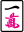
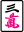
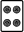
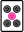
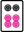
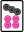
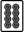

# Mahjong Competition Rules (MCR)

## Table of contents

- [Basic rules](#basic-rules)
- [Fan table](#fan-table)
  + [1 fan](#1-fan)
  + [2 fan](#2-fan)
  + [4 fan](#4-fan)
  + [6 fan](#6-fan)
  + [8 fan](#8-fan)
  + [12 fan](#12-fan)
  + [16 fan](#16-fan)
  + [24 fan](#24-fan)
  + [32 fan](#32-fan)
  + [48 fan](#48-fan)
  + [64 fan](#64-fan)
  + [88 fan](#88-fan)
-  [Overlapping fan](#overlapping-fan)
-  [Scoring](#scoring)
-  [(very) Basic strategy](#very-basic-strategy)
  + [You have lots of tiles in one suit](#you-have-lots-of-tiles-in-one-suit)
  + [Your tiles are all connected but in different suits](#your-tiles-are-all-connected-but-in-different-suits)
  + [You have 4+ pairs/triplets](#you-have-4-pairstriplets)
  + [You have lots of tiles in exactly two suits, or your tiles are not connected at all](#you-have-lots-of-tiles-in-exactly-two-suits-or-your-tiles-are-not-connected-at-all)
  + [Easy reference](#easy-reference)
-  [Reference](#reference)
  + [8+ han by frequency (excluding luck based ones)](#8-han-by-frequency-excluding-luck-based-ones)
  + [1,2,4,6 han by frequency (excluding luck based ones)](#1246-han-by-frequency-excluding-luck-based-ones)

## Basic rules

MCR plays with the following wall:

- four each of the 1-9 character tiles
- four each of the 1-9 circle tiles
- four each of the 1-9 bamboo tiles
- four each of the four winds
- four each of the three dragons
- one each of the four flowers
- one each of the four seasons

The win condition is to score at least 8 fan with a hand of one of the five following shapes:

- Four sets and a pair. Sets are triplets or sequences.
- A knitted straight plus one set and a pair. A knitted straight consists of 147 of one suit, 258 of a second suit, and 369 of a third suit.
- Seven Pairs (repeats ok).
- Thirteen Orphans: each terminal and honor tile, one of them forming a pair.
- Honors knitted hand: 14 unique tiles from the following set: 147 of one suit, 258 of a second suit, 369 of a third suit, all winds, and all dragons.

Your hand is 13 tiles, so you have to obtain the 14th by self-draw, by discard, or by robbing the tile of an added kong. If multiple players declare a win on the same discard or added kong tile, then the closest player in turn order to the discarder/kong player claims the win.

The dealer starts with 14 tiles, while everyone else starts with 13. There is an initial go-around where everybody discards flowers starting from the dealer. Once everyone has declared their starting flowers, the dealer discards a tile.

There is no scoring implication for being the dealer. Dealer is just the player who discards first. The dealership rotates anticlockwise every round, regardless of whether it ended in a win or a draw.

There is no dead wall (the game ends in a draw once the whole wall is drawn), but kong and flower replacements should be taken from the back end of the wall.

There are the three standard calls: Chow, Pung, and Kong. There are three types of kong: concealed kong is when you take out all four copies of a single tile, added kong is when you add a drawn fourth copy of a tile to your existing pung of that tile, and melded kong is when you call a discard using the other three copies of that discard. All kongs result in drawing a replacement tile, and as such you cannot kong if there are no more tiles in the wall. Concealed kongs are revealed to the table once the round is over. Swap-calling is allowed: if you call a 3 of bamboo, you may subsequently discard a 3 of bamboo in hand. A restriction on calling is that if you call chow or pung, you may not immediately call a concealed or added kong until your next draw. (In other words, those two kongs are only allowed if you have drawn a tile.)

## Fan table

To win, one must have a hand worth at least 8 fan (additive). Since this is a nontrivial task, there are various strategies to winning that will be covered briefly [at the end](#very-basic-strategy). Note that a hand worth exactly 0 fan scores 8 fan (Chicken Hand #43). Also note that flowers are worth 1 bonus fan each, which don't count towards the 8 fan requirement.

Each of the 81 fan in MCR has a numeric ID, and they are typically categorized by their value. Here we start with the smallest value and work up to the largest.

Within each category, the fan are sorted by their frequency, which is provided courtesy of [MahjongSoft's data](https://mahjongsoft.com/mcrfans.php). This data gives an idea of which fan are over- or under-valued based on how easy it is to achieve.

Some fan may have overlapping requirements, and there are some rules about that that [are covered later](#overlapping-fan).

### 1 fan

#69-#73 are all repeatable: for example, if you have two Pure Double Chows, you get 2 fan.

- __Pung of Terminals or Honors (#73)__ (31.36%): You have a triplet of terminals or honors. This triplet can be either called or concealed. Having a pung of dragons, prevalent winds, or seat winds instead awards the 2 fan Dragon Pung (#59), Prevalent Wind (#60), or Seat Wind (#61) respectively.
- __Self-Drawn (#80)__ (19.67%): You drew the winning tile yourself.
- __Closed Wait (#78)__ (19.03%): You are only waiting for one kind of tile, and the wait is a 'middle' wait like 35 waiting for 4.
- __Mixed Double Chow (#70)__ (18.47%): You have two of the same sequence in different suits.
- __One Voided Suit (#75)__ (13.85%): You lack any tiles from one of the three suits. (Honors and flowers are suitless.)
- __Short Straight (#71)__ (12.18%): You have 123 456, 234 567, 345 678, or 456 789 of one suit.
- __Single Wait (#79)__ (10.69%): You are only waiting for one kind of tile, and the wait is a pair wait like 3 waiting for another 3.
- __No Honors (#76)__ (10.88%): You have no honor tiles.
- __Edge Wait (#77)__ (8.082%): You are only waiting for one kind of tile, and the wait is 12 waiting for 3, or 89 waiting for 7.
- __Melded Kong (#74)__ (7.008%): You have called a kong or added a tile to a called triplet to make a kong.
- __Two Terminal Chows (#72)__ (5.152%): You have 123 and 789 of the same suit.
- __Pure Double Chow (#69)__ (3.931%): You have two of the exact same sequence in one suit.
- __Flower Tiles (#81)__: You get 1 fan per flower tile, but this does not contribute to the minimum requirement of 8 fan.

### 2 fan

- __All Chows (#63)__ (37.73%): All of your sets are sequences. In addition, you may not have any honor tiles.
- __Dragon Pung (#59)__ (17.19%): You have a triplet of dragons. Having two dragon triplets instead awards the 6 fan Two Dragon Pungs (#54).
- __Concealed Hand (#62)__ (9.539%): You have never called a tile (except flowers and concealed kongs).
- __All Simples (#68)__ (9.117%): Your hand consists of only number tiles 2-8. (ignores flowers)
- __Seat Wind (#61)__ (6.116%): You have a triplet of the wind matching your seat.
- __Prevalent Wind (#60)__ (6.078%): You have a triplet of the prevalent (round) wind.
- __Double Pung (#65)__ (4.290%): You have two triplets of the same number (in different suits). Repeatable.
- __Tile Hog (#64)__ (4.054%): Your hand contains all four of a tile (not in a kong). Repeatable.
- __Two Concealed Pungs (#66)__ (3.727%): You have two triplets in hand (not called), except concealed kongs also count. Repeatable.
- __Concealed Kong (#67)__ (1.562%): You have a concealed kong. Repeatable.

### 4 fan

- __Fully Concealed Hand (#56)__ (5.198%): Have no calls except concealed kongs, and win off a self draw.
- __Last Tile (#58)__ (5.045%): Win on the fourth copy of a tile. The other three copies must be visible to all players (so cannot be in your hand).
- __Outside Hand (#55)__ (3.683%): Each of your sets and pair contains a terminal or honor tile.
- __Two Melded Kongs (#57A)__ (0.5182%): You have two kongs, both formed by calling the fourth tile or by adding the fourth tile to a called triplet.

### 6 fan

- __Mixed Shifted Chows (#51)__ (18.40%): You have something like 123 234 345, with each sequence being in a different suit.
- __All Types (#52)__ (13.32%): Your hand has each of the five kinds of tiles: characters, circles, bamboo, winds, and dragons. (Flowers are ignored.)
- __Half Flush (#50)__ (11.82%): Your hand consists of one suit plus honors. (ignores flowers)
- __All Pungs (#49)__ (9.605%): All of your sets are triplets (or kongs).
- __Melded Hand (#53)__ (2.072%): Have four calls and win off a discard or by robbing a kong.
- __Two Dragon Pungs (#54)__ (0.9427%): You have two dragon triplets.
- __Two Kongs (#57B)__ (0.5182%): You have two kongs, one melded (formed by calling the fourth tile or by adding the fourth tile to a called triplet) and one concealed.

### 8 fan

- __Mixed Triple Chow (#41)__ (10.07%): You have three of the same sequence in different suits.
- __Mixed Straight (#39)__ (9.624%): You have 123 456 789, all of different suits.
- __Chicken Hand (#43)__ (0.8192%): None of the other fan apply to your hand.
- __Reversible Tiles (#40)__ (0.5837%): Your hand is composed of tiles from the following set: 1234589 of circles, 245689 of bamboo, and white dragon. (ignores flowers)
- __Mixed Shifted Pungs (#42)__ (0.4544%): You have consecutive triplets in the pattern 111 222 333 in different suits.
- __Out with Replacement Tile (#46)__ (0.4310%): Win off the replacement tile after calling a flower of a kong.
- __Robbing The Kong (#47)__ (0.2972%): Win off the tile someone tried to add to a pung.
- __Last Tile Claim (#45)__ (0.1488%): Win off the last discard.
- __Last Tile Draw (#44)__ (0.08838%): Win off the last draw.
- __Two Concealed Kongs (#48)__ (0.03029%): You have two concealed kongs.

### 12 fan

- __Upper Four (#36)__ (1.993%): Your hand consists only of the numbers 6789 (ignores flowers).
- __Lower Four (#37)__ (1.893%): Your hand consists only of the numbers 1234 (ignores flowers).
- __Lesser Honors and Knitted Tiles (#34)__ (1.520%): You win from having 14 unique tiles from the following set: 147 of one suit, 258 of a second suit, 369 of a third suit, all winds, and all dragons.
- __Knitted Straight (#35)__ (0.7848%): You win with hand containing a knitted straight: 147 of one suit, 258 of a second suit, 369 of a third suit.
- __Big Three Winds (#38)__ (0.08589%): You have three wind triplets.

### 16 fan

- __Pure Straight (#28)__ (8.575%): You have 123 456 789 in the same suit.
- __Pure Shifted Chows (#30)__ (3.577%): You have something like 123 234 345 in the same suit, or 123 345 567 in the same suit.
- __Three Concealed Pungs (#33)__ (0.7496%): You have three concealed triplets. Triplets obtained via win by self-draw count as concealed, but triplets obtained via win by discard/robbing a kong are not concealed.
- __All Fives (#31)__ (0.1594%): All of your sets and your pair contain a five.
- __Triple Pung (#32)__ (0.1561%): You have three triplets of the same number.
- __Three-Suited Terminal Chows (#29)__ (0.02884%): You have Two Terminal Chows (123 789) twice in different suits, plus a pair of fives.

### 24 fan

- __Full Flush (#22)__ (2.527%): Your hand consists of one suit only, no honors. (ignores flowers)
- __Seven Pairs (#19)__ (2.161%): You won with a seven-pair hand. Repeated pairs are allowed (and award 2 fan Tile Hog #64).
- __Greater Honors and Knitted Tiles (#20)__ (0.8308%): You have one of each wind and dragon, plus 7 unique tiles from the following set: 147 of one suit, 258 of a second suit, and 369 of a third suit.
- __Pure Shifted Pungs (#24)__ (0.4028%): You have consecutive triplets in the pattern 111222333, of the same suit.
- __Upper Tiles (#25)__ (0.2057%): Your hand consists only of the numbers 789 (ignores flowers).
- __Lower Tiles (#27)__ (0.1935%): Your hand consists only of the numbers 123 (ignores flowers).
- __Middle Tiles (#26)__ (0.1681%): Your hand consists only of the numbers 456 (ignores flowers).
- __All Even Pungs (#21)__ (0.09315%): Your hand consists of triplets and pairs of even numbers (2468) only.
- __Pure Triple Chow (#23)__ (0.05189%): You have three of the same sequence in the same suit.

### 32 fan

- __All Terminals and Honors (#18)__ (0.1692%): Your hand consists of 1, 9, and honor tiles only. (ignores flowers)
- __Four Pure Shifted Chows (#16)__ (0.09270%): You have something like 123 234 345 456 in the same suit.
- __Three Kongs (#17)__ (0.04093%): You have three kongs (does not matter if they are concealed).

### 48 fan

- __Four Pure Shifted Pungs (#15)__ (0.01257%): You have consecutive triplets in the pattern 111222333444, of the same suit.
- __Quadruple Chow (#14)__ (no data): You have four of the same sequence in the same suit.

### 64 fan

- __Little Three Dragons (#10)__ (0.2556%): You have two dragon triplets and a dragon pair.
- __Four Concealed Pungs (#12)__ (0.04824%): You have four concealed triplets. Triplets obtained via win by self-draw count as concealed, but triplets obtained via win by discard/robbing a kong are not concealed.
- __Little Four Winds (#9)__ (0.01289%): You have three wind triplets and a wind pair.
- __All Honors (#11)__ (0.007178%): Your hand is all honor tiles.
- __All Terminals (#8)__ (0.002363%): Your hand consists of 1 and 9 tiles only. (ignores flowers)
- __Pure Terminal Chows (#13)__ (0.002295%): You have exactly 123 123 55 789 789 in the same suit.

### 88 fan

- __Big Three Dragons (#2)__ (0.03299%): You have three dragon triplets.
- __Thirteen Orphans (#7)__ (0.02464%): You have one of each terminal and honor tile, one of them forming a pair.
- __All Green (#3)__ (0.003197%): Your hand consists of tiles from the set 23468 of bamboo and green dragon (ignores flowers).
- __Big Four Winds (#1)__ (0.001368%): You have four wind triplets.
- __Four Kongs (#5)__ (0.0008438%): You have four kongs (does not matter if they are concealed).
- __Seven Shifted Pairs (#6)__ (0.0002596%): You have 11 22 33 44 55 66 77 in one suit. It does not have to start at 1.
- __Nine Gates (#4)__ (no data): Your hand is concealed and is all one suit in the nine gates shape (1112345678999 + one extra tile).

## Overlapping fan

There is a complex rules system for determining whether two fan can be awarded together or not. They are

1. If you get fan A which always implies fan B, you don't get fan B. (Non-repeat principle)
2. Things like 123123123 cannot be rearranged into 111222333, you have to choose one. (Unbreakable principle)
3. Scoring a second copy of a certain fan must use completely different sets from the first copy. (Non-identical principle)
4. You have discretion to choose the highest scoring combination of fan. Riichi Advanced does this for you by choosing an arbitrary highest-scoring combination. (High vs low principle) 
5. The arrangements of sets that form fan cannot form a cycle. (Exclusionary rule)

A canonical example of the Exclusionary Rule is when you have a Mixed Straight with a Mixed Double Chow:

    

The Mixed Straight "links" the first three sequences, and the Mixed Double Chow "links" the last two sequences. Then you cannot form a cycle by also linking  and  to form Short Straight, so you can only choose one of Mixed Double Chow or Short Straight to score.

If you are not sure about the Non-repeat principle, here is a list of yaku implications taken directly from [the ruleset](/priv/static/rulesets/mcr.json). Implications are transitive.

- (88)
  + __"Big Four Winds"__ implies "Little Four Winds", "Half Flush", "Prevalent Wind", "Seat Wind"
  + __"Big Three Dragons"__ implies "Little Three Dragons"
  + __"All Green"__ implies "One Voided Suit"
  + __"Nine Gates"__ implies "Full Flush", "Concealed Hand", "Pung of Terminals"
  + __"Four Kongs"__ implies "Three Kongs", "All Pungs", "Single Wait"
  + __"Seven Shifted Pairs"__ implies "Seven Pairs", "Full Flush"
  + __"Thirteen Orphans"__ implies "All Types", "All Terminals and Honors", "Concealed Hand", "Single Wait"
- (64)
  + __"All Terminals"__ implies "All Terminals and Honors", "Pung of Terminals", "Pung of Honors", "Outside Hand", "No Honors", "All Pungs"
  + __"Little Four Winds"__ implies "Big Three Winds", "All Pungs", "Pung of Terminals", "Pung of Honors"
  + __"Little Three Dragons"__ implies "Two Dragon Pungs", "Dragon Pung"
  + __"All Honors"__ implies "All Terminals and Honors", "Half Flush", "Pung of Terminals", "Pung of Honors", "All Pungs"
  + __"Four Concealed Pungs"__ implies "Three Concealed Pungs", "All Pungs", "Concealed Hand"
  + __"Pure Terminal Chows"__ implies "All Chows", "Pure Double Chow", "Two Terminal Chows", "Full Flush"
- (48)
  + __"Quadruple Chow"__ implies "Pure Triple Chow", "Tile Hog"
  + __"Four Pure Shifted Pungs"__ implies "Pure Shifted Pungs", "All Pungs"
- (32)
  + __"Four Pure Shifted Chows"__ implies "Pure Shifted Chows", "Short Straight", "Two Terminal Chows"
  + __"Three Kongs"__ implies "Two Kongs", "Two Melded Kongs", "Melded Kong"
  + __"All Terminals and Honors"__ implies "Pung of Terminals", "Pung of Honors", "Outside Hand", "All Pungs"
- (24)
  + __"Seven Pairs"__ implies "Concealed Hand", "Single Wait"
  + __"Greater Honors and Knitted Tiles"__ implies "Lesser Honors and Knitted Tiles"
  + __"All Even Pungs"__ implies "All Pungs", "No Honors", "All Simples"
  + __"Full Flush"__ implies "Half Flush", "No Honors"
  + __"Pure Triple Chow"__ implies "Pure Double Chow"
  + __"Upper Tiles"__ implies "Upper Four", "No Honors"
  + __"Middle Tiles"__ implies "All Simples", "No Honors"
  + __"Lower Tiles"__ implies "Lower Four", "No Honors"
- (16)
  + __"Pure Straight"__ implies "Short Straight", "Two Terminal Chows"
  + __"Three-Suited Terminal Chows"__ implies "Two Terminal Chows", "All Chows", "Mixed Double Chow", "No Honors"
  + __"All Fives"__ implies "No Honors", "All Simples"
  + __"Triple Pung"__ implies "Double Pung"
  + __"Three Concealed Pungs"__ implies "Two Concealed Pungs"
- (12)
  + __"Lesser Honors and Knitted Tiles"__ implies "All Types", "Concealed Hand"
  + __"Upper Four"__ implies "No Honors"
  + __"Lower Four"__ implies "No Honors"
  + __"Big Three Winds"__ implies "Pung of Honors"
- (8)
  + __"Reversible Tiles"__ implies "One Voided Suit"
  + __"Mixed Triple Chow"__ implies "Mixed Double Chow"
  + __"Last Tile Draw"__ implies "Self-Drawn"
  + __"Out with Replacement Tile"__ implies "Self-Drawn"
  + __"Robbing The Kong"__ implies "Last Tile"
  + __"Two Concealed Kongs"__ implies "Concealed Kong", "Two Concealed Pungs"
- (6)
  + __"Half Flush"__ implies "One Voided Suit"
  + __"Melded Hand"__ implies "Single Wait"
  + __"Two Dragon Pungs"__ implies "White Dragon", "Green Dragon", "Red Dragon"
  + __"Two Kongs"__ implies "Melded Kong", "Concealed Kong"
- (4)
  + __"Fully Concealed Hand"__ implies "Self-Drawn", "Concealed Hand"
  + __"Two Melded Kongs"__ implies "Melded Kong"
- (2)
  + __"All Chows"__ implies "No Honors"
  + __"All Simples"__ implies "No Honors"

Feel free to open an [issue](https://github.com/EpicOrange/riichi_advanced/issues) if you see anything wrong with the above table.

## Scoring

Payout: Fan translates directly into the number of points paid. So 8 fan means that the payout is 8 points.

In event of a discard, the discarder pays the payout. In event of a self-drawn win, every player pays the payout. Afterwards, everyone pays the winner 8 bonus points. So the minimum 8 fan self-drawn win results in the winner gaining 48 points total (payout of 8 from each player + 8 bonus points from each player). A minimum 8 fan win by discard results in the winner gaining 32 points total (payout of 8 from the discarder + 8 bonus points from each player).

## (very) Basic strategy

The material here is based on a cursory reading of [World-Class Mahjong](https://mahjongbond.org/wp-content/uploads/2015/07/Mahjong-with-Mai-Hatsune.pdf).

Typically you look at your hand and see if you can form a hand that scores one of the 8 fan or higher hands. Otherwise you look for a "main fan" to score, and try to add the smaller fan in order to make 8 fan. In general there are like nine common ways to make 8+ fan hands, they are the following:

- Single suit sequence hands
- Flush hands
- Three suit sequence hands
- Upper or Lower Four
- All Types
- Outside hands
- All Pungs / Seven Pairs
- Knitted hands
- Concealed hands with a combination of small fan

We'll go over all of them below.

### You have lots of tiles in one suit

i.e. Single suit sequence hands and Flush hands

- If your tiles are all close together in number, consider:
  + (16 fan) __Pure Shifted Chows (#30)__ (3.577%): You can achieve this by having a "pyramid" 122333445 in one suit, or the pattern 123345567 in one suit (it does not have to start at 1).
  + (24 fan) __Pure Shifted Pungs (#24)__ (0.4028%): Similarly you can try to achieve 111222333 of the same suit. The idea is that these are patterns to look for if you have a lot of tiles close together in one suit.
- Otherwise:
  + (16 fan) __Pure Straight (#28)__ (8.575%): Like Half Flush, this is when you have a lot of unique tiles of one suit already. Unlike Half Flush, your fourth set can be of another suit. So you can trick others into thinking you're going for Half Flush but wait on a different suit instead.
  + (6 fan) __Half Flush (#50)__ (11.82%): This requires sacrificing the two suits, which is mostly fine if your tiles in the other two suits aren't likely to make a set anyways. Having all sequences, or getting a single dragon pung lets you reach 8 fan.
  + (24 fan) __Full Flush (#22)__ (2.527%): Same as Half Flush but you discard your honors and call as much as you can. Just as easy to defend against, unfortunately.

### Your tiles are all connected but in different suits

i.e. Three suit sequence hands, Upper or Lower Four, All Types, and Outside hands

- If your tiles are all close together in number, consider:
  + (8 fan) __Mixed Triple Chow (#41)__ (10.07%): if you can form the same number sequence in three suits.
  + (6 fan) __Mixed Shifted Chows (#51)__ (18.40%): if you can form 123 234 345 in three suits. Can easily be combined with 2 fan All Chows to get 8 fan.
  + (8 fan) __Mixed Shifted Pungs (#42)__ (0.4544%): if you can form 111 222 333 in three suits.
  + (12 fan) __Upper Four (#36)__ (1.993%): if you have lots of 6789.
  + (24 fan) __Upper Tiles (#25)__ (0.2057%): ...and can toss the sixes.
  + (12 fan) __Lower Four (#37)__ (1.893%): if you have lots of 1234.
  + (24 fan) __Lower Tiles (#27)__ (0.1935%): ... and can toss the fours.
  + (24 fan) __Middle Tiles (#26)__ (0.1681%): if you have lots of 456.
- Otherwise:
  + (6 fan) __All Types (#52)__ (13.32%): if you have a pair of winds and a pair of dragons. The 2 extra fan easily come from honor triplets.
  + (8 fan) __Mixed Straight (#39)__ (9.624%): if you can form 123 456 789 in different suits.
  + (4 fan) __Outside Hand (#55)__ (3.683%): if you can win with just sets that look like 111 123 789 or 999. This essentially forces some of the following, so it's easy to get at least 2 fan.
    * (1 fan) __Mixed Double Chow (#70)__ (18.47%)
    * (1 fan) __Two Terminal Chows (#72)__ (5.152%)
    * (1 fan) __Pung of Terminals or Honors (#73)__ (31.36%)
    * (1 fan) __No Honors (#76)__ (10.88%)
    * (1 fan) __One Voided Suit (#75)__ (13.85%)

### You have 4+ pairs/triplets

i.e. All Pungs / Seven Pairs hands

- (6 fan) __All Pungs (#49)__ (9.605%): viable to go for if you have a triplet in hand already, with at least 3 other pairs (preferably honors). With this you only need 2 fan, which can come from two terminal/honor pungs or a dragon pung.
- (24 fan) __Seven Pairs (#19)__ (2.161%): You can start going for this if you have 4+ pairs in hand. It is worth a lot for how easy it is to make.

### You have lots of tiles in exactly two suits, or your tiles are not connected at all

i.e. Knitted hands

- If you have lots of single honors: 
  + (12 fan) __Lesser Honors and Knitted Tiles (#34)__ (1.520%)
  + (24 fan) __Greater Honors and Knitted Tiles (#20)__ (0.8308%)
- If your disconnected tiles look like they can form a knitted straight:
  + (12 fan) __Knitted Straight (#35)__ (0.7848%)
- If neither suit is the character suit:
  + (8 fan) __Reversible Tiles (#40)__ (0.5837%): if you can make a hand with only 1234589 of circles, 245689 of bamboo, and white dragon.
  + (24 fan) __All Even Pungs (#21)__ (0.09315%): this is another way to win if you're going for Reversible Tiles.

Otherwise you will have to combine as many minor fan as you can. It is a good idea to at least force the following:

- (2 fan) __All Chows (#63)__ (37.73%): All of your sets are sequences. In addition, you may not have any honor tiles.
- (2 fan) __Concealed Hand (#62)__ (9.539%): by never calling tiles. Upgrades into Fully Concealed Hand with a self-draw.
- (2 fan) __All Simples (#68)__ (9.117%): Your hand consists of only number tiles 2-8. (ignores flowers)

If none of the above is viable, there is also the option to go for (8 fan) __Chicken Hand (#43)__ (0.8192%), which boils down to the following requirements:

- Must go out on a discard (otherwise you get Self-Drawn or Robbing a Kong)
- Must go out on a double-sided wait, either something like 34 or 2288 (otherwise you get one of Closed Wait, Edge Wait, or Single Wait)
- Must have an honor pair (otherwise you get No Honors or Pung of Terminals or Honors or All Simples)
- Must have called a tile (otherwise you get Concealed Hand)
  + that isn't a kong (otherwise you get a Kong fan)
  + that isn't a terminal or honor triplet (otherwise you get Pung of Terminals or Honors)
  + but can't have four calls (otherwise you get Melded Hand)
- Must not have two concealed triplets (Two Concealed Pungs)
- Must have one sequence (otherwise you could get All Pungs)
- Must contain all three suits (otherwise you get One Voided Suit)
- Additionally, your sets cannot form the following:
  + 123 789 in one suit (Two Terminal Chows)
  + 234 567 in one suit (Short Straight)
  + 234 234 in one or two suits (Mixed Double Chow or Pure Double Chow)
  + 222 222 in two suits (Double Pung)
  + 234 345 456 in three suits (Mixed Shifted Chows)
  + cannot use up four of a single tile (Tile Hog)

### Easy reference

The most common 2+ fan to remember are:

- (2 fan) __Concealed Hand (#62)__ (9.539%)
- (2 fan) __All Chows (#63)__ (37.73%)
- (6 fan) __All Pungs (#49)__ (9.605%)
- (6 fan) __Mixed Shifted Chows (#51)__ (18.40%)
- (8 fan) __Mixed Triple Chow (#41)__ (10.07%)
- (6 fan) __All Types (#52)__ (13.32%)
- (2 fan) __Dragon Pung (#59)__ (17.19%)
- (6 fan) __Half Flush (#50)__ (11.82%)
- (8 fan) __Mixed Straight (#39)__ (9.624%)
- (16 fan) __Pure Straight (#28)__ (8.575%)

The most common 1 fan are:

- (1 fan) __Pung of Terminals or Honors (#73)__ (31.36%)
- (1 fan) __Self-Drawn (#80)__ (19.67%)
- (1 fan) __Closed Wait (#78)__ (19.03%)
- (1 fan) __Mixed Double Chow (#70)__ (18.47%)
- (1 fan) __One Voided Suit (#75)__ (13.85%)
- (1 fan) __Short Straight (#71)__ (12.18%)
- (1 fan) __No Honors (#76)__ (10.88%)
- (1 fan) __Single Wait (#79)__ (10.69%)

Remember that kongs give you easy fan, and that fan from flowers don't count towards the minimum of 8.

## Reference

### 8+ han by frequency (excluding luck based ones)

- (8 fan) __Mixed Triple Chow (#41)__ (10.07%): You have three of the same sequence in different suits.
- (8 fan) __Mixed Straight (#39)__ (9.624%): You have 123 456 789, all of different suits.
- (16 fan) __Pure Straight (#28)__ (8.575%): You have 123 456 789 in the same suit.
- (16 fan) __Pure Shifted Chows (#30)__ (3.577%): You have something like 123 234 345 in the same suit, or 123 345 567 in the same suit.
- (24 fan) __Full Flush (#22)__ (2.527%): Your hand consists of one suit only, no honors. (ignores flowers)
- (24 fan) __Seven Pairs (#19)__ (2.161%): You won with a seven-pair hand. Repeated pairs are allowed (and award 2 fan Tile Hog #64).
- (12 fan) __Upper Four (#36)__ (1.993%): Your hand consists only of the numbers 6789 (ignores flowers).
- (12 fan) __Lower Four (#37)__ (1.893%): Your hand consists only of the numbers 1234 (ignores flowers).
- (12 fan) __Lesser Honors and Knitted Tiles (#34)__ (1.520%): You win from having 14 unique tiles from the following set: 147 of one suit, 258 of a second suit, 369 of a third suit, all winds, and all dragons.
- (24 fan) __Greater Honors and Knitted Tiles (#20)__ (0.8308%): You have one of each wind and dragon, plus 7 unique tiles from the following set: 147 of one suit, 258 of a second suit, and 369 of a third suit.
- (8 fan) __Chicken Hand (#43)__ (0.8192%): None of the other fan apply to your hand.
- (12 fan) __Knitted Straight (#35)__ (0.7848%): You win with hand containing a knitted straight: 147 of one suit, 258 of a second suit, 369 of a third suit.
- (16 fan) __Three Concealed Pungs (#33)__ (0.7496%): You have three concealed triplets. Triplets obtained via win by self-draw count as concealed, but triplets obtained via win by discard/robbing a kong are not concealed.
- (8 fan) __Reversible Tiles (#40)__ (0.5837%): Your hand is composed of tiles from the following set: 1234589 of circles, 245689 of bamboo, and white dragon. (ignores flowers)
- (8 fan) __Mixed Shifted Pungs (#42)__ (0.4544%): You have consecutive triplets in the pattern 111 222 333 in different suits.
- (24 fan) __Pure Shifted Pungs (#24)__ (0.4028%): You have consecutive triplets in the pattern 111222333, of the same suit.
- (64 fan) __Little Three Dragons (#10)__ (0.2556%): You have two dragon triplets and a dragon pair.
- (24 fan) __Upper Tiles (#25)__ (0.2057%): Your hand consists only of the numbers 789 (ignores flowers).
- (24 fan) __Lower Tiles (#27)__ (0.1935%): Your hand consists only of the numbers 123 (ignores flowers).
- (32 fan) __All Terminals and Honors (#18)__ (0.1692%): Your hand consists of 1, 9, and honor tiles only. (ignores flowers)
- (24 fan) __Middle Tiles (#26)__ (0.1681%): Your hand consists only of the numbers 456 (ignores flowers).
- (16 fan) __All Fives (#31)__ (0.1594%): All of your sets and your pair contain a five.
- (16 fan) __Triple Pung (#32)__ (0.1561%): You have three triplets of the same number.

### 1,2,4,6 han by frequency (excluding luck based ones)

- (2 fan) __All Chows (#63)__ (37.73%): All of your sets are sequences. In addition, you may not have any honor tiles.
- (1 fan) __Pung of Terminals or Honors (#73)__ (31.36%): You have a triplet of terminals or honors. This triplet can be either called or concealed. Having a pung of dragons, prevalent winds, or seat winds instead awards the 2 fan Dragon Pung (#59), Prevalent Wind (#60), or Seat Wind (#61) respectively.
- (1 fan) __Closed Wait (#78)__ (19.03%): You are only waiting for one kind of tile, and the wait is a 'middle' wait like 35 waiting for 4.
- (1 fan) __Mixed Double Chow (#70)__ (18.47%): You have two of the same sequence in different suits.
- (6 fan) __Mixed Shifted Chows (#51)__ (18.40%): You have something like 123 234 345, with each sequence being in a different suit.
- (2 fan) __Dragon Pung (#59)__ (17.19%): You have a triplet of dragons. Having two dragon triplets instead awards the 6 fan Two Dragon Pungs (#54).
- (1 fan) __One Voided Suit (#75)__ (13.85%): You lack any tiles from one of the three suits. (Honors and flowers are suitless.)
- (6 fan) __All Types (#52)__ (13.32%): Your hand has each of the five kinds of tiles: characters, circles, bamboo, winds, and dragons. (Flowers are ignored.)
- (1 fan) __Short Straight (#71)__ (12.18%): You have 123 456, 234 567, 345 678, or 456 789 of one suit.
- (6 fan) __Half Flush (#50)__ (11.82%): Your hand consists of one suit plus honors. (ignores flowers)
- (1 fan) __No Honors (#76)__ (10.88%): You have no honor tiles.
- (1 fan) __Single Wait (#79)__ (10.69%): You are only waiting for one kind of tile, and the wait is a pair wait like 3 waiting for another 3.
- (6 fan) __All Pungs (#49)__ (9.605%): All of your sets are triplets (or kongs).
- (2 fan) __Concealed Hand (#62)__ (9.539%): You have never called a tile (except flowers and concealed kongs).
- (2 fan) __All Simples (#68)__ (9.117%): Your hand consists of only number tiles 2-8. (ignores flowers)
- (1 fan) __Edge Wait (#77)__ (8.082%): You are only waiting for one kind of tile, and the wait is 12 waiting for 3, or 89 waiting for 7.
- (2 fan) __Seat Wind (#61)__ (6.116%): You have a triplet of the wind matching your seat.
- (2 fan) __Prevalent Wind (#60)__ (6.078%): You have a triplet of the prevalent (round) wind.
- (4 fan) __Fully Concealed Hand (#56)__ (5.198%): Have no calls except concealed kongs, and win off a self draw.
- (1 fan) __Two Terminal Chows (#72)__ (5.152%): You have 123 and 789 of the same suit.
- (2 fan) __Double Pung (#65)__ (4.290%): You have two triplets of the same number (in different suits). Repeatable.
- (2 fan) __Tile Hog (#64)__ (4.054%): Your hand contains all four of a tile (not in a kong). Repeatable.
- (1 fan) __Pure Double Chow (#69)__ (3.931%): You have two of the exact same sequence in one suit.
- (2 fan) __Two Concealed Pungs (#66)__ (3.727%): You have two triplets in hand (not called), except concealed kongs also count. Repeatable.
- (4 fan) __Outside Hand (#55)__ (3.683%): Each of your sets and pair contains a terminal or honor tile.
- (6 fan) __Melded Hand (#53)__ (2.072%): Have four calls and win off a discard or by robbing a kong.
- (6 fan) __Two Dragon Pungs (#54)__ (0.9427%): You have two dragon triplets.
