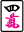
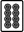
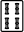
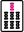

# Riichi Mahjong in brief

Riichi is a four-player game played with 34 different kinds of tiles:

- numbered 1-9 character tiles  (__manzu__),
- numbered 1-9 circle tiles  (__pinzu__),
- numbered 1-9 bamboo tiles  (__souzu__),
- four wind tiles  (east, south, west, north),
- and three dragon tiles  (white dragon, green dragon, red dragon).

There are four copies of each tile, giving a total of 136 tiles in the __wall__. In addition, one of the four "five" tiles in each suit  is a red five  which is worth extra (explained later). Riichi Advanced mods may add or subtract from this tileset, but this is the default tileset. In the game messages, manzu are notated 1m to 9m, pinzu 1p to 9p, souzu 1s to 9s, wind tiles 1z to 4z, and dragons 5z to 7z, in the order indicated above. Red fives are notated 0m, 0p, or 0s.

The goal of riichi is to maximize your points, which start at 25000. To earn points, you must be the first in each round to complete a 14-tile hand. A hand is defined as one of the following:

- Four sets and a pair,
- Seven pairs, or
- Each 1 and 9 of each suit (terminals) plus one of each wind and dragon (honor tiles), plus a 14th tile that is a copy of one of those tiles.

The latter two are considered special hands, and are difficult to achieve. The majority of hands (>97%) are four sets and a pair.

A __set__ is either a 3-tile sequence, like , or a triplet, like . Your starting hand of 13 tiles might not contain any ready-made sets, so you must progress your hand by drawing and discarding tiles. You do not declare your sets when they are made; they remain hidden in your hand.

The game starts with everyone being dealt 13 tiles from the wall. The East player (also known as the __dealer__) is dealt a 14th tile to start the game. Play starts from the dealer's first discard and continues counterclockwise, with each player drawing and discarding a tile.

## Riichi and winning

Once your hand is one-away from a winning hand (__tenpai__), hovering over a tile shows you your winning tiles if you discard that tile. For example, if your hand is  , then hovering over the  will show that you are __waiting__ for  to complete your hand of four sets and a pair. Once someone discards  or , you may call __ron__ to claim it and complete your hand. Alternatively, if you draw  or  yourself, then you may call __tsumo__ to claim it and complete your hand.

When tenpai, you may declare __riichi__. This means betting 1000 points, locking your hand, and telling everyone that you are near a win, which are all significant downsides. This is indicated on the board by a sideways discard. Once you declare riichi you are locked to discarding every tile you draw until you draw one of your winning tiles, or until someone discards one of your winning tiles. This makes riichi a bit of a gamble. The upside is that riichi is worth 1 han, the basic scoring unit. __All hands require 1 han to win__, making riichi very valuable. Hand conditions that give you han are called __yaku__, and riichi is one of the most common (occuring in around 41% of hands).

If you manage to win before your next discard (after your riichi declaration discard), you earn a bonus yaku associated with riichi is called __ippatsu__, which is worth 1 han.

Some rare conditions in which you cannot riichi: you cannot riichi if you have less than 1000 points or if there are not enough tiles left in the wall for you to have a next draw.

## Furiten

In riichi (and all variants supported by Riichi Advanced), all discards are placed in front of their respective player.

In riichi these discards have a special significance: they indicate which discards are __safe__ against that player. There is a rule called __furiten__ that states that if a player cannot call ron on tiles they have discarded before. This means if someone discarded , you can discard  and it is guaranteed that player cannot call ron on it.

This is significant because if someone calls ron on your discard, you pay the full amount.

Furiten is actually a little broader than described above. The full rule is as follows:

- If any of your winning tiles is in your discards, you cannot ron, period.
- (Temporary furiten) If someone discarded a tile that could have completed your hand (whether you have yaku or not), and you didn't win off it, then you are unable to call ron until your next draw.
- (Permanent furiten) If you are in riichi, and someone discarded a tile that could have completed your hand (whether you have yaku or not), you are unable to call ron for the remainder of the round.

In Riichi Advanced, if you are in furiten, it will be indicated by the appearance of some small text `furiten` at the bottom.

You may still tsumo when in furiten.

## Calls

One a tile has been discarded, often the next player in turn continues by drawing their tile. However, this process can be interrupted by calling the discarded tile. There are three possible calls on discarded tiles:

- __Chii__: If you are next in turn order, and the discarded tile completes a __sequence__, instead of drawing a tile you may claim the discard and set aside the completed sequence. Then you must discard a tile as usual. All tiles set aside are considered part of your hand, but are visible to all and cannot be discarded.
- __Pon__: Even if you are not next in turn order, if the discarded tile completes a __triplet__, you may claim the discard and set aside the completed triplet. Pon overrides chii, and also changes the turn order (it becomes your turn to discard). Like with chii, all tiles set aside are considered part of your hand, but are visible to all and cannot be discarded.
- __Kan__: If you have a triplet of the discarded tile in hand, you may call kan to claim the discard and set aside the completed __quad__, which is considered to be a triplet for winning purposes. It becomes your turn, and you draw a replacement tile from the back of the wall (the __dead wall__). We will go into detail about kan and quads in a bit.

As soon as you call a discard, your hand is considered __open__, and __you may no longer declare riichi__. This is a big downside of calling, so many players are hesitant to call, even if it means progressing their hand.

As a small bonus, calls also invalidate ippatsu, so if someone declares riichi and you call a tile before their next discard, and they end up winning before their next discard, they do not get ippatsu because of your call.

A triplet of dragons, like , is considered a __value triplet__, or __yakuhai__, and always worth 1 han each. Yakuhai is also one of the most common yaku (occurring in around 50% of hands). This means that dragons are often called, because even though it means you cannot call riichi, the 1 han allows one to achieve a winning hand. A triplet of winds is also yakuhai if it matches either the round marker or your seat marker (or both, totalling 2 han). All games start in the East round, so at the beginning east winds  are often desirable to keep and call.

## Exhaustive draw

The __dead wall__ consists of the 14 tiles at the end of the wall. The game ends (with no winner) once the wall is exhausted and only the dead wall remains.

During an exhaustive draw, players who are tenpai are paid by players who are not tenpai. The payment amount depends on the number of tenpai players:

- 0 tenpai players: no payment
- 1 tenpai player: they are paid 1000 from everyone else
- 2 tenpai players: each non-tenpai player pays one of the tenpai players 1500
- 3 tenpai players: the non-tenpai player pays everyone 1000
- 4 tenpai players: no payment

In addition, the __honba__ counter is increased by one. Each honba adds 300 to the value of the next winning hand. The honba counter also increases by one every time the dealer (East player) wins. If a nondealer wins, honba is reset to zero.

## Dora

If playing with dora (on by default in Riichi Advanced) the dead wall features a __dora indicator__. In Riichi Advanced, dora indicators are displayed at the top of the screen. If the dora indicator is , then we consider all  in-game to be __dora__. The rule is that the dora indicator indicates the next tile in sequence to be dora.  wraps around to , and for honor tiles, the rule is →→→→ and →→→.

If you win a hand, every dora tile in your hand grants a bonus 1 han. Dora is the most space-efficient way to get han. Keep in mind: it is often said that __dora is not yaku__. This is important because __every hand must have yaku to win__, and dora does not count.

The wall is physically made of two-tile-tall stacks, so the dead wall is 7 stacks with one of the top layer tiles flipped as the dora indicator. The tile under the dora indicator is known as the __ura dora__ indicator. These are not shown until somebody __who has declared riichi__ wins. Players who win with riichi get access to the ura dora indicators, which act the same as the dora indicators by indicating an additional tile that counts as dora, and this is called __ura dora__. Like dora, ura dora is not yaku. Players who win but not in riichi do not get access to ura dora.

Red fives always count as dora, and are known as __aka dora__.

## Kan

As discussed previously, you may call kan on a discarded tile if you have three copies of that tile in hand. This opens your hand (you forgo riichi). In addition, after your kan replacement tile draw and your subsequent discard, an additional dora indicator is revealed in the dead wall. A maximum of four kans can be made in one game, meaning five potential dora indicators maximum. (On the fourth kan, the game ends in an abortive draw.)

Ura dora indicators consist of every tile under a dora indicator, so kans also add ura dora to the game. Therefore, every kan makes riichi even more valuable.

Most players do not kan (<5% call rate) unless they are confident in winning or are desperate for points. This is because the additional dora / ura dora will likely go to your opponents.

There are three ways to kan, and they all involve forming quads:

- __Daiminkan__: This is calling a discard with a triplet of the same tile in hand, as discussed previously.
- __Shouminkan__ or __Kakan__: If you called pon on  and later draw a , you may call kan during your turn to add your drawn  to the existing pon. Like with daiminkan, you draw a replacement tile and reveal a new dora indicator after your discard.
- __Ankan__: If at any point during your turn you have four of the same tile in hand, such as , you may call kan to set those aside and draw a replacement tile. Ankan importantly __does not open your hand__, so you may still call riichi after this. In addition, the new dora indicator is revealed immediately rather than after your discard.

## Yaku

There are a number of yaku in riichi mahjong, but the following six are the most common:

- Yakuhai (~50% of hands): discussed previously. 1 han each.
- Riichi (~41% of hands): discussed previously. 1 han.
- Tsumo (~25% of hands): When your hand is __closed__ (no calls, except ankan) and you win by tsumo (self-draw), you get 1 han.
- Tanyao (~22% of hands): Your hand consists of only tiles 2-8. So no ones, nines, winds, or dragons. 1 han.
- Pinfu (~20% of hands): Closed hand with all sequences. In addition, your pair must not be made of yakuhai tiles, and your final wait must be a two-sided sequence wait (__ryanmen__), such as . 1 han.
- Ippatsu (~7.9% of hands): discussed previously. 1 han.

Yaku stack additively, and that is often the goal: you want to maximize the value of your winning hand.

There are many other yaku -- they will be listed at the bottom in order of frequency.

Riichi Advanced will automatically calculate your yaku and display them under a winning hand.

## Scoring

To score a hand, you add up all your han and consult a scoring table:

- 1 han: 1000 points, 1500 if dealer.
- 2 han: 2000 points, 2900 if dealer.
- 3 han: 3900 points, 5800 if dealer.
- 4 han: 7700 points, 11600 if dealer.
- 5 han: 8000 points, 12000 if dealer. "Mangan"
- 6-7 han: 12000 points, 18000 if dealer. "Haneman"
- 8-10 han: 18000 points, 24000 if dealer. "Baiman"
- 11-12 han: 24000 points, 36000 if dealer. "Sanbaiman"
- 13+ han: 32000 points, 48000 if dealer. "Yakuman"

In addition, you add 300 to the score for every honba, and you pick up all the 1000 riichi bets on the table.

Riichi Advanced will automatically score your hand and distribute the points, but it is useful to know the range of points you can earn. The rough calculation is that a 1 han hand is 1000 points, and each additional han roughly doubles that score, up to 4 han.

Once the winning hand has been evaluated, payment proceeds as follows:

- If it is a ron, the discarder pays the full amount.
- If it is a tsumo and the winner is the dealer, the payment is split equally among all players, rounded up to the nearest 100. Note that this can result in a payment slightly greater than the calculated ron score.
- If it is a tsumo and the winner is a non-dealer, the payment X is split unequally. The two non-dealers pay X/4 rounded up to the nearest 100, and the dealer pays X/2 rounded up to the nearest 100. Note that this can result in a payment slightly greater than the calculated ron score.
- (rare) If multiple players call ron on the same discard, the payments happen separately. The player who gets honba/riichi bets is the next player in turn order -- other winners do not get honba or riichi bets.

## Fu

If you have less than 5 han, then in addition to yaku, you may increase your score by having triplets or quads in hand. Each triplet and quad is worth some amount of __fu__ based on if they are a terminal/honor triplet or not.

- Triplet of 2-8 tiles: 4 fu
- Triplet of terminals/honors: 8 fu
- Quad of 2-8 tiles: 16 fu
- Quad of terminals/honors: 32 fu

This fu amount is halved if the triplet/quad is open (formed via call or from calling ron). Note that ankan is not considered open, and triplets formed by tsumo (self-draw) are considered closed.

In addition, the following events give bonus fu:

- Always: +20 fu
- Closed hand ron: +10 fu
- Tsumo (self-draw win): +2 fu
- Final wait can be considered as a single tile wait: +2 fu
- Pair is a yakuhai tile: +2 fu (+4 fu if it's both the round wind and seat wind)

Fu is then rounded up to the nearest 10. This calculation is a bit involved, but in most cases, fu is 30, leading to the scoring table above. In reality, the score (below 5 han, "mangan") is calculated as follows:

    fu * 4 * 2^han

times 4 if non-dealer, or 6 if dealer. The result is rounded up to the nearest 100, and capped at 8000 (if non-dealer) or 12000 (if dealer). For han ≥ 5, fu is irrelevant, consult the scoring table above.

As an example, if you have 1 han 30 fu as non-dealer then it's `4 * 30 * 4 * 2^1 = 960`, which rounds up to 1000. Every han doubles the 960 figure, which explains why the score progression above is 1000 → 2000 → 3900 → 7700 instead of an exact doubling.

A full scoring table for riichi can be found online, but the above scoring table is recommended for beginners, since most hands are 30 fu.

## Ending the game

A game of riichi consists of a four-round East round, plus a four-round South round. During each four-round cycle, each player has the opportunity to be dealer once. Games can go on longer because if the dealer wins, they stay dealer for the next round (a __repeat__). A game of riichi typically lasts 10 rounds (meaning 2 repeats).

The game also ends once someone goes below zero points, though this is not common.

## Yaku list

- __Yakuhai__ (~50% of hands): Have a value triplet in hand, defined as either a dragon triplet, a round wind triplet, or a seat wind triplet. 1 han each.
- __Riichi__ (~41% of hands): Declare riichi, and win. 1 han.
- __Tsumo__ (~25% of hands): When your hand is __closed__ (no calls, except ankan) and you win by tsumo (self-draw), you get 1 han.
- __Tanyao__ (~22% of hands): Your hand consists of only tiles 2-8. So no ones, nines, winds, or dragons. 1 han.
- __Pinfu__ (~20% of hands): Closed hand with all sequences. In addition, your pair must not be made of yakuhai tiles, and your final wait must be a two-sided sequence wait (__ryanmen__), such as . 1 han.
- __Ippatsu__ (~7.9% of hands): Declare riichi, and win before your next discard after your riichi discard, with nobody making any calls in between. 1 han.
- __Honitsu__ (~4.7% of hands): Your hand consists of only one suit plus honor tiles. 3 han if closed, 2 han if open.
- __Iipeikou__ (~3.8% of hands): Your hand contains two identical sequences of the same suit, like . 1 han if closed, does not count if open.
- __Sanshoku Doujun__ (~3.7% of hands): You have the same sequence in all three suits, like   . 2 han if closed, 1 han if open.
- __Chiitoitsu__ (~2.8% of hands): Your hand is seven pairs. 2 han.
- __Ittsu__ (~1.5% of hands): You have the sequences 123 456 879 of a single suit in hand. 2 han if closed, 1 han if open.
- __Toitoi__ (~1.4% of hands): Your hand is all triplets. 2 han.
- __Haitei/Houtei__ (~0.82% of hands): You won off the last tile in the wall, or the last discard of the game, respectively. 1 han.
- __Chanta__ (~0.80% of hands): Every set/pair in your hand contains a terminal or honor tile. 2 han if closed, 1 han if open.
- __Sanankou__ (~0.62% of hands): Your hand contains three closed triplets. 2 han.
- __Chinitsu__ (~0.55% of hands): Your hand consists of only one suit, no honor tiles. Overrides honitsu. 6 han if closed, 5 han if open.
- __Junchan__ (~0.28% of hands): Every set/pair in your hand contains a terminal tile, no honors. Overrides chanta. 3 han if closed, 2 han if open.
- __Rinshan__ (~0.26% of hands): You won by tsumo off the replacement tile after a kan. 1 han.
- __Double Riichi__ (~0.19% of hands): You declared riichi on your first discard and won. 2 han instead of the typical 1 han.

The following are exceedingly rare yaku:

- __Shousangen__ (~0.067% of hands): You have two dragon triplets and a dragon pair. 2 han (plus the 2 han from the dragon triplets).
- __Ryanpeikou__ (~0.031% of hands): You have two sets of identical sequences (iipeikou). Overrides iipeikou and chiitoitsu. 3 han.
- __Sanshoku Doukou__ (~0.022% of hands): You have the same triplet in all three suits, like   . 2 han.
- __Honroutou__ (~0.018% of hands): Your hand consists of 1, 9, and honor tiles. Basically the opposite of tanyao. 2 han, plus you have to get this with toitoi (2 han).
- __Chankan__ (~0.015% of hands): When someone calls kakan, you have the option to call ron on that tile, and you get this yaku as a result. 1 han.
- __Sankantsu__ (~0.002% of hands): You have three kans (of any kind). 2 han.

The percentage stats are pulled from [here](http://tenhou.net/sc/prof.html).

## Yakuman

The following ten rare yaku are considered __yakuman__, which immediately gives you 32000 (non-dealer)/48000 (dealer) points. Yakuman also stack, multiplying e.g. 32000 into 64000.

- __Suuankou__ (~0.026% of hands): All four of your sets are concealed triplets. Yakuman.
- __Daisangen__ (~0.019% of hands): You have all three dragon triplets. Yakuman.
- __Kokushi Musou__ (~0.018% of hands): You have each terminal and honor tile, with one of them forming a pair. Yakuman.
- __Shousuushii__: You have three wind triplets and a wind pair. Yakuman.
- __Tenhou/Chiihou__: You win off your first draw, with no intervening calls between the start of the round and your draw. Yakuman.
- __Tsuuiisou__: Your hand consists only of honor tiles. Yakuman.
- __Ryuuiisou__: Your hand consists only of all-green tiles: . Yakuman.
- __Chinroutou__: Your hand consists only of 1 and 9. Yakuman.
- __Chuurenpoutou__: Your final hand (including winning tile) looks like  of any suit, plus one additional tile of that suit. Yakuman.

The following four yaku are considered __double yakuman__, and are exceedingly rare:

- __Suuankou Tanki__: All four of your sets are concealed triplets, and your final wait is for your pair. Double yakuman.
- __Kokushi Musou Juusan Menmachi__: You have each terminal and honor tile, and your final wait is for your pair. Double yakuman.
- __Daisuushii__: You have all four wind triplets. Double yakuman.
- __Junsei Chuurenpoutou__: Your hand is exactly  of any suit, and your final wait is for any tile of that suit. Double yakuman.

## Pao

This is an extremely rare and obscure rule that occurs with daisangen and daisuushii.

Let's take daisangen for example. If a player has called two dragon triplets, and you help them complete their third dragon triplet by discarding the third dragon, then you are marked with __pao__. This is a penalty for helping another player complete an obvious yakuman. (For daisuushi, it occurs when giving the fourth wind to a player with three open wind triplets.)

If you are marked with pao and the yakuman player wins without you dealing their final winning tile, then one of two things happen:

- The yakuman player won by tsumo: Instead of the payment being split among all players, you pay the full amount for the yakuman.
- The yakuman player won by ron: The discarder pays half the yakuman payment, and you pay the other half plus honba.

In the event of multiple yakuman, pao only applies to the daisangen/daisuushii portion of the payment. This can result in some very weird payment logic that I had to code into Riichi Advanced.
