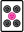
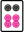
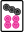
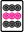

# Riichi Mahjong in brief

Riichi is a four-player game played with 34 different kinds of tiles:

- numbered 1-9 character tiles  (**manzu**),
- numbered 1-9 circle tiles  (**pinzu**),
- numbered 1-9 bamboo tiles  (**souzu**),
- four wind tiles ,
- and three dragon tiles .

There are four copies of each tile, giving a total of 136 tiles. Riichi Advanced mods may add or subtract from this tileset, but this is the default tileset.

The goal of riichi is to maximize your points, which start at 25000. To earn points, you must be the first to complete a 14-tile hand. A hand is defined as one of the following:

- Four sets and a pair,
- Seven pairs, or
- Each 1 and 9 of each suit (terminals) plus one of each wind and dragon (honor tiles), plus a 14th tile that is a copy of one of those tiles.

The latter two are considered special hands. The majority of hands (>97%) are four sets and a pair.
