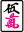
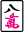
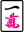

# Sanma

Sanma, or three-player mahjong, is a variation of Riichi mahjong. Besides having three players instead of four, the core differences are as follows:

- Your starting score is 35000 instead of 25000.
- Chii is disallowed.
- The 2-8 manzu tiles  are removed from the game.  and  as dora indicators now indicate each other as dora.
- The north wind tile  acts as __nukidora__: they can be declared and put aside for +1 extra han, which (like dora) does not count as yaku. Dora applies: every  dora indicator adds 1 to the extra value of each . You can still use north winds to form your hand, but you will not get the extra han.
- Upon declaring a north wind, you draw a replacement tile from the dead wall (the dead wall now has 8 draws to accommodate for this). Winning on this replacement tile does not grant rinshan.
- There is __tsumo loss__: for example, a non-dealer mangan is paid 4000 from the dealer and 2000 from the non-dealer, for a total of 6000 instead of the typical 8000.
