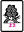
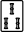
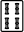
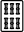
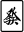
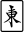
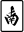
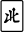
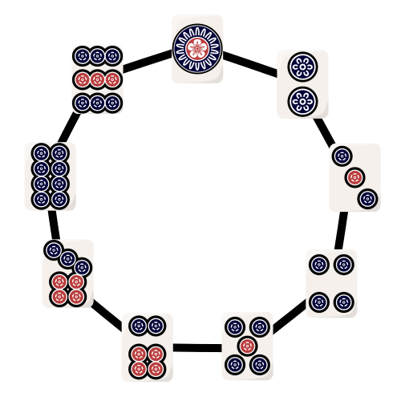

# Space Mahjong

[Link to article on riichi.wiki](https://web.archive.org/web/20260213143251/https://riichi.wiki/Space_mahjong)

This is a completely normal Riichi mahjong variant with three major rule changes:

1. You may chii from any player.
2. Sequences may wrap around, so you can have 891 and 912 as sequences.
  + Note that this eliminates the 2 fu from side waits (penchan) since there are no more side waits.
  + Terminals still count as terminals for scoring purposes.
3. Any three winds can form a sequence. One of each of the three dragon tiles can form a sequence.
  + These sequences do not score yakuhai or fu.
  + You only need two honor tiles to chii a third from any player.
  + Open kokushi musou becomes possible (worth 3 han).

## Major yaku differences

- Chiitoitsu is removed. (You can enable a mod to put it back in if you want.)
- Chanta/Junchan may accept 891 and 912 sequences. Their value does not change.
- Pinfu can include honor sequences, as they are sequences and do not score fu. Penchan does not exist, so it is easier to earn pinfu in general.
- Honitsu can include honor sequences. The value is still 2 han open/3 han closed.
- Honroutou can include honor sequences. The value is still 2 han.
- You can have open kokushi musou worth 3 han.
- Chuurenpoutou may start with any tile, so  is a perfectly standard chuurenpoutou 9-sided wait.

All other yaku work as normal, including tanyao.

## Very basic space mahjong strategy

### Recognizing honor tile shapes

The first fact to add to your repertoire is that any 2 winds connect with each other, and any 2 dragons connect with each other, so floating tiles are not really a thing in the honors suit. For example:

- Any two dragons  waits on the other dragon .
- Any two winds  waits on the other two winds .
- Any four dragon tiles is either a ryantan that may act as a kantan , or two ryanmens that may act as kanchans .
- Having all four winds  is a 4-way tanki wait for any wind.

Basically honor tiles are better for making sequences than number tiles. You can force honitsu and chanta much easier because of this.

### Chanta is better than tanyao

Observe:

- Tanyao can use 234, 345, 456, 567, 678, 7 kinds of triplets of 2-8. That's 5 sequences, 7 triplets.
- Chanta can use 789, 891, 912, 123, all 5 honors sequences, 111, 999, all 7 honors triplets. That's 9 sequences, 9 triplets.

So chanta is just better in terms of efficiency, and also value since closed chanta is 2 han and honors triplets are often yakuhai.

### Consider yakuman

Open kokushi musou is only 3 han, but the condition for getting it is basically drawing the 6 terminal tiles plus 3 winds and 2 dragons. In riichi it's barely possible to get kokushi starting from 8 tiles, but in space mahjong you're looking at 6+ tiles instead.

Chuurenpoutou is basically 4 tiles away from any ittsuu, and it is an actual yakuman so go for it.

### Long suji is actually real

- 1 is suji to 4 and 7
- 2 is suji to 5 and 8
- 3 is suji to 6 and 9
- 4 is suji to 7 and 1 (normal)
- 5 is suji to 8 and 2 (normal)
- 6 is suji to 9 and 3 (normal)
- 7 is suji to 1 and 4
- 8 is suji to 2 and 5
- 9 is suji to 3 and 6

Basically, long suji is real in space mahjong, and every two same-suji tiles indicates naka suji against the third. Suji is only effective against ryanmen, and penchan is now ryanmen, so that's the core of space mahjong defense theory right there.

### Sotogawa becomes aida yon ken

Conventional riichi wisdom is that if someone discards 3 early, they're probably not waiting for 1 or 2 since that would mean cutting 3 from 223 or 233 or 334, you get the idea. That's the principle of sotogawa ('outside').

In space mahjong, sotogawa is less effective because they could easily have a 89 waiting on 1, or a 91 waiting on 2. You're going to need another sotogawa tile from the other side if you want 1 or 2 to be safer. Let's say they dropped an 8 early on as well. That makes 89 and 91 less likely, so you can be pretty sure they're not waiting on 9, 1, or 2 unless they have a tanki or shanpon wait.

But if they dropped a 3 and an 8 early, then the most probable wait they have is going to be a 56 waiting on 47. This is because 56 is the only ryanmen that is not helped by having a 3 or 8 in hand. There is a name for this principle in riichi as well, it's aida yon ken.

Aida yon ken is a lesser known defensive principle, that says if someone discards 2 and 7 for example, then they probably have 45 waiting on 36, so 36 become dangerous. This applies to 1-6, 2-7, 3-8, and 4-9: if one of those pairs is discarded, there is a heightened risk that a ryanmen is in between. In space mahjong, this is even more true since any other wait in that suit is less likely due to double sotogawa. Also you have 9 pairs to worry about now:

- 1-6 indicates 34 is more likely
- 2-7 indicates 45 is more likely
- 3-8 indicates 56 is more likely
- 4-9 indicates 67 is more likely
- 5-1 indicates 78 is more likely
- 6-2 indicates 89 is more likely
- 7-3 indicates 91 is more likely
- 8-4 indicates 12 is more likely
- 9-5 indicates 23 is more likely

Rather than memorize this, you just recognize that if their discards form near-opposites in the suit:

then any wait in that suit is slightly more likely to be the larger side's ryanmen.
