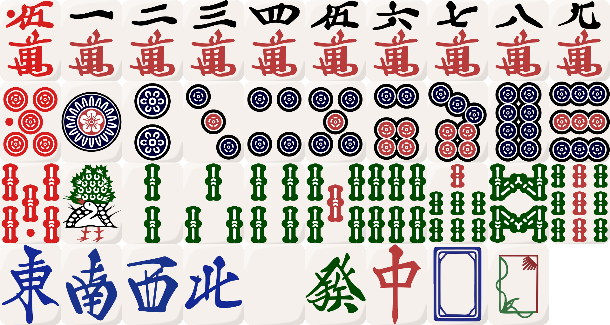
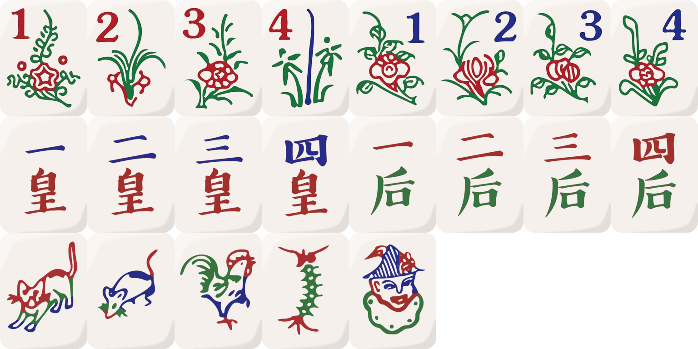
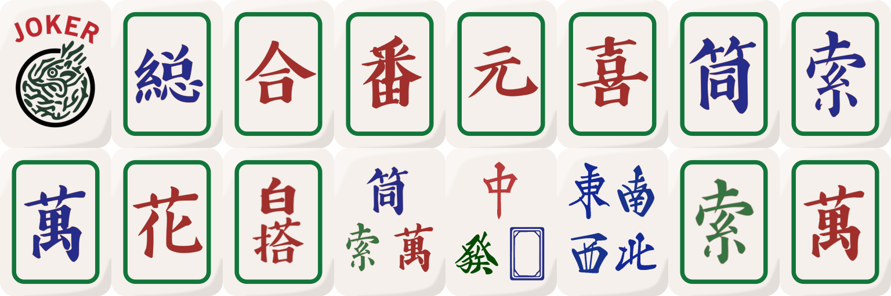
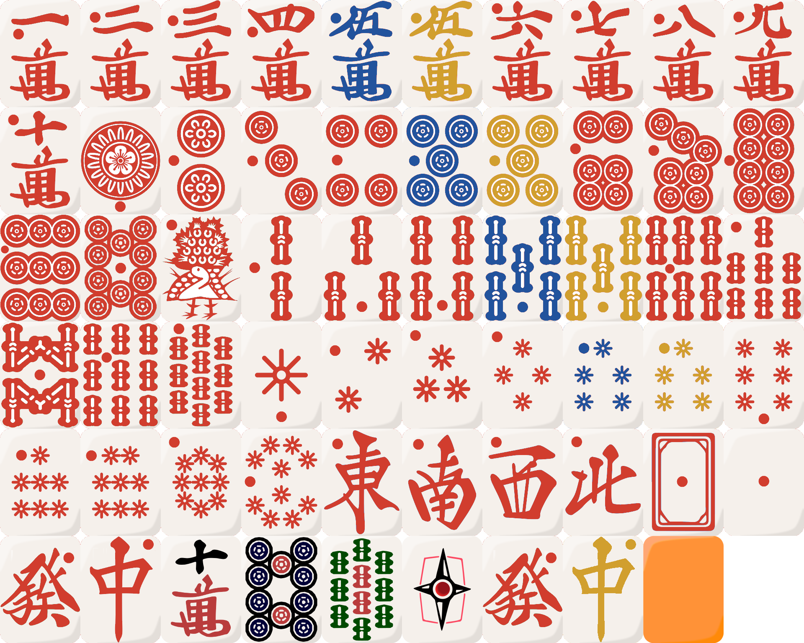

# Tile reference

This document is a reference for all of the tiles currently supported in the tileset.

## Standard tiles + variant white dragons

- `0m`, `1m`, `2m`, `3m`, `4m`, `5m`, `6m`, `7m`, `8m`, `9m`
- `0p`, `1p`, `2p`, `3p`, `4p`, `5p`, `6p`, `7p`, `8p`, `9p`
- `0s`, `1s`, `2s`, `3s`, `4s`, `5s`, `6s`, `7s`, `8s`, `9s`
- `1z`, `2z`, `3z`, `4z`, `5z`, `6z`, `7z`, `0z`, `8z`

## Flowers

- `1f`, `2f`, `3f`, `4f`, `1g`, `2g`, `3g`, `4g`
- `1k`, `2k`, `3k`, `4k`, `1q`, `2q`, `3q`, `4q`
- `1a`, `2a`, `3a`, `4a`, `1y`

## Jokers

- `1j`, `2j`, `3j`, `4j`, `5j`, `6j`, `7j`, `8j`
- `9j`, `10j`, `12j`, `13j`, `15j`, `16j`, `18j`, `19j`

## Star and Galaxy tiles

- `1t`, `2t`, `3t`, `4t`, `5t`, `6t`, `7t`, `8t`, `9t`, `10t`
- `11m`, `12m`, `13m`, `14m`, `15m`, `16m`, `17m`, `18m`, `19m`, `110m`
- `11p`, `12p`, `13p`, `14p`, `15p`, `16p`, `17p`, `18p`, `19p`, `110p`
- `11s`, `12s`, `13s`, `14s`, `15s`, `16s`, `17s`, `18s`, `19s`, `110s`
- `11t`, `12t`, `13t`, `14t`, `15t`, `16t`, `17t`, `18t`, `19t`, `110t`
- `11z`, `12z`, `13z`, `14z`, `15z`, `16z`, `17z`, `0t`

## Aka and other

- `01m`, `02m`, `03m`, `04m`, `25m`, `35m`, `06m`, `07m`, `08m`, `09m`
- `010m`, `01p`, `02p`, `03p`, `04p`, `25p`, `35p`, `06p`, `07p`, `08p`
- `09p`, `010p`, `01s`, `02s`, `03s`, `04s`, `25s`, `35s`, `06s`, `07s`
- `08s`, `09s`, `010s`, `01t`, `02t`, `03t`, `04t`, `25t`, `35t`, `06t`
- `07t`, `08t`, `09t`, `010t`, `01z`, `02z`, `03z`, `04z`, `00z`, `05z`
- `06z`, `07z`, `2y`, `10m`, `10p`, `10s`, `25z`, `26z`, `27z`, `1x`
