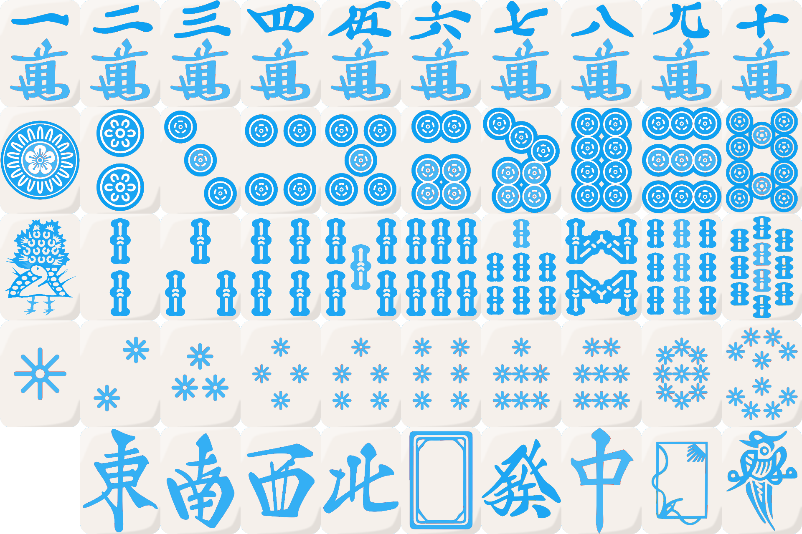
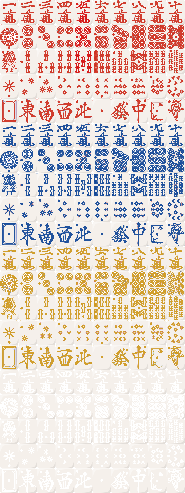

# Tile reference

This document is a reference for all of the tiles currently supported in the tileset.

## Standard tiles

- `0m`, `1m`, `2m`, `3m`, `4m`, `5m`, `6m`, `7m`, `8m`, `9m`
- `0p`, `1p`, `2p`, `3p`, `4p`, `5p`, `6p`, `7p`, `8p`, `9p`
- `0s`, `1s`, `2s`, `3s`, `4s`, `5s`, `6s`, `7s`, `8s`, `9s`
- `1z`, `2z`, `3z`, `4z`, `5z`, `6z`, `7z`

## Variant tiles and spacers

- `0z`, `8z`, `9z`, `00s`, `10m`, `10p`, `10s`
- `1x`, and a bunch of spaces:
  + `2x` (tile-width space),
  + `3x` (half-width space),
  + `4x` (zero-width space),
  + `5x` (quarter-width space),
  + `6x` (1/8-width space),
  + `7x` (1/16-width space),
  + `8x` (1/32-width space)

## Flowers

- `1f`, `2f`, `3f`, `4f`, `1g`, `2g`, `3g`, `4g`
- `1a`, `2a`, `3a`, `4a`, `1k`, `2k`, `3k`, `4k`
- `1q`, `2q`, `3q`, `4q`, `1y`

## Jokers

- `1j`, `0j`, `2j`, `9j`, `4j`, `5j`, `6j`, `7j`
- `8j`, `10j`, `12j`, `3j`, `14j`, `15j`, `17j`, `18j`
- `19j`, `37j`, `46j`, `147j`, `258j`, `369j`, `789j`, `456j`
- `123j`, `11j`, `22j`, `20j`, `91j`, `64j`, `73j`, `852j`
- `30j`, `31j`, `32j`, `33j`, `34j`, `2y`

## Star tiles

- `1t`, `2t`, `3t`, `4t`, `5t`, `6t`, `7t`, `8t`, `9t`, `10t`

## Galaxy tiles

- `11m`, `12m`, `13m`, `14m`, `15m`, `16m`, `17m`, `18m`, `19m`, `110m`
- `11p`, `12p`, `13p`, `14p`, `15p`, `16p`, `17p`, `18p`, `19p`, `110p`
- `11s`, `12s`, `13s`, `14s`, `15s`, `16s`, `17s`, `18s`, `19s`, `110s`
- `11t`, `12t`, `13t`, `14t`, `15t`, `16t`, `17t`, `18t`, `19t`, `110t`
- (n/a), `11z`, `12z`, `13z`, `14z`, `15z`, `16z`, `17z`, `18z`, `100s`

## Aka/Ao/Kin/Transparent

- `01m`, `02m`, `03m`, `04m`, `05m`, `06m`, `07m`, `08m`, `09m`, `010m`
- `01p`, `02p`, `03p`, `04p`, `05m`, `06p`, `07p`, `08p`, `09p`, `010p`
- `01s`, `02s`, `03s`, `04s`, `05m`, `06s`, `07s`, `08s`, `09s`, `010s`
- `01t`, `02t`, `03t`, `04t`, `05t`, `06t`, `07t`, `08t`, `09t`, `010t`
- `01z`, `02z`, `03z`, `04z`, `05z`, `06z`, `07z`, `00z`, `08z`, `000s`
- `21m`, `22m`, `23m`, `24m`, `25m`, `26m`, `27m`, `28m`, `29m`, `210m`
- `21p`, `22p`, `23p`, `24p`, `25p`, `26p`, `27p`, `28p`, `29p`, `210p`
- `21s`, `22s`, `23s`, `24s`, `25s`, `26s`, `27s`, `28s`, `29s`, `210s`
- `21t`, `22t`, `23t`, `24t`, `25t`, `26t`, `27t`, `28t`, `29t`, `210t`
- `21z`, `22z`, `23z`, `24z`, `25z`, `26z`, `27z`, `20z`, `28z`, `200s`
- `31m`, `32m`, `33m`, `34m`, `35m`, `36m`, `37m`, `38m`, `39m`, `310m`
- `31p`, `32p`, `33p`, `34p`, `35p`, `36p`, `37p`, `38p`, `39p`, `310p`
- `31s`, `32s`, `33s`, `34s`, `35s`, `36s`, `37s`, `38s`, `39s`, `310s`
- `31t`, `32t`, `33t`, `34t`, `35t`, `36t`, `37t`, `38t`, `39t`, `310t`
- `31z`, `32z`, `33z`, `34z`, `35z`, `36z`, `37z`, `30z`, `38z`, `300s`
- `41m`, `42m`, `43m`, `44m`, `45m`, `46m`, `47m`, `48m`, `49m`, `410m`
- `41p`, `42p`, `43p`, `44p`, `45p`, `46p`, `47p`, `48p`, `49p`, `410p`
- `41s`, `42s`, `43s`, `44s`, `45s`, `46s`, `47s`, `48s`, `49s`, `410s`
- `41t`, `42t`, `43t`, `44t`, `45t`, `46t`, `47t`, `48t`, `49t`, `410t`
- `41z`, `42z`, `43z`, `44z`, `45z`, `46z`, `47z`, `40z`, `48z`, `400s`
